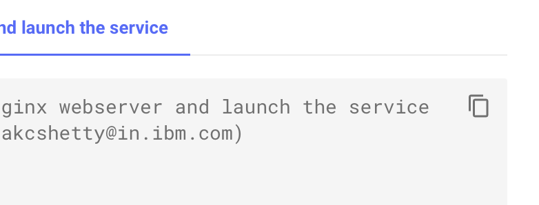
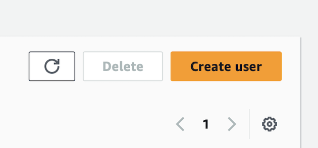
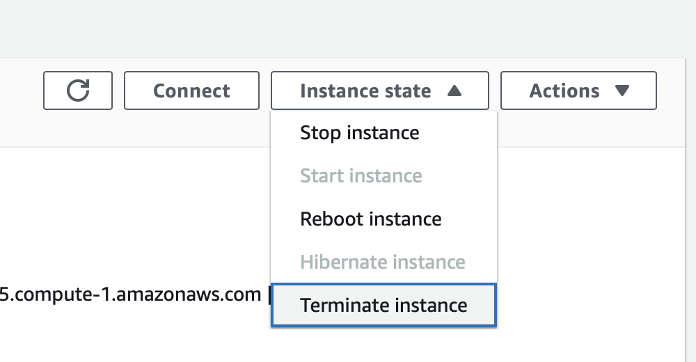

!!! quote "**OPTIONAL** SECTION — NOT REQUIRED FOR LEVEL 3 CREDIT"
    
    IBM technical sellers and business partners are **NOT** required to complete this section to receive Level 3 credit. However, it is highly recommended by the authors that you attempt the material, given the tremendous demonstration value it provides for clients.

!!! warning "COSTS & BILLING"

    Be aware that deploying a live Amazon EC2 instance on AWS **does** incur real-world charges which are the responsibility of the individual to pay for. If you wish to go ahead with deploying the live environment— **which you are encouraged, but NOT REQUIRED, to complete** —you will need to do so on your personal AWS account, with any potential billings and charges incurred to your personal credit card.

    The billing associated with an Amazon EC2 `t2.small` instance and other services needed for the demo is **minimal**: an on-demand hourly rate of **$0.023 USD** at the time of publication. Running the fully-deployed WordPress and EC2 environments for 24 hours cost USD $2.03 in billing when testing for publication.

    <a href="https://aws.amazon.com/ec2/pricing/on-demand/" target="_blank">Additional AWS pricing details and plans are available online.</a>

<br/>

To conclude the Level 3 Technical Sales education on *IBM watsonx Code Assistant for Red Hat Ansible Lightspeed* (**WCA**), you will be provided with a complete set of instructions for deploying a **live** Amazon Web Services (AWS) environment with Ansible automation, consisting of a **<a href="https://wordpress.com" target="_blank">WordPress</a>** web application running atop an **<a href="https://aws.amazon.com/ec2/" target="_blank">Amazon EC2 VPC</a>**.

- The deployment of the environments will be conducted entirely using Red Hat Ansible automation, executed on your local machine, and deployed to AWS cloud.

- The generation of the Ansible Tasks and code required to automate these deployments will be created using the generative AI capabilities of the WCA extension for VS Code.

Ansible Playbooks to support this demo were prepared ahead of time in a public GitHub repository and are available for your use at the links below.

!!! warning ""
  
    **TEMPLATE (`.yml`)**: <a href="https://github.com/bienko/WCA-Lightspeed-L3/blob/main/TEMPLATE.yml" target="_blank">https://github.com/bienko/WCA-Lightspeed-L3/blob/main/TEMPLATE.yml</a>

The `TEMPLATE.yml` Playbook contains the skeleton of the application you will ultimately build. Playbook structure, key variables, Task descriptions, and comments are provided. Use the generative AI capabilities of WCA to fill out the details of the various Ansible Tasks, then compare the results with the `SOLUTION.yml` file below.


!!! warning ""

    **SOLUTION (`.yml`)**: <a href="https://github.com/bienko/WCA-Lightspeed-L3/blob/main/SOLUTION.yml" target="_blank">https://github.com/bienko/WCA-Lightspeed-L3/blob/main/SOLUTION.yml</a>

The `SOLUTION.yml` Playbook contains the complete set of Ansible Playbook instructions needed to fully deploy a live EC2 VPC instance on AWS and host a WordPress application within that environment. You will need to replace certain variables (indicated by comments in the code) with details specific to your personal AWS account and environment. Afterwards, you can— and are encouraged to —execute the Playbook with Ansible and deploy a **live**, at-cost instance to your personal AWS account.

Once the two YAML files have been downloaded to your local machine, open them with VS Code and follow along with the instructions below.

---

??? quote "DOWNLOAD .yml FILES TO DESKTOP"

    You can easily downlod the `TEMPLATE` and `SOLUTION` *.yml* files to your local machine.

    <br/>
    {: loading=lazy width="400"}

    {: loading=lazy width="400"}
    <br/>

    Navigate to the GitHub links provided (above) and click the **Download raw file** button.

??? quote "HOW TO CREATE NEW `YAML` PLAYBOOKS"

    **Note:** You need to copy and paste the contents of the Playbook into a **New File...** within the *same* Lightspeed project directory that was used for the previous lab modules in order for the VS Code extension to engage.

    To create a new YAML Playbook within a VS Code environment:
    
    **a.** Copy the contents of the Playbook to clipboard using the button in the top-right corner of the lab guide code block.
    
    {: loading=lazy width="400"}

    **b.** Return to your VS Code environment. In the top-left corner of the interface, with your Ansible Lightspeed folder selected, click the **New File...** button.
    
    {: loading=lazy width="400"}

    **c.** Name the file to a description of your choosing, ending with `.yml` as the filetype. Set it to `CustomPlaybook.yml`, for example. Save it to one of the directories in the `ansible-wca-demo-kit` folder.

    **d.** Paste the clipboard contents into the YAML file and follow along with the suggestions below.

??? quote "COPY AND PASTE CODE WITHIN THE VM"

    Information "copied" to your local machine's clipboard cannot be "pasted" directly into the virtual machine (VM) environment or VS Code. If you wish to copy and paste instructions directly from the lab documentation, it is recommended that you open the GitHub instructions **inside** the VM's web browser (Firefox). This will allow you to copy instructions to the VM's clipboard and paste instructions inside the VS Code editor.

??? quote "ANSIBLE LIGHTSPEED IS MISSING OR CODE RECOMMENDATIONS ARE NOT GENERATING"
    Ansible Lightspeed and WCA will only generate code recommendations for *Ansible Playbooks* and *YAML* files. VS Code will typically auto-detect the programming language of the document you're working with, but on occassion you may need to manually specify the language. Even if working with a YAML file, you'll still need to specify the language mode as `Ansible` for the Lightspeed plugin to engage.

    To set the language mode correctly:

    - In the bottom-right corner of the VS Code interface, hover over the **Select Language Mode** toggle^[A]^

    - A console will appear at the top of VS Code with a drop-down list of options^[B]^

    - Click `Ansible` from the suggested languages, or enter the text yourself and hit ++return++

    - Confirm that the Select Language Mode toggle in the bottom-right corner displays `Ansible`

    <br/>
    {: loading=lazy width="600"}

    {: loading=lazy width="600"}

#
# Use WCA to generate code for the `TEMPLATE.yml` Playbook, then compare against the `SOLUTION.yml` Playbook to evaluate the results
#

In the steps ahead, you will use WCA's AI-generated code suggestions to populate the contents of Tasks within the `TEMPLATE.yml` Playbook. There are 14 Tasks in total and we will examine them each in sequence.

For each Task, a tabbed code snippet is provided within this lab documentation to make it easy for you to toggle between the `TEMPLATE` (the Task prior to AI-generated code suggestions) and the proper `SOLUTION` (the Task as it should be written for a successful deployment to AWS).

Compare the AI-generated code suggestions you receive in VS Code with the expected `SOLUTION` code. You *will* find that there are occassional discrepancies and variables that need to be adjusted. Generative AI can save users tremendous amounts of time and effort by automating the creation of powerful blocks of code— as you will observe in generating these tasks —but it still requires a degree of human supervision and double-checking. However, the time saved with hands on keyboard is enormous and the potential for the future is boundless.

---

1. Open the `TEMPLATE.yml` Playbook in VS Code and ensure that the Ansible Lightspeed extension is active.

---

2. Scroll down `MODULE 1` (**Line 4**) and take note of the comments, as well as the `<PLACEHOLDER>` values. If you wish to fully deploy this environment to AWS, you will need to register for an AWS account, create an IAM (Identity Access Management) user, and associate an SSH key with the necessary permissions to access the account. These values will then be substituted in your code for the `aws_access_key` and `aws_secret_key` variables.

    Instructions on how to sign up for AWS and create those keys will be included at the end of this module, and you will be reminded at that time to update these variables. However, for now, let's focus on generating the Ansible Tasks.

---

3. Continue scrolling down until you reach `TASK 1` (**Line 18**) for the creation of a virtual private cloud (VPC) named 'wordpress'. Generate the Task code within VS Code and compare your results with the `SOLUTION` tab.

    === "TEMPLATE"

        ``` yaml
        # TASK 1
        #   Creation of a virtual private cloud (VPC) named 'wordpress'.
        #   Should have value 10.0.0.0/16 associated with cidr_block.
        - name: Create VPC named wordpress
        ```

    === "SOLUTION"

        ``` yaml
        # TASK 1
        #   Creation of a virtual private cloud (VPC) named 'wordpress'.
        #   Should have value 10.0.0.0/16 associated with cidr_block.
        - name: Create VPC named wordpress
          amazon.aws.ec2_vpc_net:
            name: wordpress
            cidr_block: 10.0.0.0/16
            state: present
          register: wordpress_vpc
        ```

    !!! note "TAGS"

        One element of AI-generated Task code that you may find yourself frequently needing to update are tags and other naming conventions, such as the `register: wordpress_vpc` pair in `TASK 1`. While the Ansible Lightspeed extension will remember the context of variables that are *already* named within the Playbook, it will struggle with how to name *new* variables — like `wordpress_vpc`. Take note, however, that as you generate code for the other Tasks in the Playbook that `wordpress_vpc` will be recalled and referenced.

---

4. After validating the previous code block, continue scrolling down until you reach `TASK 2` (**Line 23**) for the creation of a security group which allows network traffic over SSH and HTTP/s. Generate, evaluate, and refine the Task code as needed.

    - Notice that the `wordpress_vpc` attribute which was registered in `TASK 2` has been referenced in the creation of the `vpc_id` in `TASK 3`
    
    - Ignore the additional space between adjacent `{``{` characters that are included in `SOLUTION` code tabs — these are included only to allow rendering of the code block in GitHub and are not intended as part of the finalized code

    === "TEMPLATE"

        ``` yaml
        # TASK 2
        #   Creation of the security group which allows traffic over SSH and HTTP/s
        #   TCP ports 80-80, 443-443, 22-22
        - name: Create and register wordpress_vpc VPC security group allow SSH and HTTP
        ```

    === "SOLUTION"

        ``` yaml
        # TASK 2
        #   Creation of the security group which allows traffic over SSH and HTTP/s
        #   TCP ports 80-80, 443-443, 22-22
        - name: Create and register wordpress_vpc VPC security group allow SSH and HTTP
          amazon.aws.ec2_security_group:
            name: wordpress
            description: Allow SSH and HTTP/HTTPS
            vpc_id: "{ { wordpress_vpc.vpc.id } }" # Ignore extra space between { { cbaracters.
            rules:
              - proto: tcp
                from_port: 80
                to_port: 80
                cidr_ip: 0.0.0.0/0
              - proto: tcp
                from_port: 443
                to_port: 443
                cidr_ip: 0.0.0.0/0
              - proto: tcp
                from_port: 22
                to_port: 22
                cidr_ip: 0.0.0.0/0
          register: wordpress_sg
        ```
---

5. Continue scrolling down until you reach `TASK 3` (**Line 28**) for the creation of an internet gateway for the wordpress VPC. Generate, evaluate, and refine the Task code as needed.

    === "TEMPLATE"

        ``` yaml
        # TASK 3
        #   Creation of an internet gateway for the wordpress VPC
        - name: Create internet gateway for VPC wordpress_vpc
        ```

    === "SOLUTION"

        ``` yaml
        # TASK 3
        #   Creation of an internet gateway for the wordpress VPC
        - name: Create internet gateway for VPC wordpress_vpc
          amazon.aws.ec2_vpc_igw:
            vpc_id: "{ { wordpress_vpc.vpc.id } }"
            state: present
          register: wordpress_igw
        ```
---

6. Continue down to `TASK 4` (**Line 32**) for the creation of an AWS network subnet for the WordPress VPC.

    === "TEMPLATE"

        ``` yaml
        # TASK 4
        #   Creation of a network subnet for the wordpress VPC
        - name: Create subnet in wordpress_vpc
        ```

    === "SOLUTION"

        ``` yaml
        # TASK 4
        #   Creation of a network subnet for the wordpress VPC
        - name: Create subnet in wordpress_vpc
          amazon.aws.ec2_vpc_subnet:
            state: present
            vpc_id: "{ { wordpress_vpc.vpc.id } }"
            cidr: 10.0.0.0/16
          register: wordpress_subnet
        ```
---

7. Continue down to `TASK 5` (**Line 36**) for the creation of a routing table associated with wordpress VPC's subnet and internet gateway.

    === "TEMPLATE"

        ``` yaml
        # TASK 5
        #   Creation of a routing table associated with wordpress VPC's subnet and internet gateway
        - name: Create route table for subnet and gateway wordpress_igw
        ```

    === "SOLUTION"

        ``` yaml
        # TASK 5
        #   Creation of a routing table associated with wordpress VPC's subnet and internet gateway
        - name: Create route table for subnet and gateway wordpress_igw
          amazon.aws.ec2_vpc_route_table:
            state: present
            vpc_id: "{ { wordpress_vpc.vpc.id } }"
            tags:
              Name: sg_public
              Project: phoenix
            subnets:
              - "{ { wordpress_subnet.subnet.id } }"
            routes:
              - dest: 0.0.0.0/0
                gateway_id: "{ { wordpress_igw.gateway_id } }"
          register: wordpress_route_table
        ```

    !!! note ""
        WCA can be "creative" with its choice of tags and identifiers. You are welcome to adjust these to your liking, or even eliminate them from the Task code altogether. In the majority of cases these tags and identifiers are used for organization and tracking purposes, but not necessarily anything critical to the functioning of the Ansible Playbook or the infrastructure it is automating.

---

8. Continue further down until you reach `TASK 6` (**Line 40**), which is one of the more consequential steps in the Playbook as it involves the creation of the Amazon EC2 `t2.small` instance on AWS according to the settings defined in `TASKS 1-5`.

    - Note that the `image_id` and `ami` values correspond to a specific Amazon Machine Image (ami) for Red Hat Enterprise Linux 9. Hundreds of alternative operating system images are available to select from on AWS, so you may modify this if you so choose; however, for the purposes of deploying WordPress it will make no meaningful difference.

    - The pair `key_name: "bienko-key"` relates to an EC2 instance key (SSH) that you will need to create before attempting to deploy an EC2 instance via Ansible. Instructions for how to create that key will be given at the end of this module for those who wish to deploy a live environment.

    === "TEMPLATE"

        ``` yaml
        # TASK 6
        #   Creation of an EC2 t2.small instance with attributes defined in Tasks 1-5
        #   Amazon Machine Image (ami) image_id: ami-026ebd4cfe2c043b2
        #   Registered to Red Hat Enterprise Linux 9 (HVM, 64-bit x86) image
        #   Replace `key_name:` value with your EC2 .pem keypair - DO NOT include .pem as part of filename
        #   Use 'chmod 400' to change file permissions of .pem file before executing Playbook
        - name: Create t2.small instance named wordpress in wordpress_subnet assign public ip
        ```

    === "SOLUTION"

        ``` yaml
        # TASK 6
        #   Creation of an EC2 t2.small instance with attributes defined in Tasks 1-5
        #   Amazon Machine Image (ami) image_id: ami-026ebd4cfe2c043b2
        #   Registered to Red Hat Enterprise Linux 9 (HVM, 64-bit x86) image
        #   Replace `key_name:` value with your EC2 .pem keypair - DO NOT include .pem as part of filename
        #   Use 'chmod 400' to change file permissions of .pem file before executing Playbook
        - name: Create t2.small instance named wordpress in wordpress_subnet assign public ip
          amazon.aws.ec2_instance:
              name: wordpress
              image_id: "ami-026ebd4cfe2c043b2"
              instance_type: t2.small
              vpc_subnet_id: "{ { wordpress_subnet.subnet.id } }"
              security_groups: "{ { wordpress_sg.group_id } }"
              network:
                assign_public_ip: true
              key_name: "bienko-key"
              state: running
          register: wordpress_server
        ```
---

9. Continue down to `TASK 7` (**Line 48**). You will notice that in both the `TEMPLATE` and `SOLUTION` versions of the Playbook that this Task is fully defined already. For now, leave this as a hard-coded element within your Playbook and do not attempt to recreate the task with code generation.

    === "TEMPLATE"

        ``` yaml
        # TASK 7
        #   This section has been hard-coded ahead of time.
        #   DO NOT regenerate using AI-suggested code.
        #   Replace `ansible_ssh_private_key_file` value with path on local machine to SSH key — INCLUDE .pem as part of filename
        #   Use 'chmod 400' to change file permissions of .pem file before executing Playbook
        - name: Add host to inventory using tunnel using wordpress_instance public ip and ansible user ec2-user
          ansible.builtin.add_host:
            name: wordpress
            ansible_host: "{ { wordpress_server.instances[0].public_ip_address } }"
            ansible_user: ec2-user
            ansible_ssh_private_key_file: "bienko-key.pem"
        ```

    === "SOLUTION"

        ``` yaml
        # TASK 7
        #   This section has been hard-coded ahead of time.
        #   DO NOT regenerate using AI-suggested code.
        #   Replace `ansible_ssh_private_key_file` value with path on local machine to SSH key — INCLUDE .pem as part of filename
        #   Use 'chmod 400' to change file permissions of .pem file before executing Playbook
        - name: Add host to inventory using tunnel using wordpress_instance public ip and ansible user ec2-user
          ansible.builtin.add_host:
            name: wordpress
            ansible_host: "{ { wordpress_server.instances[0].public_ip_address } }"
            ansible_user: ec2-user
            ansible_ssh_private_key_file: "bienko-key.pem"
        ```

    !!! warning "PLAYBOOK MODIFICATIONS REQUIRED"

        Although `TASK 7` does not require WCA to generate any code suggestions, it *does* require the user to modify the value of the `ansible_ssh_private_key_file` attribute. Set this attribute to the directory path where the private SSH key (`.pem` file) is located on your local machine. Be sure to include the `.pem` filetype as part of the value and also ensure you have changed the permissions on the file (using Terminal and executing the `chmod 400 bienko-key.pem` instruction) before attempting to run the Playbook.

---

10. Scrolling further down the Playbook you will find `MODULE B` (**Line 60**), made up Ansible Tasks concerned with installing and configuring WordPress on the newly-provisioned AWS EC2 (VPC) instance. Locate `TASK 8` (**Line 67**) which waits for a connection to be established to the EC2 instance before advancing the sequence of automation tasks.

    === "TEMPLATE"

        ``` yaml
        # TASK 8
        #   Wait for a connection to be established to the EC2 instance.
        - name: Wait for connection
        ```

    === "SOLUTION"

        ``` yaml
        # TASK 8
        #   Wait for a connection to be established to the EC2 instance.
        - name: Wait for connection
          ansible.builtin.wait_for_connection:
            delay: 10
            timeout: 30
        ```
---

11. Next, continue further down the Playbook and locate `TASK 9` (**Line 71**) which commences installation of the necessary drivers and services on Amazon EC2 once a connection to the instance has been established.

    === "TEMPLATE"

        ``` yaml
        # TASK 9
        #   After connecting, begin installation of necessary drivers and services.
        - name: Install httpd, php, php-mysqli, and mariadb-server
        ```

    === "SOLUTION"

        ``` yaml
        # TASK 9
        #   After connecting, begin installation of necessary drivers and services.
        - name: Install httpd, php, php-mysqli, and mariadb-server
          ansible.builtin.package:
            name:
              - httpd
              - php
              - php-mysqlnd
              - mariadb-server
            state: present
        ```
---

12. Scroll down further until you locate `TASK 10` (**Line 75**) which is responsible for downloading and decompressing (unarchiving) WordPress installation contents onto the EC2 instance.

    === "TEMPLATE"

        ``` yaml
        # TASK 10
        #   Download and decompress (unarchive) WordPress contents on EC2 instance.
        - name: Download and unarchive wordpress
        ```

    === "SOLUTION"

        ``` yaml
        # TASK 10
        #   Download and decompress (unarchive) WordPress contents on EC2 instance.
        - name: Download and unarchive wordpress
          ansible.builtin.unarchive:
            src: https://wordpress.org/latest.tar.gz
            dest: /var/www/html
            remote_src: true
            creates: /var/www/html/wordpress
        ```
---

13. Afterwards, locate `TASK 11` (**Line 79**) which sets the ownership attributes for the WordPress environment on Amazon EC2 and prepares it for hosting via Apache webserver.

    === "TEMPLATE"

        ``` yaml
        # TASK 11
        #   Set owner attributes for WordPress environment.
        - name: Change owner of /var/www/html/wordpress to apache:apache
        ```

    === "SOLUTION"

        ``` yaml
        # TASK 11
        #   Set owner attributes for WordPress environment.
        - name: Change owner of /var/www/html/wordpress to apache:apache
          ansible.builtin.file:
            path: /var/www/html
            owner: apache
            group: apache
            recurse: true
        ```
---

14. Further down the Playbook, locate `TASK 12` (**Line 83**) which deploys the services installed in `TASK 9`.

    === "TEMPLATE"

        ``` yaml
        # TASK 12
        #   Deploy services installed in Task 9.
        - name: Start and enable httpd, php-fpm and mariadb services
        ```

    === "SOLUTION"

        ``` yaml
        # TASK 12
        #   Deploy services installed in Task 9.
        - name: Start and enable httpd, php-fpm and mariadb services
          ansible.builtin.service:
            name: "{ { item } }"
            state: started
            enabled: true
          loop:
            - httpd
            - php-fpm
            - mariadb
        ```
---

15. `MODULE C` (**Line 87**) of the Playbook covers the final set of operations. It is responsible for ensuring that WordPress is deployed on the newly-provisioned AWS EC2 (VPC) instance and that the WordPress web page is accessible to the user. As you did previously in *Step 2*, you will need to replace the `<PLACEHOLDER>` values and `region` details on **Lines 96-98** if you want to fully deploy this application into a live AWS environment.

---

16. Locate `TASK 13` (**Line 101**) which is responsible for gathering facts about AWS EC2 (VPC) instance and the deployed WordPress application that is running atop of it.

    === "TEMPLATE"

        ``` yaml
        # TASK 13
        #   Gather facts about AWS EC2 (VPC) instance and deployed WordPress application.
        - name: Gather ec2 instance info for tag name wordpress
        ```

    === "SOLUTION"

        ``` yaml
        # TASK 13
        #   Gather facts about AWS EC2 (VPC) instance and deployed WordPress application.
        - name: Gather ec2 instance info for tag name wordpress
          amazon.aws.ec2_instance_info:
            filters:
              tag:Name: wordpress
              instance-state-name: running
          register: ec2_facts
        ```
---

17. Finally, you have arrived at the final step in the Playbook configuration: `TASK 14` (**Line 105**), which is responsible for hosting the WordPress web app and making it accessible to users.

    === "TEMPLATE"

        ``` yaml
        # TASK 14
        #   Host the WordPress web application and make accessible to user.
        - name: Debug ec2_facts public dns name
        ```

    === "SOLUTION"

        ``` yaml
        # TASK 14
        #   Host the WordPress web application and make accessible to user.
        - name: Debug ec2_facts public dns name
          ansible.builtin.debug:
            msg: "{ { ec2_facts.instances[0].public_dns_name } }/wordpress/readme.html"
        ```
---

# To deploy a **live** Amazon EC2 instance and WordPress application on AWS, follow along with the steps below.
#

Congratulations on making it this far! At this stage, your Playbook is ready for execution. However, there are still some preparation that you need to do before this Playbook can be used to automate deployment of the WordPress application into a live Amazon EC2 environment.

---

18. In order to execute the Ansible Playbook on your local machine, you will need to install Ansible locally.

    - Red Hat provides <a href="https://docs.ansible.com/ansible/latest/installation_guide/intro_installation.html" target="_blank">extensive online documentation</a> for how to go about installing Ansible
    
    - The authors of your lab guide recommend doing so by executing the following instructions in a Terminal window (macOS), or equivalent steps using <a href="https://learn.microsoft.com/en-us/powershell/scripting/install/installing-powershell-on-windows?view=powershell-7.3" target="_blank">PowerShell</a> (Windows)

    - Follow the prompts until you receive confirmation that Ansible is installed

    ``` shell
    brew install ansible
    ```

    ??? warning "`HOMEBREW` IS MISSING — CLICK TO EXPAND"

        If you do not have the Homebrew package manager ("brew") installed in a macOS environment, execute the following instruction inside a Terminal console:
        ```
        /bin/bash -c "$(curl -fsSL https://raw.githubusercontent.com/Homebrew/install/HEAD/install.sh)"
        ```
        Wait for the installation to conclude and then retry the instructions from Step 18.

---

19. If you have not registered for an AWS account previously, you need to do so now.

    - You will need to supply a personal credit card for billing expenses
    
    - If you have an existing Amazon account, your AWS account can be linked to that profile if you so choose

    !!! warning ""
  
        **AWS Registration**: <a href="https://aws.amazon.com/resources/create-account/" target="_blank">https://aws.amazon.com/resources/create-account/</a>

---

20. With a registered AWS account, you next need to navigate from the AWS dashboard into the **Identity and Access Management (IAM)** tool. You can search for this using the **Search** bar at the top of the screen and entering `IAM`.

    <br/>
    {: loading=lazy width="600"}

---

21. Once inside the IAM tool, look along the left-side of the interface and drill down into **Users**.

---

22. Click the **Create User** orange button located in the top-right corner of the interface.

    <br/>
    {: loading=lazy width="400"}

---

23. Within the **Create User** panel, specify your user details and permissions.

    - Set `Username` to a name of your choosing.

    - Click **Next** to advance the configuration tool.

    - Under **Set Permissions** > **Permission Options**, select the `Add user to group` tile.

    - Click the **Set permissions boundary - *optional*** tile to expand permission options.

    - Toggle the checkmark next to the **Use a permissions boundary to control the maximum permissions** option.

    - Under **Permissions Policies**, search the table for the `AdministratorAccess` policy and **enable** that policy. You may receive warnings against doing so — ignore those for now.

    - Continue following the prompts until the User has been created.

    {: loading=lazy width="600"}

---

24. Once the User has been created, your web browser will reopen the User panel of the IAM tool. Here you can see various details about the User, including their **Security Credentials** and any keys associated with the User. This section will be empty given that you have only just now created the User.

---

25. Drill down into the **Access Keys** category and click the **Create Access Key** button located below the (empty) table.

    <br/>
    {: loading=lazy width="600"}

---

26. A secret access key will be created and the web browser will reload to show you details about that key. **Record this information** to a notepad. Details about the secret access key can only be viewed or downloaded at the time the key is created (now). It cannot be recovered afterwards. However, if you lose your key details, all is not lost — you can always create a new secret access key at a later time.

    - Record the `Access Key`, which will be used to replace the `<PLACEHOLDER>` value assigned to `aws_access_key` in *Step 2* and *Step 15* of this lab guide.

    - Record the `Secret Access Key`, which will replace the `<PLACEHOLDER>` value assigned to `aws_secret_key` in *Step 2* and *Step 15* of this lab guide.

---

27. Take note at this time as well about the **Region** in which your AWS account is located.

    - You can easily look up this information by examining the URL in your web browser address bar, as shown below (`us-east-1`).

    - **Record** the region's name, as it will replace the `region` value assigned to the Playbook.

    <br/>
    {: loading=lazy width="400"}

    !!! warning "PLAYBOOK MODIFICATIONS REQUIRED"

        Replace the `<PLACEHOLDER>` values for variables `aws_access_key` and `aws_secret_key` with the `Access Key` and `Secret Access Key`, respectively.

        - Lines 13, 14, 96, and 97 of the `TEMPLATE.yml` Playbook

        - Lines 13, 14, 179, and 180 of the `SOLUTION.yml` Playbook

        Replace the value for variable `region` with the region assigned to your unique AWS account.

        - Lines 15 and 98 of the `TEMPLATE.yml` Playbook
        
        - Lines 15 and 181 of the `SOLUTION.yml` Playbook

---

28. Next, you'll need to create an SSH **Key Pair** with authorization to interact with (and ultimately deploy) Amazon EC2 instances. Return to the search bar at the top of the AWS interface and enter `EC2`. Drill down into the **Amazon EC2** service page from the results.

---

29. From the left-hand navigation bar, drill down into the **Network & Security** > **Key Pairs** tab.

---

30. Click the orange **Create key pair** button in the top-right of the page.

---

31. A configuration tool will ask for additional information about the Key Pair:

    - **Name** can be set to a value of your choosing

    - **Key pair type** set to `RSA`

    - **Private key file format** set to `.pem`

    - When satisfied, click the orange **Create key pair** button

    {: loading=lazy width="600"}

---

32. The web browser will redirect to a page where you can view details about the newly-created Key Pair for EC2. **Download** the `.pem` file to your local device, preferably to the same directory that your `TEMPLATE.yml` and `SOLUTION.yml` Playbooks are located within.

    !!! warning "PLAYBOOK MODIFICATIONS REQUIRED"

        The value of `ansible_ssh_private_key_file` must be updated within your Playbooks to account for the full path to the `.pem` file on your local machine. If you save the Key Pair file to the same directory that your Ansible Playbooks are located within, you do not need to qualify the value with anything more than the name of the file (`bienko-key.pem`). If it is saved in a *different* directory, you will need to spell out the full path + file name.

        Update the value of `ansible_ssh_private_key_file` in the following locations:

        - **Line 58** of the `TEMPLATE.yml` Playbook

        - **Line 113** of the `SOLUTION.yml` Playbook

---

33. It is necessary to adjust the permissions assigned to the Key Pair file (on your local machine) before attempting to connect via Ansible to AWS.

    - Open a Terminal console on your local machine and navigate (`cd`) to the directory in which the Key Pair file is saved.
    
    - Execute the following to adjust the permissions assigned to the `.pem` file:

    ``` shell
    chmod 400 filename.pem
    ```

---

# Executing the Ansible Playbook
#

At last, you are ready to execute the Playbook and use Ansible automation to deploy both an Amazon EC2 instance and a WordPress web application.

---

34. With the Terminal console, navigate to the directory (`cd`) where both the Ansible Playbook and your `KeyPair.pem` file are located.

    - You may use either the `TEMPLATE.yml` Playbook that you customized or the `SOLUTION.yml` Playbook for executing the Ansible automation tasks.
    
    - Regardless of the Playbook being used, you must modify the Playbook with the necessary AWS security and account credentials information.

    - When ready, execute the following instruction with the Terminal console:

    ``` shell
    ansible-playbook TEMPLATE.yml
    ```

---

35. Monitor the console's output as the Ansible Playbook iterates across each of the Tasks customized earlier. A fantastic feature of Ansible's automation is that if any of the Tasks should fail, the steps involved in that Task can be re-tried in subsequent runs; likewise, Tasks which executed successfully won't be repeated, but are validated and skipped instead.

    - If you encounter errors during the litany of automation tasks, return to the Playbook and attempt to debug the issue. Re-issue the instruction in *Step 34* to console to attempt the Ansible Playbook execution again.
    
    - Continue iterating in this manner until all 14 Tasks have been successfully executed.

---

36. After successfully deploying the Amazon EC2 environment and instantiating a WordPress application, the console will return a URL to the Terminal's output as part of `TASK 14`'s `[debug]` instruction. Copy the URL to clipboard and then paste it into your web browser to access the WordPress application.

    <br/>
    {: loading=lazy width="600"}

---

37. If your web browser loads the quick-start page for WordPress, you have successfully deployed the application and its supporting EC2 environment — entirely using generative AI and Ansible automation. **Well done!**

    <br/>
    {: loading=lazy width="600"}

---

# Cleaning up and conclusion
#

!!! warning "COSTS & BILLING"

    It is essential that you terminate and deprovision the EC2 instance at the conclusion of the hands on lab. Otherwise, your personal AWS account will continue to be billed for as long as the resources are provisioned.

Once you are ready to retire your environment, you will need to return to the AWS Dashboard to terminate the EC2 instance and hosted WordPress application.

---

38. You can monitor your Amazon EC2 instance from the EC2 dashboard. At the top of the page, locate the **Resources** table and drill down into the **Instances (running)** tab.

---

39. Details about your EC2 environment are summarized within the **Instances** table. Click the name of your EC2's `Instance ID` to expose additional details and management options.

    <br/>
    {: loading=lazy width="600"}

---

40. In the top-right corner of the interface, click the **Instance state** button and select **Terminate instance** from the drop-down menu.

    <br/>
    {: loading=lazy width="400"}

---

41. Confirm the deprovisioning request by clicking the orange **Terminate** button. All storage associated with the EC2 instance will automatically be deleted. Terminating an instance cannot be undone once underway.

---

42. It is recommended that you delete all of the **Security Groups** (3 total) and **Key Pairs** (1 total) associated with the EC2 instance. To do so, return to the EC2 Dashboard and follow a similar procedure to *Steps 38-41*.

---

43. Search for `IAM` in the AWS taskbar to return to the **Identity Access Management** panel. If you wish to further secure your AWS account, delete all unwanted users or consider reducing the user's privilege from AdministratorAccess to a more restrictive class.

---

That concludes the hands-on components to this Level 3 course, but your learning and experimentation doesn't need to end here. Continue to experiment with generating Tasks for Ansible Playbooks. If you have worked extensively with Ansible previously, try recreating Tasks you've written previously from old Playbooks using generative AI — just be careful not to use confidential or sensitive information as part of those tests. See if you can spot the differences or improvements made from the AI-generated code recommendations.

Feel free to reach out to the authors of this coursework if you have suggestions for Tasks or code generation techniques that you'd like to see included in future iterations of this hands-on training.