!!! note ""
    If you require assistance or run into issues with the hands-on lab, help is available.

    - **Environment issues:** The lab environment is managed by IBM Technology Zone. <a href="https://techzone.ibm.com/help" target="_blank">Opening a support case ticket</a> is recommended for issues related to the hands-on environment (provisioning, running, and so on.)

    - **Documentation issues:** If there is an error in the lab documentation, or if you require additional support in completing the material, open a thread on the <a href="https://ibm.enterprise.slack.com/archives/C063VF1G54J" target="_blank">#wca-ansible-techzone-support</a> Slack channel.

    - **Product questions:** For questions related to IBM watsonx Code Assistant capabilities, sales opportunities, roadmap, and other such matters, open a thread on the <a href="https://ibm.enterprise.slack.com/archives/C059NKPUCP9" target="_blank">#watsonx-code-assistant</a> Slack channel.

#
# Reserving a lab environment
#

Before getting started with *IBM watsonx Code Assistant for Red Hat Ansible Lightspeed* (**WCA**), an environment must be reserved and deployed via the *IBM Technology Zone* (**ITZ**).

You will require access to the ITZ in order to reserve your environment and complete the lab. If you do not yet have access or an account with the ITZ, <a href="https://techzone.ibm.com/" target="_blank">you will need to register for one</a>.

There are **TWO** environments that you must reserve from ITZ:

- `Request a Red Hat Acccount`: responsible for generating unique access credentials for *IBM watsonx Code Assistant* and *Red Hat Ansible Lightspeed* authorizations
    
- `WCA for Ansible Essentials Plan - Visual Studio Desktop 1.3`: virtualized machine prepared with Visual Studio Code and lab demonstration scripts pre-installed; you will authenticate within this environment using the Red Hat account requested from ITZ

Follow along with the instructions below to request and configure these environments.

---

1. Click the IBM Technology Zone link below and select **Request a Red Hat Account**^[A]^:

    !!! warning ""
        **URL:** <a href="https://techzone.ibm.com/collection/ibm-watson-x-code-assistant-for-ansible-lightspeed/environments" target="_blank">https://techzone.ibm.com/collection/ibm-watson-x-code-assistant-for-ansible-lightspeed/environments</a>

    <br/>

    !!! note inline end "FULLSCREEN IMAGES"

        Click on any of the screenshots within this documentation to enlarge the image.
    
    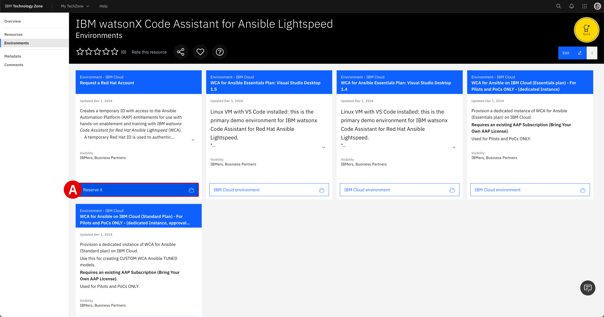{: loading=lazy width="450"}

---

2. From the *Single environment reservation options*, select **Reserve now**^[A]^.

    <br/>
    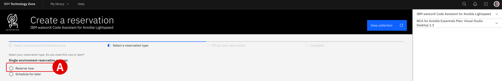{: loading=lazy width="600"}

---

3. Supply additional details about your ITZ reservation request:

    - **Name**^[A]^: Give your reservation a unique name.

    - **Purpose**^[B]^: Set to `Practice / Self-Education` and affirm that customer data will not be used with the environment. If you are replicating this hands-on demonstration with a client, you must select Customer Demo and supply a sales opportunity number.

    - **Purpose Description**^[C]^: Provide a brief summary of how the environment will be used.

    - **Preferred Geography**^[D]^: Select the data center region that is closest to your location.

    - **End Date & Time**^[E]^: Select a time and date for when the reservation will expire. The recommended amount is 2 days, although it is possible to finish the hands-on demonstration within a few hours. Additional time extensions are available.

    When satisfied, verify that you agree to the *Terms and Conditions* for the environment and finalize your reservation request by clicking **Submit**^[F]^.

    <br/>

    !!! note inline end "PROVISIONING TIMES"

        Reservations take approximately **15-30 minutes** to complete from the time that you click submit. If you navigate to the **<a href="https://techzone.ibm.com/my/reservations" target="_blank">My Reservations</a>** tab of the ITZ, you can monitor the progress of your reservation. Wait for the ITZ reservation to be marked as *"Ready"* before attempting to start the lab.

    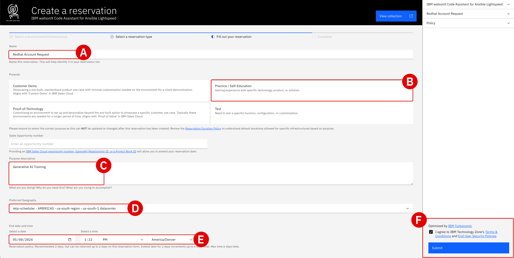{: loading=lazy width="400"}

---

4. When the Red Hat account request has been processed by IBM Technology Zone, you will receive a **pair** of emails: one from ITZ and a second from Red Hat.

    - `Reservation Ready on IBM Technology Zone` : You can ignore the contents of this email, as the relevant account and licensing information are contained in the Red Hat email. Confirm that the ITZ email states that **Status Update: Ready**^[A]^.

    - `Red Hat Login Email Verification` : This email, addressed from a `no-reply@redhat.com` account^[B]^, contains the resources necessary for accessing your uniquely-generated Red Hat credentials. The lab guide steps that follow will instruct you on how to set those up and how to use them for accessing your *IBM watsonx Code Assistant for Red Hat Ansible Lightspeed* entitlements inside VS Code.

    <br/>
    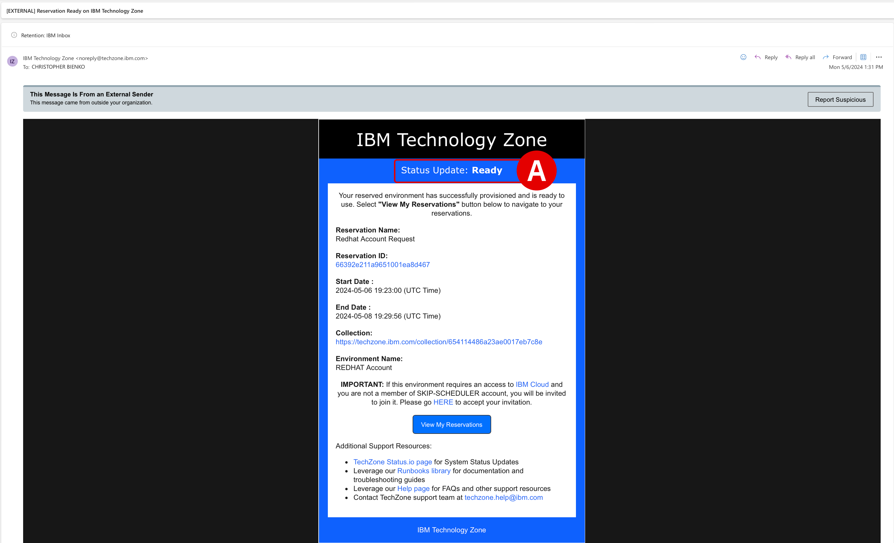{: loading=lazy width="600"}

    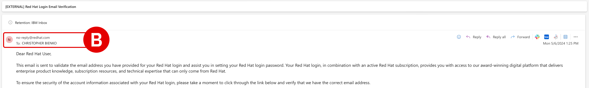{: loading=lazy width="600"}

---

5. With the `Red Hat Login Email Verification` email open, take note of two essential pieces of information:

    - Locate the **Account Information**^[A]^ details at the bottom of the email. `Your login:` is the unique Red Hat account assigned for you by ITZ. `Your email address:` will be the address associated with your ITZ account. **Record** both to a notepad for reference later.

    - Click the **URL**^[B]^ located within the body of the invitation email to finalize your account registration with Red Hat.

    <br/>
    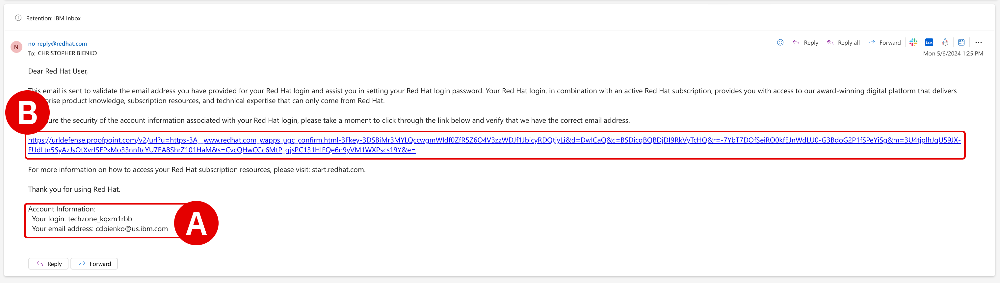{: loading=lazy width="600"}

---

6. An *Email Confirmation* page will load within your web browser.

    - Note that the value of `Red Hat login` is the same as the one recorded in *Step 5*

    - **Create** a new `Password`^[A]^ and record this to a notepad for reference later

    - When ready, click **Save**^[B]^ to finalize registration

    !!! note "REGISTRATION IS REQUIRED"
    
        - If you already have a personal account with Red Hat, **you must still register for a new account** using the invitation URL provided

        - **Do not** attempt to use a personal Red Hat account in the later steps of the *Setup & Troubleshooting* guide, as that account will not have access to the WCA services needed to perform the training

        - Red Hat accounts created for this training will be de-authorized and deleted by IBM Technology Zone after the reservation period has ended

    <br/>
    {: loading=lazy width="600"}

---

#
# Installation of Visual Studio Code and Extensions
#

Before getting started with *IBM watsonx Code Assistant for Red Hat Ansible Lightspeed* (**WCA**), you will first setup *Visual Studio Code* (commonly referred to as **VS Code**) on a local machine. This will provide an integrated development environment for experimenting with WCA's generative AI capabilities.

---

7. Download the latest **Stable Build**^[A]^ release of VS Code available for your machine's operating system using the link below.

    !!! warning ""
        **Download**: <a href="https://code.visualstudio.com" target="_blank">https://code.visualstudio.com</a>

    Follow along with the installer wizard steps and continue with the hands-on lab instructions once VS Code is running on your local machine.

    <br/>

    !!! note inline end "FULLSCREEN IMAGES"

        Click on any of the screenshots within this documentation to enlarge the image.

    {: loading=lazy width="450"}

---

8. Launch the VS Code application and take note of the sidebar along the left-side.

    - Click the **Extensions** icon^[A]^ to open the marketplace of services and open source technologies that can be integrated with VS Code

    - If you have used VS Code previously, extensions that have already been integrated with the environment will be listed along the left side

    <br/>
    {: loading=lazy width="600"}

---

9. At the top of the **Extensions** panel is a search bar:

    - Type ```Ansible``` into the search bar^[A]^ and then hit ++return++

    - Click the blue **Install** button^[B]^ for the official *Ansible* extension for VS Code, published by *Red Hat* (blue checkmark)
    
    !!! note "INSTALLATION PROMPTS"
        You might receive two different prompts during the installation process:
        
        - `Do you trust the authors of the files in this workspace?`: select **Trust Workspace & Install**
        
        - `Do you want to allow untrusted files in this window?`: select **Open**

        - Installation of the Ansible extension for VS Code should only take a moment — an *Extension:Ansible* welcome panel will open when it is finished
    
    <br/>
    {: loading=lazy width="600"}

    {: loading=lazy width="600"}

---

10. Once the Ansible extension has been integrated with VS Code, close any *Welcome* tabs that open and look for Ansible under the *Installed* services in the **Extensions** panel.

    - Click the **Manage** ("cogwheel") icon located just to the right of the Ansible tile

    - From the drop-down options, click **Extension Settings**^[A]^

    - If **Extension Settings** is not available from the drop-down menu, try right-clicking on the Ansible extension tile instead

    <br/>
    {: loading=lazy width="600"}

---

11. *Settings* for the Ansible extension will be displayed within a new panel.

    - Ensure that **User**^[A]^ is selected at the top of the panel — do not edit *Workspace*

    - Using the search bar^[B]^ at the top of the panel, add the text `Lightspeed` to filter the available options

    - **Check** the option for `Ansible > Lightspeed`^[C]^ 
    
    - **Check** the option for `Ansible > Lightspeed: Suggestions`^[D]^

    - **Check** the option for `Ansible > Lightspeed: Disable Content Suggestion Header`^[E]^

    - Changes to *Settings* are automatically saved and applied – click the `X` button in the top-left corner of the panel's tab

    <br/>
    {: loading=lazy width="600"}

---

12. Click the **Ansible** plugin^[A]^ (denoted by the `A` logo) on the left-hand side of the interface.

    - Two panels will open along the left side of the interface

    - Within the *Ansible Lightspeed Login* panel, click the blue **Connect** button^[B]^

    - `The extension Ansible wants to sign in using Ansible Lightspeed`: click **Allow**^[C]^

    - `Do you want Code to open the external website?`: click **Open**^[D]^

    <br/>
    {: loading=lazy width="600"}

    {: loading=lazy width="600"}

    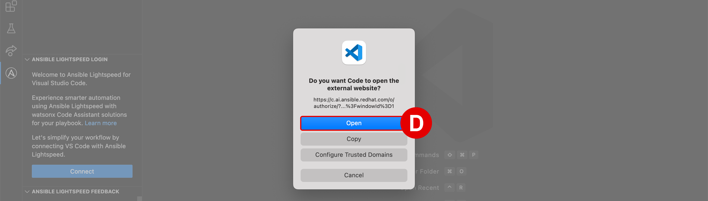{: loading=lazy width="600"}

---

13. A web browser will load with the header `Log in to Ansible Lightspeed with IBM watsonx Code Assistant` — this is where you will supply your registration details recorded in *Step 5* in order to authenticate the VS Code plugin with WCA.

    - Click the **Log in with Red Hat** button^[A]^

    - If you had previously logged in to Red Hat with your browser, you might not be asked again for those credentials

    - If you *are* asked to provide a `Username` and `Password`, supply the values recorded in *Step 5* of this module

    <br/>
    {: loading=lazy width="600"}

---

14. After logging in with Red Hat, the web browser will display the prompt to `Authorize Ansible Lightspeed for VS Code`.

    - Click **Authorize**^[A]^

    - `Do you want to allow this website to open Visual Studio Code?`: click **Allow**^[B]^

    - `Allow Ansible extension to open this URI?`: click **Open**^[C]^

    <br/>
    {: loading=lazy width="600"}

    {: loading=lazy width="600"}

    {: loading=lazy width="600"}

---

15. At this stage, the Ansible extension for VS Code is now authenticated and connected to *IBM watsonx Code Assistant*.

    - Verify^[A]^ that the environment is logged in as your unique `Username` and that the `User Type: Licensed`

    - A notification pop-up will also appear in the bottom-right corner of the VS Code interface confirming the successful login

    <br/>
    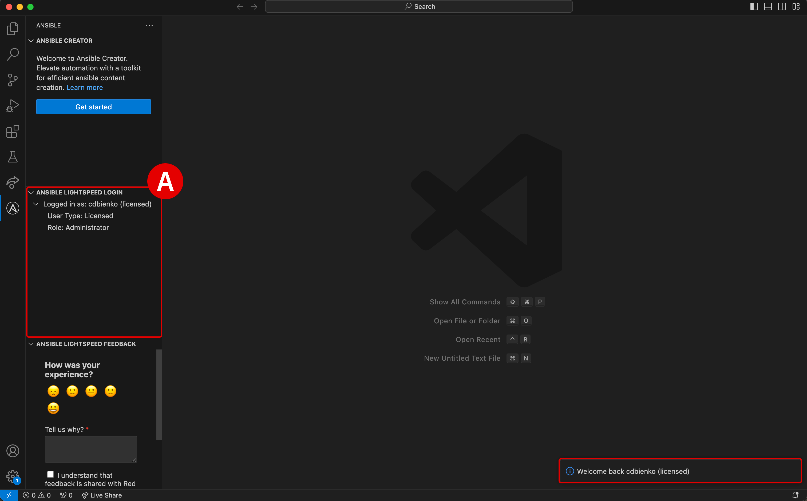{: loading=lazy width="600"}

    ??? warning "CLICK TO EXPAND — FAILURE TO LOGIN OR TIMED OUT"

        - If the authentication procedure in *Steps 12-14* takes too long, activation of the plugin will be "timed out" and the VS Code environment will display an error message^[B]^ in the bottom-right corner

        - Click the **Connect**^[C]^ button as shown and repeat *Steps 12-14* as before; the login process should run smoother (and faster) on the second attempt

            <br/>
            {: loading=lazy width="600"}

---

#
# Preparing the Ansible Playbook materials

To begin experimenting with WCA's generative AI capabilities, you will first need access to some Ansible Playbooks to generate Tasks with. Playbook templates have already been prepared ahead of time for this training so that you can get straight to work.

---

16. Click the **Explorer** button at the top of the left-hand VS Code interface. Depending on your VS Code environment, the Explorer tab will look one of two ways. **Click to expand** whichever one of the two options best describes your situation and follow the instructions.

    ??? tip "I AM NEW TO *VS CODE*"

        If you are working within a new installation of VS Code, the **Explorer** tab^[A]^ will display `NO FOLDER OPENED` and give options to either *Open Folder* or *Clone Repository*. You must specify the public GitHub repository from which to `clone` the Ansible Playbook templates into the local (VS Code) environment. A `clone` request in GitHub is essentially a request to replicate code from the cloud-hosted repository into the local environment.

        ??? warning "`GIT NOT INSTALLED` — CLICK TO EXPAND"

            If your machine has not used **<a href="https://git-scm.com" target="_blank">Git</a>** previously, you may be prompted by VS Code to install it before attempting a `clone` request. This is more commonplace on Windows operating systems, but some MacOS users may need to install Git as well. The following instructions will guide you through the process:

            - With the VS Code application open, click the **Source Control**^[A]^ tab from the left-hand interface and then click **Download Git**^[B]^.

            - A web browser will open to the <a href="https://git-scm.com" target="_blank">git-scm.com</a> Downloads page. 
            
                - **Download**^[C]^ the version recommended for your machine's particular operating system.
                
                - The recommended version will be displayed first at the top of the list. 
                
                - Execute the installer on your machine and follow along with the prompts to finish installing Git. Accept the license agreement and accept the default values on each page.
            
            - Return to VS Code and once again click the **Source Control**^[D]^ tab, then click the blue **Initialize Repository**^[E]^ button.

            - From the top of the **Source Control** tab, click the three dots `...`^[F]^ icon to expand a drop-down menu of options. Click on the **Clone**^[G]^ option.

            - Follow the instructions for the remainder of this section to clone the `ansible-wca-demo-kit` repository to your local machine^[H]^.

            <br/>
            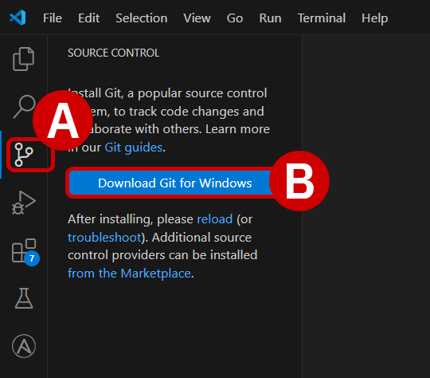{: loading=lazy width="500"}

            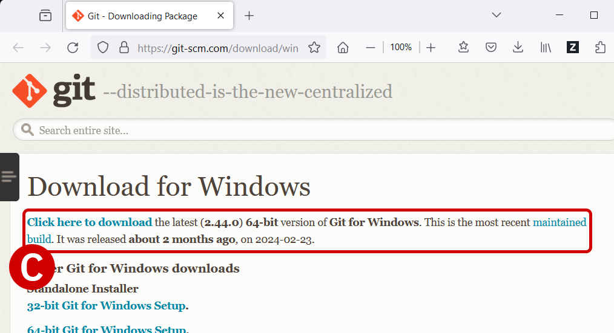{: loading=lazy width="500"}

            {: loading=lazy width="500"}

            {: loading=lazy width="500"}

            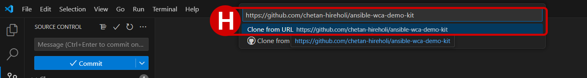{: loading=lazy width="500"}
        
        - Click the **Clone Repository** button^[B]^, which will open an executable console^[C]^ at the top of VS Code

        - You must specify the public GitHub repository from which to "clone" the Ansible Playbook templates into the local (VS Code) environment
        
            Enter following GitHub repository address into the console and hit ++return++ to confirm:
            
            ```
            https://github.com/chetan-hireholi/ansible-wca-demo-kit
            ```

        - If prompted `Would you like to open the cloned repository?`: click **Open**^[D]^

        - If prompted `Do you trust the authors of the files in this folder?`: click **Yes, I trust the authors**^[E]^

        <br/>
        {: loading=lazy width="600"}

        {: loading=lazy width="600"}

        {: loading=lazy width="600"}

        {: loading=lazy width="600"}

    ??? note "I HAVE USED *VS CODE* BEFORE"

        If you have worked with VS Code before and have added projects or folders to the environment previously, those folders (and their contents) will be displayed within the **Explorer** tab. However, you still need to clone (replicate) the Ansible Playbook templates from GitHub to a folder on your local machine. A `clone` request in GitHub is essentially a request to replicate code from the cloud-hosted repository into the local environment.
        
        ??? warning "`GIT NOT INSTALLED` — CLICK TO EXPAND"

            If your machine has not used **<a href="https://git-scm.com" target="_blank">Git</a>** previously, you may be prompted by VS Code to install it before attempting a `clone` request. This is more commonplace on Windows operating systems, but some MacOS users may need to install Git as well. The following instructions will guide you through the process:

            - With the VS Code application open, click the **Source Control**^[A]^ tab from the left-hand interface and then click **Download Git**^[B]^.

            - A web browser will open to the <a href="https://git-scm.com" target="_blank">git-scm.com</a> Downloads page. 
            
                - **Download**^[C]^ the version recommended for your machine's particular operating system.
                
                - The recommended version will be displayed first at the top of the list. 
                
                - Execute the installer on your machine and follow along with the prompts to finish installing Git. Accept the license agreement and accept the default values on each page.
            
            - Return to VS Code and once again click the **Source Control**^[D]^ tab, then click the blue **Initialize Repository**^[E]^ button.

            - From the top of the **Source Control** tab, click the three dots `...`^[F]^ icon to expand a drop-down menu of options. Click on the **Clone**^[G]^ option.

            - Follow the instructions for the remainder of this section to clone the `ansible-wca-demo-kit` repository to your local machine^[H]^.

            <br/>
            {: loading=lazy width="500"}

            {: loading=lazy width="500"}

            {: loading=lazy width="500"}

            {: loading=lazy width="500"}

            {: loading=lazy width="500"}

        - To perform a `clone` request with VS Code, perform the following action (depending on your OS):
        
            1. **Windows**: Press ++ctrl+shift+p++ to open an executable console at the top of VS Code

            2. **macOS**: Press ++cmd+shift+p++ to open an executable console at the top of VS Code

        - Enter following command into the console and hit ++return++ to confirm:
        
            ```
            git:clone
            ```

        - Next, specify the public repository from which to clone the Ansible Playbook templates. Enter following GitHub repository address into the console and hit ++return++ to confirm:
        
            ```
            https://github.com/chetan-hireholi/ansible-wca-demo-kit
            ```

    !!! warning ""
        Regardless of whether you are new to VS Code or have used VS Code previously, the remainder of the steps in the *Setup & Troubleshooting* module are the same.

---

17. Confirm that the working directory^[A]^ is now set to `ansible-wca-demo-kit` and that it contains files similar to those listed in the screenshot below.

    <br/>
    {: loading=lazy width="600"}

---

18. As a final step, verify that you have access to the latest demo code by performing the following `git fetch` and `git pull` commands:

    - From the top of the VM interface, drill down into **View** and then **Command Palette**^[A]^

    - Into the pop-up console^[B]^, type `git fetch`, hit ++return++, and wait patiently for the operation to finish (no responses will be prompted to screen if no updates to the code repository were necessary)

    - Open the console once again, type `git pull`, and then hit ++return++

    - At this stage, the hands-on environment has been fully configured

    <br/>
    {: loading=lazy width="600"}

    {: loading=lazy width="600"}

---

#
# Troubleshooting and support

!!! note ""
    If you require assistance or run into issues with the hands-on lab, help is available.

    - **Environment issues:** The lab environment is managed by IBM Technology Zone. <a href="https://techzone.ibm.com/help" target="_blank">Opening a support case ticket</a> is recommended for issues related to the hands-on environment (provisioning, running, and so on.)

    - **Documentation issues:** If there is an error in the lab documentation, or if you require additional support in completing the material, open a thread on the <a href="https://ibm.enterprise.slack.com/archives/C063VF1G54J" target="_blank">#wca-ansible-techzone-support</a> Slack channel.

    - **Product questions:** For questions related to IBM watsonx Code Assistant capabilities, sales opportunities, roadmap, and other such matters, open a thread on the <a href="https://ibm.enterprise.slack.com/archives/C059NKPUCP9" target="_blank">#watsonx-code-assistant</a> Slack channel.

!!! warning "UNABLE TO INSTALL *VS CODE* LOCALLY — REQUIRE A VIRTUAL MACHINE"

    Due to security or regulatory constraints, certain IBM clients or individuals enrolled in this training may be unable to install software (such as VS Code) on their local machines. As an alternative, IBM Technology Zone is able to provision a virtual machine environment that can be reserved at no-charge for completing the hands-on training. Click to expand the instructions embedded below for how to setup the virtual machine environment. Note that the documentation's instructions remain the same for the other modules, regardless of whether you are using a "local" or "virtualized" VS Code environment — although the "local" option is the preferred option.

    ??? quote "CLICK TO EXPAND INSTRUCTIONS FOR REQUESTING A VM"

        1. Follow the link below and select the **WCA for Ansible Essentials Plan: Visual Studio Desktop 1.3**^[A]^ (or later) tile:

            !!! warning ""
                **URL:** <a href="https://techzone.ibm.com/collection/ibm-watson-x-code-assistant-for-ansible-lightspeed/environments" target="_blank">https://techzone.ibm.com/collection/ibm-watson-x-code-assistant-for-ansible-lightspeed/environments</a>

            <br/>

            !!! note inline end "FULLSCREEN IMAGES"

                Click on any of the screenshots within this documentation to enlarge the image.
            
            {: loading=lazy width="400"}

        ---

        2. From the *Single environment reservation options*, select **Reserve now**^[A]^.

            <br/>
            {: loading=lazy width="600"}

        ---

        3. Supply additional details about your ITZ reservation request:

            - **Name**^[A]^: Give your reservation a unique name.

            - **Purpose**^[B]^: Set to `Practice / Self-Education` and affirm that customer data will not be used with the environment. If you are replicating this hands-on demonstration with a client, you must select Customer Demo and supply a sales opportunity number.

            - **Purpose Description**^[C]^: Provide a brief summary of how the environment will be used.

            - **Preferred Geography**^[D]^: Select the data center region that is closest to your location.

            - **End Date & Time**^[E]^: Select a time and date for when the reservation will expire. The recommended amount is 2 days, although it is possible to finish the hands-on demonstration within a few hours. Additional time extensions are available.

            When satisfied, verify that you agree to the *Terms and Conditions* for the environment and finalize your reservation request by clicking **Submit**^[F]^.

            <br/>

            !!! note inline end "PROVISIONING TIMES"

                Reservations take approximately **15-30 minutes** to complete from the time that you click submit. If you navigate to the **<a href="https://techzone.ibm.com/my/reservations" target="_blank">My Reservations</a>** tab of the ITZ, you can monitor the progress of your reservation. Wait for the ITZ reservation to be marked as *"Ready"* before attempting to start the lab.

            {: loading=lazy width="400"}

        ---

        4. When the ITZ environment is ready to go, you will receive an email to your inbox (similar to the screenshot below). Click the blue **View My Reservations** at the bottom of the email to open a page with more details about the environment. 

            Alternatively, you can click the <a href="https://techzone.ibm.com/my/reservations" target="_blank">My Reservations</a>^[A]^ tab from the ITZ home page to drill down into your environment's details.

            <br/>
            {: loading=lazy width="400"}

        ---

        5. Near the top of the page, under *Published Services*, click the **noVNC**^[A]^ link to access the virtual machine.

            <br/>
            {: loading=lazy width="600"}

        ---

        6. A new tab will open within your web browser for the VM environment.

            - It is recommended that Firefox be used for optimal performance
            
            - Along the left-side edge of the page, click the **Cog**^[A]^ icon
            
            - From the pop-up menu, click **Scaling Mode** and then select **Remote Resizing**
            
            - The VM window will now be properly scaled to the size of your browser window
            
            - Click the **Connect**^[B]^ button to continue with authentication

            <br/>
            {: loading=lazy width="600"}

        ---

        7. Supply the following password and click **Send Credentials**: 

        ```
        IBMDem0s!
        ```

        ---

        8. Once you have successfully authenticated, click the **Activities**^[A]^ button in the top-left corner of the interface to pull open the list of available applications from the bottom of the screen.

            Click the **Visual Studio Code**^[B]^ application shortcut at the bottom of the desktop to start up the service.

            If you wish to copy and paste instructions directly from the lab documentation into the virtual machine (VM), it is recommended that you open the GitHub instructions **inside** the VM's web browser (Firefox). This will allow you to copy instructions to the VM's clipboard and paste instructions inside the VS Code editor.

            You may access the web browser at any time by clicking the **Activities**^[A]^ button and then launching **Firefox**^[C]^, as shown.

            <br/>

            {: loading=lazy width="600"}
            !!! note ""
                Visual Studio (VS) Code is a code editor built on open source technology that is free to use and published by Microsoft. Distributions are available for both Windows and macOS operating systems.

        ---

        9. VS Code will load and then present you with an *Authentication Required* splash screen.

            - Enter the same password^[A]^ used to log into the VM: `IBMDem0s!`

            - Click **Unlock**^[B]^

            {: loading=lazy width="600"}

        ---

        10. If this is your first time logging into the VM, you must authenticate and activate the Ansible Lightspeed extension for VS Code.

            Click the **Ansible**^[A]^ extension (denoted by the large `A` icon) from the left-hand interface open expose details about the Ansible plug-in.

            <br/>
            {: loading=lazy width="600"}

        ---

        11. In the bottom-right corner of the interface^[A]^, you may receieve a notification stating that `You must be logged in to use the Ansible Lightspeed`, which confirms that the Ansible Lightspeed service still needs to be activated for this VM environment.

            Additionally, along the left-hand side of the interface^[B]^, you will also receive a welcome notice attached to the `Ansible Lightspeed Login` panel.

            - Click either the **Connect**^[C]^ or **Login** buttons to proceed with authentication and activation of the plugin

            - When prompted with `The extension Ansible wants to sign in using Ansible Lightspeed`, click **Allow**^[D]^ 

            <br/>
            {: loading=lazy width="600"}

            {: loading=lazy width="600"}

        ---

        12. Firefox web browser will open within the VM and redirect to a Red Hat authentication page, as shown below.

            - Click **Log in with Red Hat**^[A]^

            - Note that the page load may be sluggish or slow — please be patient and give it a few moments before retrying this step

            <br/>
            {: loading=lazy width="600"}

        ---

        13. The VM environment already has access credentials saved to Firefox's keychain. Use the stored username and password to authenticate the Ansible Lightspeed plugin with Red Hat.

            - For the **Red Hat login or email**^[A]^ field, enter `ibm-wxca-demo-user`

            - For the **Password**^[B]^ field, enter `IBMDem0s!`

            - Log in when ready

            <br/>
            {: loading=lazy width="600"}

            {: loading=lazy width="600"}

        ---

        14. A pop-up notification will ask to `Authorize Ansible Lightspeed for VS Code`. Click **Authorize**^[A]^ to proceed.

            {: loading=lazy width="600"}

            ??? warning "CLICK TO EXPAND — FAILURE TO LOGIN OR TIMED OUT"

                If the authentication procedure in *Steps 11-14* takes too long (over 60 seconds), activation of the plugin will be "timed out" and the VS Code environment will display an error message^[B]^ in the bottom-right corner.

                Click the **Connect**^[C]^ button as shown and repeat *Steps 11-14* as before. The login process should run smoother (and faster) on the second attempt.

                {: loading=lazy width="600"}

        ---

        15. Verify^[A]^ that the environment is logged in as `wca-ibm-demo-user` and that the `User Type: Licensed`.

            <br/>
            {: loading=lazy width="600"}

        ---

        16. Click the **Explorer**^[A]^ button (as shown) in the top-left corner of the interface.

            Confirm that the working directory is set to `ansible-wca-demo-kit` and that it contains files similar to those listed in the screenshot below.

            <br/>
            {: loading=lazy width="600"}

        ---

        17. As a final step, verify that the VM has access to the latest demo code by performing the following `git fetch` and `git pull` commands:

            - From the top of the VM interface, drill down into **View** and then **Command Palette**^[A]^

            - Into the pop-up console^[B]^, type `git fetch`, then hit `Return`, and wait patiently for the operation to finish

            - Open the console once again, type `git pull`, and then hit `Return` (no responses will be prompted to screen if no updates to the code repository were necessary)

            <br/>
            {: loading=lazy width="600"}

            {: loading=lazy width="600"}

        <br/>
        At this stage, the hands-on environment has been fully configured.

<br/>
As you settle in to the environment and begin your training, you may encounter unexpected warnings or errors. Many of these can be safely ignored or can be easily rectified. This section will serve as a running list of frequently asked questions and troubleshooting techniques. Click on any of the following topics for additional details.

---

??? quote "FAILED TO CONNECT TO THE SERVER / `"YOU DON'T HAVE ACCESS TO IBM WATSONX..."`"
    This warning will occur when the Ansible plugin for VS Code needs to be re-authenticated with WCA. It can occur after an extended period of inactivity or a system restart. For example, if your lab environment is running inside a VM, pausing or restarting the VM may produce this error.

    To re-authenticate:

    - **Sign out** from the *VS Code* application by clicking the User icon^[A]^ in the bottom-left corner of the interface, hover over your username, and then click **Sign Out**^[B]^

    - **If you are running this environment inside a virtual machine (VM)**, closing and restarting the VM *will not* resolve the issue — you must sign out from the *VS Code* application, not the VM

    - Once logged out, follow from *Step 7* of the *Setup & Troubleshooting* to re-authenticate with WCA

    <br/>
    {: loading=lazy width="600"}


??? quote "CODE RECOMMENDATIONS ARE NOT GENERATING"
    Ansible Lightspeed and WCA will only generate code recommendations for *Ansible Playbooks* and *YAML* files. VS Code will typically auto-detect the programming language of the document you're working with, but on occassion you may need to manually specify the language. Even if working with a YAML file, you'll still need to specify the language mode as `Ansible` for the Lightspeed plugin to engage.

    To set the language mode correctly:

    - In the bottom-right corner of the VS Code interface, hover over the **Select Language Mode** toggle^[A]^

    - A console will appear at the top of VS Code with a drop-down list of options^[B]^

    - Click `Ansible` from the suggested languages, or enter the text yourself and hit ++return++

    - Confirm that the Select Language Mode toggle in the bottom-right corner displays `Ansible`

    <br/>
    {: loading=lazy width="600"}

    {: loading=lazy width="600"}


??? quote "`"ANSIBLE-LINT IS NOT AVAILABLE."`"
    `ansible-lint` checks Playbooks for practices and behavior that could potentially be improved and can fix some of the most common ones for you. It will constantly check your Ansible syntax as you type and provide recommendations for how to improve it.
    
    - You can safely **ignore** this error if it occurs during the lab exercises

    - If you wish to install `ansible-lint` on your local machine, execute the following instruction within a Terminal console:

        ``` shell
        python3 -m pip install --upgrade --user ansible-lint
        ```

        {: loading=lazy width="600"}


??? quote "RED *ANSIBLE* ICON ALONG BOTTOM-RIGHT INTERFACE"
    The *Ansible* extension for VS Code will check your local machine to determine if Red Hat Ansible has been installed locally. If you have not set up Ansible (the standalone version) on your local machine previously, this tile will display as red.

    You can safely **ignore** this error if it occurs during the lab exercises.

    <br/>
    {: loading=lazy width="600"}


??? quote "CANNOT SET PROPERTIES OF UNDEFINED (SETTING 'currentModelValue')"
    Make sure that the **Model ID Override** field is set to `empty` in your Ansible for VS Code extension settings.
    
    To verify this:

    - Click the **Extensions** tab^[A]^ along the left-hand interface

    - Click the **Manage** icon^[B]^ on the right side of the *Ansible* extension tile, then drill down into **Extension Settings**^[C]^

    - Add the text `Model` to the search filter^[D]^ at the top of the Extension Settings panel

    - Clear the input field^[E]^ of any model IDs and leave it blank

    - Close the Extension Settings panel by clicking `X` and return to the Ansible Playbook

    <br/>
    {: loading=lazy width="600"}

    {: loading=lazy width="600"}

    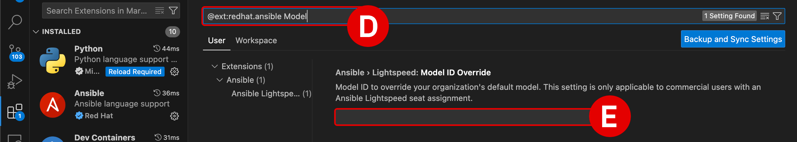{: loading=lazy width="600"}


??? quote "SPAWN C:\Windows\system32\cmd.exe ENOENT"
    This warning is not related to Ansible or WCA. You can safely **ignore** this error if it occurs during the lab exercises.

    <br/>
    {: loading=lazy width="600"}


??? quote "PYTHON DRIVERS ARE MISSING"
    The WCA extension for VS Code requires that Python drivers are included within the workspace. These are usually configured within VS Code by default, but can be easily set if necessary. Look for a ```Python``` tile adjacent to the ```Ansible``` tile along the bottom-right corner of the VS Code interface. If it is not set, **click** the tile and select the `Python 3.11.5 64-bit` drivers.

    - Click the gold-colored `Select python environment` button at the bottom-right of the interface

    - From the console at the top of the VS Code environment, select the recommended `Python 3.11.5 64-bit` option and hit ++return++ to confirm

        <br/>
        {: loading=lazy width="300"}
        
        {: loading=lazy width="300"}

??? quote "GIT NOT INSTALLED"
    If your machine has not used **<a href="https://git-scm.com" target="_blank">Git</a>** previously, you may be prompted by VS Code to install it before attempting a `clone` request. This is more commonplace on Windows operating systems, but some MacOS users may need to install Git as well. The following instructions will guide you through the process:

    - With the VS Code application open, click the **Source Control**^[A]^ tab from the left-hand interface and then click **Download Git**^[B]^.

    - A web browser will open to the <a href="https://git-scm.com" target="_blank">git-scm.com</a> Downloads page. 
    
        - **Download**^[C]^ the version recommended for your machine's particular operating system.
        
        - The recommended version will be displayed first at the top of the list. 
        
        - Execute the installer on your machine and follow along with the prompts to finish installing Git. Accept the license agreement and accept the default values on each page.
    
    - Return to VS Code and once again click the **Source Control**^[D]^ tab, then click the blue **Initialize Repository**^[E]^ button.

    - From the top of the **Source Control** tab, click the three dots `...`^[F]^ icon to expand a drop-down menu of options. Click on the **Clone**^[G]^ option.

    - Follow the instructions for the remainder of this section to clone the `ansible-wca-demo-kit` repository to your local machine^[H]^.

    <br/>
    {: loading=lazy width="500"}

    {: loading=lazy width="500"}

    {: loading=lazy width="500"}

    {: loading=lazy width="500"}

    {: loading=lazy width="500"}

??? quote "COPY AND PASTE INSTRUCTIONS INTO A VIRTUAL MACHINE"
    If you are running the lab environment inside a virtual machine (VM), it might not be possible to "paste" lab instructions from your local machine's clipboard directly into the VM.
    
    If you wish to copy and paste instructions directly from the lab documentation, it is recommended that you open the GitHub instructions **inside** the VM's web browser (Firefox). This will allow you to copy instructions to the VM's clipboard and paste instructions inside the VS Code editor.

---

#
# Next steps

The following section will cover the fundamentals of AI-recommended code generation for Ansible Tasks.