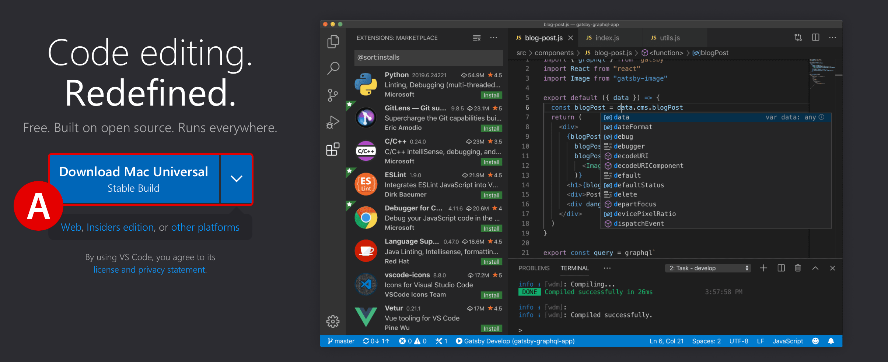
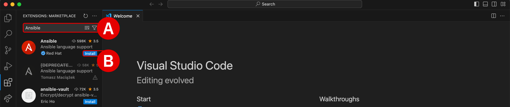
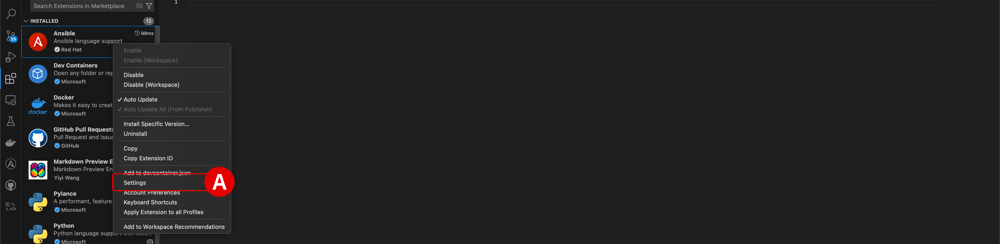
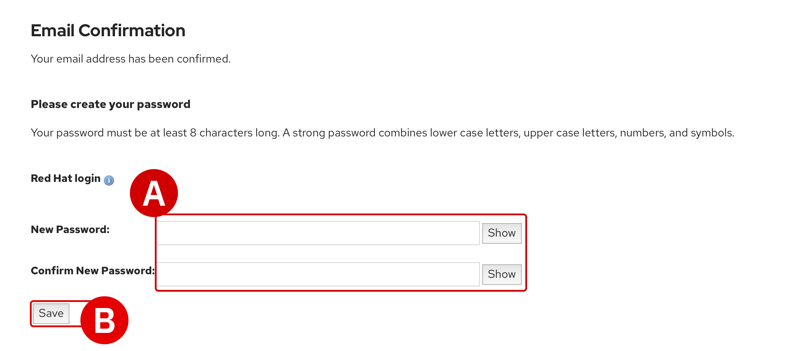
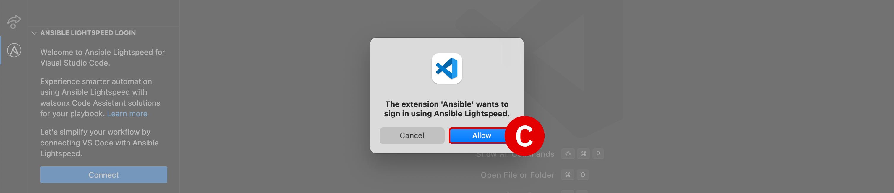
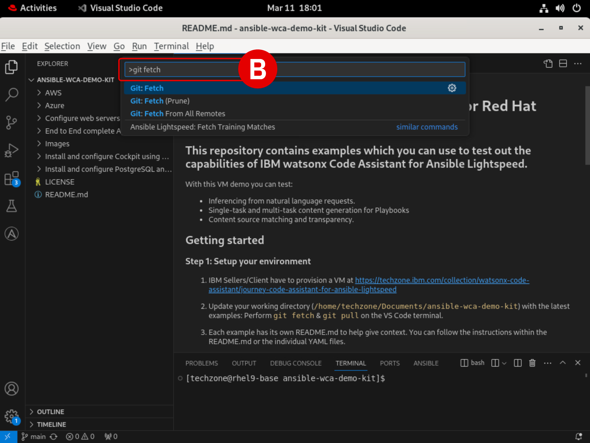
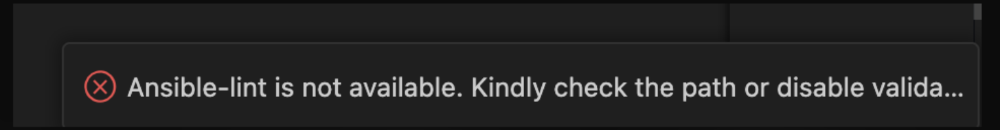
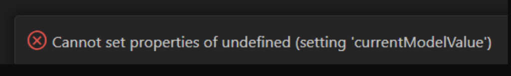

# Installation of Visual Studio Code and Extensions
#

Before getting started with *IBM watsonx Code Assistant for Red Hat Ansible Lightspeed* (**WCA**), you will first setup *Visual Studio Code* (commonly referred to as **VS Code**) on a local machine. This will provide an integrated development environment for experimenting with WCA's generative AI capabilities.

---

1. Download the latest **Stable Build**^[A]^ release of VS Code availabe for your machine's operating system using the link below.

    !!! warning ""
        **Download**: <a href="https://code.visualstudio.com" target="_blank">https://code.visualstudio.com</a>

    Follow along with the installer wizard steps and continue with the hands-on lab instructions once VS Code is running on your local machine.

    <br/>

    !!! note inline end "FULLSCREEN IMAGES"

        Click on any of the screenshots within this documentation to enlarge the image.

    {: loading=lazy width="450"}

---

2. Launch the VS Code application and take note of the sidebar along the left-side.

    - Click the **Extensions** icon^[A]^ to open the marketplace of services and open source technologies that can be integrated with VS Code

    - If you have used VS Code previously, extensions that have already been integrated with the environment will be listed along the left side

    <br/>
    {: loading=lazy width="600"}

---

3. At the top of the **Extensions** panel is a search bar:

    - Type ```Ansible``` into the search bar^[A]^ and then hit ++return++

    - Click the blue **Install** button^[B]^ for the official *Ansible* extension for VS Code, published by *Red Hat* (blue checkmark)
    
    !!! note "INSTALLATION PROMPTS"
        You may receive two different prompts during the installation process:
        
        - `Do you trust the authors of the files in this workspace?`: select **Trust Workspace & Install**
        
        - `Do you want to allow untrusted files in this window?`: select **Open**

        - Installation of the Ansible extension for VS Code should only take a moment — an *Extension:Ansible* welcome panel will open when it is finished
    
    <br/>
    {: loading=lazy width="600"}

    {: loading=lazy width="600"}

---

4. Once the Ansible extension has been integrated with VS Code, close any *Welcome* tabs that open and look for Ansible under the *Installed* services in the **Extensions** panel.

    - Click the **Manage** ("cogwheel") icon located just to the right of the Ansible tile

    - From the drop-down options, click **Extension Settings**^[A]^

    <br/>
    {: loading=lazy width="600"}

---

5. *Settings* for the Ansible extension will be displayed within a new panel.

    - Ensure that **User**^[A]^ is selected at the top of the panel — do not edit *Workspace*

    - Using the search bar^[B]^ at the top of the panel, add the text `Lightspeed` to filter the available options

    - **Check** the option for `Ansible > Lightspeed`^[C]^ 
    
    - **Check** the option for `Ansible > Lightspeed: Suggestions`^[D]^

    - **Check** the option for `Ansible > Lightspeed: Disable Content Suggestion Header`^[E]^

    - Changes to *Settings* are automatically saved and applied – click the `X` button in the top-left corner of the panel's tab

    <br/>
    {: loading=lazy width="600"}

---

#
# Accessing your Red Hat credentials and authenticating with WCA

**Red Hat credentials** will already have been emailed to you prior to starting this hands-on material, as part of the registration process. The invitation email will have a header similar to `Red Hat Login Email Verification`, addressed from a `no-reply@redhat.com` account.

Locate this email in your inbox and follow along with the steps below to authenticate the VS Code extension with the *IBM watsonx Code Assistant for Red Hat Ansible Lightspeed* (WCA) environment that has been pre-provisioned for this training.

---

6. Click the **URL**^[A]^ located within the body of the invitation email to finalize your account registration with the WCA environment.

    - An *Email Confirmation* page will load within your web browser

    - **Record** the value of `Red Hat login` to a notepad for reference later

    - **Create** a new `Password` and **record** this to a notepad for reference later

    - When ready, click **Save**^[B]^ to finalize registration

    !!! note "REGISTRATION IS REQUIRED"
    
        - If you already have a personal account with Red Hat, **you must still register for a new account** using the invitation URL provided

        - **Do not** attempt to use a personal Red Hat account in the later steps of the *Setup & Troubleshooting* guide, as that account will not have access to the WCA services needed to perform the training

        - Red Hat accounts created for this training will be de-authorized and deleted after the hands-on training period has ended

    <br/>
    {: loading=lazy width="600"}

    {: loading=lazy width="600"}

---

7. Return to the VS Code editor and click the **Ansible** plugin^[A]^ (denoted by the `A` logo) on the left-hand side of the interface.

    - Two panels will open along the left side of the interface

    - Within the *Ansible Lightspeed Login* panel, click the blue **Connect** button^[B]^

    - `The extension Ansible wants to sign in using Ansible Lightspeed`: click **Allow**^[C]^

    - `Do you want Code to open the external website?`: click **Open**^[D]^

    <br/>
    {: loading=lazy width="600"}

    {: loading=lazy width="600"}

    {: loading=lazy width="600"}

---

8. A web browser will load with the header `Log in to Ansible Lightspeed with IBM watsonx Code Assistant` — this is where you will supply your registration details recorded in *Step 6* in order to authenticate the VS Code plugin with WCA.

    - Click the **Log in with Red Hat** button^[A]^

    - If you had previously logged in to Red Hat with your browser, you might not be asked again for those credentials

    - If you *are* asked to provide a `Username` and `Password`, supply the values recorded in *Step 6* of this module

    <br/>
    {: loading=lazy width="600"}

---

9. After logging in with Red Hat, the web browser will display the prompt to `Authorize Ansible Lightspeed for VS Code`.

    - Click **Authorize**^[A]^

    - `Do you want to allow this website to open Visual Studio Code?`: click **Allow**^[B]^

    - `Allow Ansible extension to open this URL?`: click **Open**^[C]^

    <br/>
    {: loading=lazy width="600"}

    {: loading=lazy width="600"}

    {: loading=lazy width="600"}

---

10. At this stage, the Ansible extension for VS Code is now authenticated and connected to *IBM watsonx Code Assistant*.

    - Verify^[A]^ that the environment is logged in as your unique `Username` and that the `User Type: Licensed`

    - A notification pop-up will also appear in the bottom-right corner of the VS Code interface confirming the successful login

    <br/>
    {: loading=lazy width="600"}

    ??? warning "CLICK TO EXPAND — FAILURE TO LOGIN OR TIMED OUT"

        - If the authentication procedure in *Steps 7-9* takes too long, activation of the plugin will be "timed out" and the VS Code environment will display an error message^[B]^ in the bottom-right corner

        - Click the **Connect**^[C]^ button as shown and repeat *Steps 7-9* as before; the login process should run smoother (and faster) on the second attempt

            <br/>
            {: loading=lazy width="600"}

---

#
# Preparing the Ansible Playbook materials

To begin experimenting with WCA's generative AI capabilities, you will first need access to some Ansible Playbooks to generate Tasks with. Playbook templates have already been prepared ahead of time for this training so that you can get straight to work.

---

11. Click the **Explorer** button at the top of the left-hand VS Code interface. Depending on your VS Code environment, the Explorer tab will look one of two ways. **Click to expand** whichever one of the two options best describes your situation and follow the instructions.

    ??? tip "I AM NEW TO *VS CODE*"

        If you are working within a new installation of VS Code, the **Explorer** tab^[A]^ will display `NO FOLDER OPENED` and give options to either *Open Folder* or *Clone Repository*. You must specify the public GitHub repository from which to "clone" the Ansible Playbook templates into the local (VS Code) environment. A "clone" request in GitHub is essentially a request to replicate code from the cloud-hosted repository into the local environment.
        
        - Click the **Clone Repository** button^[B]^, which will open an executable console^[C]^ at the top of VS Code

        - You must specify the public GitHub repository from which to "clone" the Ansible Playbook templates into the local (VS Code) environment
        
            Enter following GitHub repository address into the console and hit ++return++ to confirm:
            
            ```
            https://github.com/chetan-hireholi/ansible-wca-demo-kit
            ```

        - If prompted `Would you like to open the cloned repository?`: click **Open**^[D]^

        - If prompted `Do you trust the authors of the files in this folder?`: click **Yes, I trust the authors**^[E]^

        <br/>
        {: loading=lazy width="600"}

        {: loading=lazy width="600"}

        {: loading=lazy width="600"}

        {: loading=lazy width="600"}

    ??? note "I HAVE USED *VS CODE* BEFORE"

        If you have worked with VS Code before and have added projects or folders to the environment previously, those folders (and their contents) will be displayed within the **Explorer** tab. However, you still need to clone (replicate) the Ansible Playbook templates from GitHub to a folder on your local machine. A "clone" request in GitHub is essentially a request to replicate code from the cloud-hosted repository into the local environment.
        
        - To perform a clone request with VS Code, perform the following action (depending on your operating system):
        
            1. **Windows**: Press ++ctrl+shift+p++ to open an executable console at the top of VS Code

            2. **macOS**: Press ++cmd+shift+p++ to open an executable console at the top of VS Code

        - Enter following command into the console and hit ++return++ to confirm:
        
            ```
            git:clone
            ```

        - Next, specify the public repository from which to clone the Ansible Playbook templates. Enter following GitHub repository address into the console and hit ++return++ to confirm:
        
            ```
            https://github.com/chetan-hireholi/ansible-wca-demo-kit
            ```

    !!! warning ""
        Regardless of whether you are new to VS Code or have used VS Code previously, the remainder of the steps in the *Setup & Troubleshooting* module are the same.

---

12. Confirm that the working directory^[A]^ is now set to `ansible-wca-demo-kit` and that it contains files similar to those listed in the screenshot below.

    <br/>
    {: loading=lazy width="600"}

---

13. As a final step, verify that the VM has access to the latest demo code by performing the following `git fetch` and `git pull` commands:

    - From the top of the VM interface, drill down into **View** and then **Command Palette**^[A]^

    - Into the pop-up console^[B]^, type `git fetch`, hit ++return++, and wait for the operation to finish

    - Open the console once again, type `git pull`, and then hit ++return++

    - At this stage, the hands-on environment has been fully configured

    <br/>
    {: loading=lazy width="600"}

    {: loading=lazy width="600"}

---

#
# Troubleshooting and support

!!! note ""
    If you require assistance or run into issues with the hands-on lab, help is available.

    - **Environment issues:** The lab environment is managed by IBM Technology Zone. <a href="https://techzone.ibm.com/help" target="_blank">Opening a support case ticket</a> is recommended for issues related to the hands-on environment (provisioning, running, and so on.)

    - **Documentation issues:** If there is an error in the lab documentation, or if you require additional support in completing the material, open a thread on the <a href="https://ibm.enterprise.slack.com/archives/C063VF1G54J" target="_blank">#wca-ansible-techzone-support</a> Slack channel.

    - **Product questions:** For questions related to IBM watsonx Code Assistant capabilities, sales opportunities, roadmap, and other such matters, open a thread on the <a href="https://ibm.enterprise.slack.com/archives/C059NKPUCP9" target="_blank">#watsonx-code-assistant</a> Slack channel.

As you settle in to the environment and begin your training, you may encounter unexpected warnings or errors. Many of these can be safely ignored or can be easily rectified. This section will serve as a running list of frequently asked questions and troubleshooting techniques. Click on any of the following topics for additional details.

---

??? quote "FAILED TO CONNECT TO THE SERVER"
    This warning will occur when the Ansible plugin for VS Code needs to be re-authenticated with WCA. It can occur after an extended period of inactivity or a system restart. For example, if your lab environment is running inside a VM, pausing or restarting the VM may produce this error.

    To re-authenticate:

    - **Sign out** from the *VS Code* application by clicking the User icon^[A]^ in the bottom-left corner of the interface, hover over your username, and then click **Sign Out**^[B]^

    - **If you are running this environment inside a virtual machine (VM)**, closing and restarting the VM *will not* resolve the issue — you must sign out from the *VS Code* application, not the VM

    - Once logged out, follow from *Step 7* of the *Setup & Troubleshooting* to re-authenticate with WCA

    <br/>
    {: loading=lazy width="600"}


??? quote "ANSIBLE LIGHTSPEED IS MISSING OR CODE RECOMMENDATIONS ARE NOT GENERATING"
    Ansible Lightspeed and WCA will only generate code recommendations for *Ansible Playbooks* and *YAML* files. VS Code will typically auto-detect the programming language of the document you're working with, but on occassion you may need to manually specify the language. Even if working with a YAML file, you'll still need to specify the language mode as `Ansible` for the Lightspeed plugin to engage.

    To set the language mode correctly:

    - In the bottom-right corner of the VS Code interface, hover over the **Select Language Mode** toggle^[A]^

    - A console will appear at the top of VS Code with a drop-down list of options^[B]^

    - Click `Ansible` from the suggested languages, or enter the text yourself and hit ++return++

    - Confirm that the Select Language Mode toggle in the bottom-right corner displays `Ansible`

    <br/>
    {: loading=lazy width="600"}

    {: loading=lazy width="600"}


??? quote "ANSIBLE-LINT IS NOT AVAILABLE"
    `ansible-lint` checks playbooks for practices and behavior that could potentially be improved and can fix some of the most common ones for you. It will constantly check your Ansible syntax as you type and provide recommendations for how to improve it.
    
    You can safely **ignore** this error if it occurs during the lab exercises.

    <br/>
    {: loading=lazy width="600"}


??? quote "RED *ANSIBLE* ICON ALONG BOTTOM-RIGHT INTERFACE"
    The *Ansible* extension for VS Code will check your local machine to determine if Red Hat Ansible has been installed locally. If you have not set up Ansible (the standalone version) on your local machine previously, this tile will display as red.

    You can safely **ignore** this error if it occurs during the lab exercises.

    <br/>
    {: loading=lazy width="600"}


??? quote "CANNOT SET PROPERTIES OF UNDEFINED (SETTING 'currentModelValue')"
    Make sure that the **Model ID Override** field is set to `empty` in your Ansible for VS Code extension settings.
    
    To verify this:

    - Click the **Extensions** tab^[A]^ along the left-hand interface

    - Click the **Manage** icon^[B]^ on the right side of the *Ansible* extension tile, then drill down into **Extension Settings**^[C]^

    - Add the text `Model` to the search filter^[D]^ at the top of the Extension Settings panel

    - Clear the input field^[E]^ of any model IDs and leave it blank

    - Close the Extension Settings panel by clicking `X` and return to the Ansible Playbook

    <br/>
    {: loading=lazy width="600"}

    {: loading=lazy width="600"}

    {: loading=lazy width="600"}


??? quote "SPAWN C:\Windows\system32\cmd.exe ENOENT"
    This warning is not related to Ansible or WCA. You can safely **ignore** this error if it occurs during the lab exercises.

    <br/>
    {: loading=lazy width="600"}


??? quote "PYTHON DRIVERS ARE MISSING"
    The WCA extension for VS Code requires that Python drivers are included within the workspace. These are usually configured within VS Code by default, but can be easily set if necessary. Look for a ```Python``` tile adjacent to the ```Ansible``` tile along the bottom-right corner of the VS Code interface. If it is not set, **click** the tile and select the `Python 3.11.5 64-bit` drivers.

    - Click the gold-colored `Select python environment` button at the bottom-right of the interface

    - From the console at the top of the VS Code environment, select the recommended `Python 3.11.5 64-bit` option and hit ++return++ to confirm

        <br/>
        {: loading=lazy width="300"}
        
        {: loading=lazy width="300"}


??? quote "COPY AND PASTE INSTRUCTIONS INTO A VIRTUAL MACHINE"
    If you are running the lab environment inside a virtual machine (VM), it might not be possible to "paste" lab instructions from your local machine's clipboard directly into the VM.
    
    If you wish to copy and paste instructions directly from the lab documentation, it is recommended that you open the GitHub instructions **inside** the VM's web browser (Firefox). This will allow you to copy instructions to the VM's clipboard and paste instructions inside the VS Code editor.

---

#
# Next steps

The following section will cover the fundamentals of AI-recommended code generation for Ansible Playbooks using *IBM watsonx Code Assistant*.