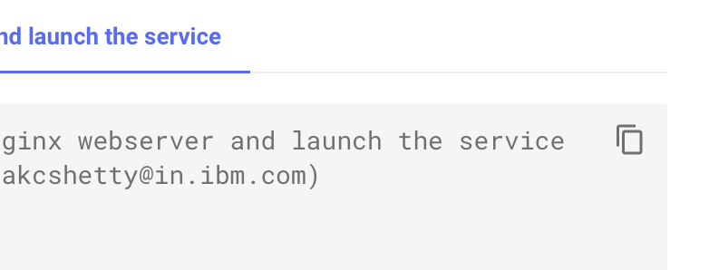
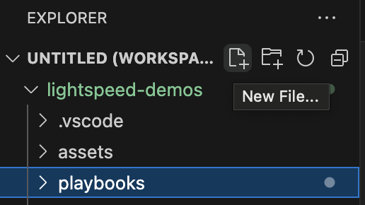
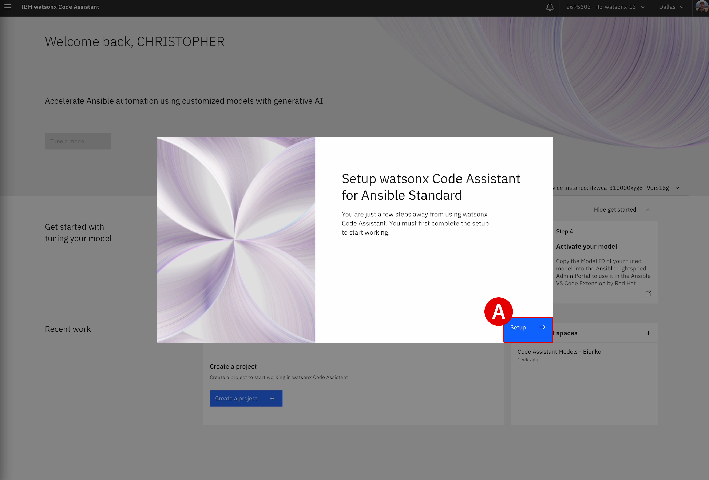
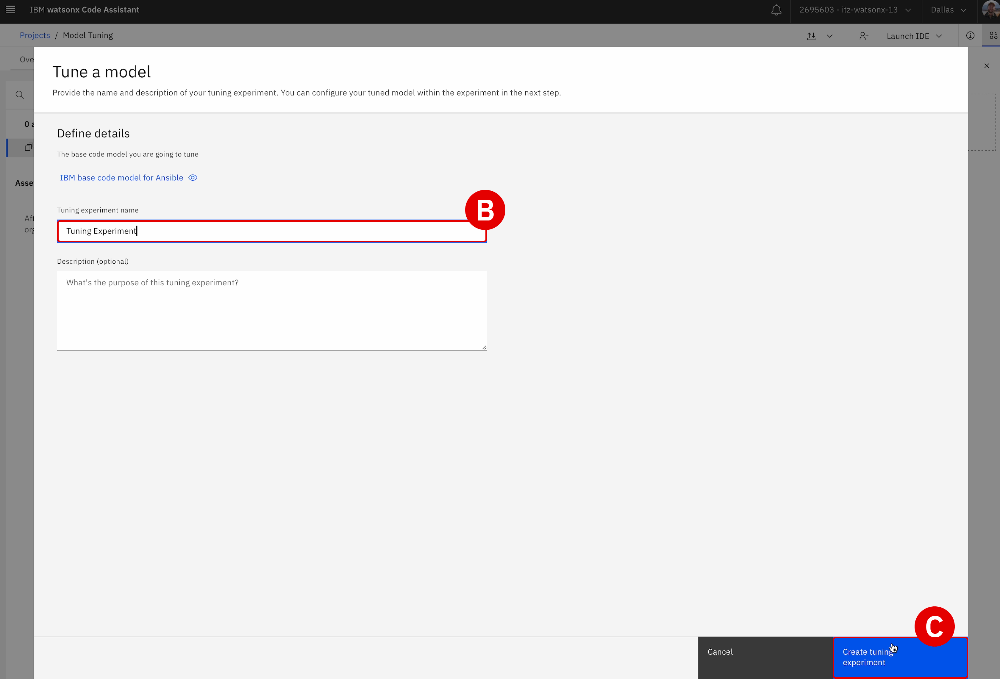
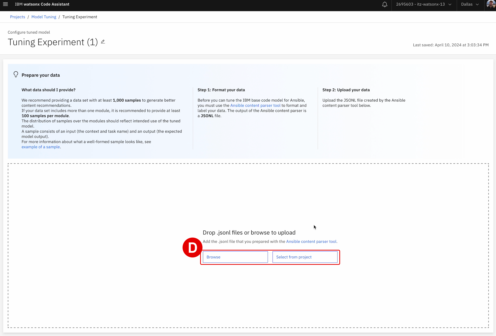
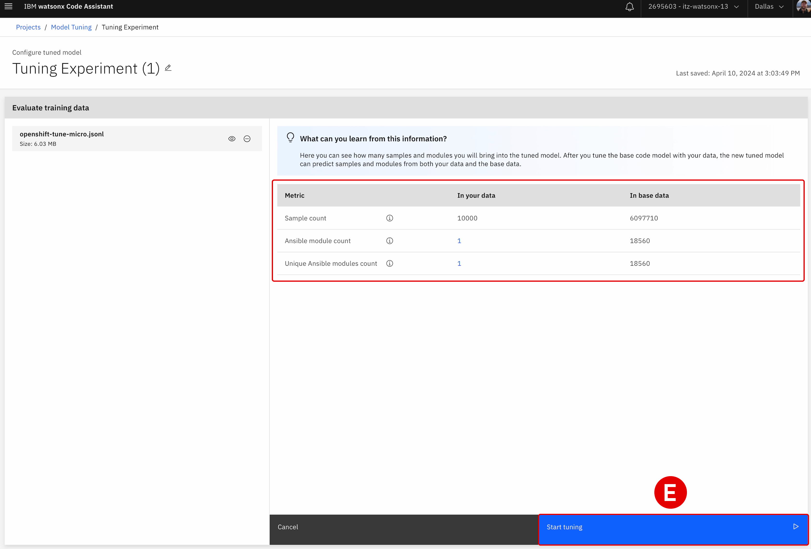
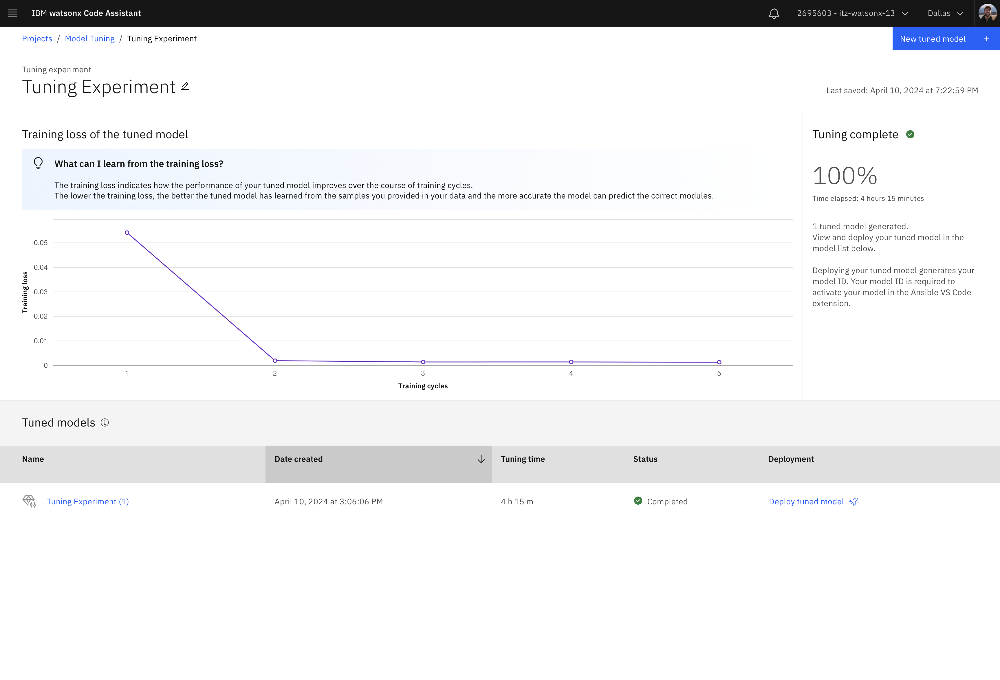
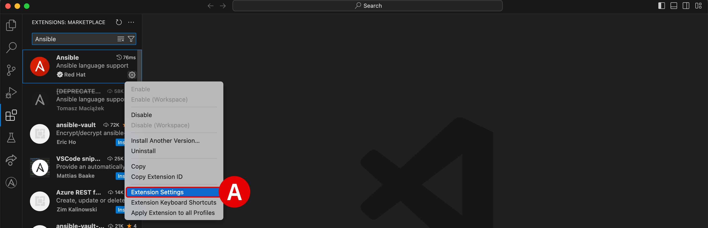

#


!!! quote ""
    Christopher Bienko *(Principal, IBM Global Sales Enablement)* demonstrates key elements of the `Task Description Tuning and Model Customization` module. *<a href="https://ibm.seismic.com/Link/Content/DC3jTJ8DXqj32GfHc4PfBDgWFgGB" target="_blank">[15 min]</a>*

## **i. Fine-tuning task prompts**

In this section, you will experiment with customized Ansible Playbooks and test how changes made to an Ansible Task's natural language descriptions can impact the recommended code produced by *IBM watsonx Code Assistant for Red Hat Ansible Lightspeed* (**WCA**).

!!! note "UNPREDICTABLE RESULTS FROM GENERATIVE AI & LLMs"

    A consequence of using generative AI and Large Language Models (LLMs) is that the recommended code output of these systems will never be 100% consistent for each and every execution. For this reason, LLMs are referred to as "non-deterministic" systems — as opposed to "deterministic" systems. This is both a strength and weakness of LLMs. As you will observe in this module, even a slight modification to the Task description or the smallest change to how a Playbook is structured— the descriptions used, the variables set, and so on —will influence AI-generated code recommendations.

    The iterative process that you will go through in this module can be viewed in three different ways:

      1. On the one hand, it shows the sensitivity of generative AI models to even the most nuanced change in **natural language prompts** — for good or bad. Generative AI can produce tremendous work and that output is further guided along by best practices built-in from Red Hat and IBM. But in the end, the AI can only infer user intent from the natural language descriptions supplied to it. The more clearly a user defines their Task descriptions and intent, the more likely that WCA will correctly generate code which mirrors that intent; conversely, the less precise those descriptions are, the more likely WCA will misinterpret and miss the mark. Precision *is* key for the disambiguation of natural language prompts.

      2. Human feedback and **humans-in-the-loop** are essential to these formative stages of generative AI. As offerings like WCA mature, the natural language processing capabilities of the service will continue to be refined and improved. Additional packages, functions, and training data from Ansible Galaxy (as well as other sources) are continuously being added to IBM Granite's LLMs for code, which will in turn continually improve the AI-generated code recommendations made to users.

      3. By using the **Model Tuning** capabilities built into WCA, organizations and users are able to customize the recommendations produced by the service, tuning a domain-specific LLM with the organization's *own* Ansible Playbooks. The content and code recommendations that WCA suggests can be tailored to an organization's standards, best practices, and programming styles. These capabilities will be explored later in this module.

The take-away here is that **your results may vary**: they may differ from the `SOLUTION` code presented in the steps below. Keep this in mind as you work through the examples in this section and understand that it is not a bug, but rather a consequence of working with generative AI in general.

The precision with which a Playbook author describes Ansible Tasks in natural language will determine the accuracy and effectiveness of WCA's generated code recommendations.

---

1. A template `CUSTOM PLAYBOOK #1` YAML file has been prepared for you below.

    - Copy and paste the code from the `TEMPLATE` tab into a **New File...** within VS Code

    - Name and save the file as you see fit: for example, `customplaybook1.yml`

    ??? quote "HOW TO CREATE NEW `YAML` PLAYBOOKS"

        **Note:** You need to copy and paste the contents of the Playbook into a **New File...** within the *same* Lightspeed project directory that was used for the previous lab modules in order for the VS Code extension to engage.

        To create a new YAML Playbook within a VS Code environment:
        
        **a.** Copy the contents of the Playbook to clipboard using the button in the top-right corner of the lab guide code block.
        
        {: loading=lazy width="400"}

        **b.** Return to your VS Code environment. In the top-left corner of the interface, with your Ansible Lightspeed folder selected, click the **New File...** button.
        
        {: loading=lazy width="400"}

        **c.** Name the file to a description of your choosing, ending with `.yml` as the filetype. Set it to `CustomPlaybook.yml`, for example. Save it to one of the directories in the `ansible-wca-demo-kit` folder.

        **d.** Paste the clipboard contents into the YAML file and follow along with the suggestions below.

    ??? quote "COPY AND PASTE CODE WITHIN THE VM"

        Information "copied" to your local machine's clipboard cannot be "pasted" directly into the virtual machine (VM) environment or VS Code. If you wish to copy and paste instructions directly from the lab documentation, it is recommended that you open the GitHub instructions **inside** the VM's web browser (Firefox). This will allow you to copy instructions to the VM's clipboard and paste instructions inside the VS Code editor.

    ??? quote "ANSIBLE LIGHTSPEED IS MISSING OR CODE RECOMMENDATIONS ARE NOT GENERATING"
        Ansible Lightspeed and WCA will only generate code recommendations for *Ansible Playbooks* and *YAML* files. VS Code will typically auto-detect the programming language of the document you're working with, but on occassion you may need to manually specify the language. Even if working with a YAML file, you'll still need to specify the language mode as `Ansible` for the Lightspeed plugin to engage.

        To set the language mode correctly:

        - In the bottom-right corner of the VS Code interface, hover over the **Select Language Mode** toggle^[A]^

        - A console will appear at the top of VS Code with a drop-down list of options^[B]^

        - Click `Ansible` from the suggested languages, or enter the text yourself and hit ++return++

        - Confirm that the Select Language Mode toggle in the bottom-right corner displays `Ansible`

        <br/>
        {: loading=lazy width="600"}

        {: loading=lazy width="600"}

    === "CUSTOM PLAYBOOK 1"

        ``` yaml linenums="1"
        # CUSTOM PLAYBOOK #1 — Invoke 2 modules to automatically update 2 types of servers.

        ---
        # TASK 1
        - name: Update web servers
          hosts: webservers
          become: true

          tasks:
            - name: Ensure apache is at the latest version

            - name: Write the apache config file

        # TASK 2
        - name: Update db servers
          hosts: databases
          become: true

          tasks:
            - name: Ensure postgresql is at the latest version

            - name: Ensure that postgresql is started
        ```
    
---

2. The template `CUSTOM PLAYBOOK #1` contains two sets of tasks:

    - `TASK 1` (**Lines 5-12**) checks if the web server software is up to date and runs an update if necessary

    - `TASK 2` (**Lines 15-22**) checks if the database server software is up to date and runs an update if necessary

---

3. Examine the instruction on **Line 12**, which prompts Ansible to create ("write") a configuration file for an Apache webserver:
``` yaml
- name: Write the apache config file
```

---

4. Place your cursor at the end of **Line 12** and press ++return++ to generate WCA-recommended code for the task. Accept the recommendation by pressing ++tab++.

    Two tabs are presented below:
    
    - ```AI-GENERATED CODE``` shows the output from running WCA's generative AI capabilities on **Line 12** of the unmodified *CUSTOM PLAYBOOK #1* YAML template.
  
    - ```SOLUTION CODE``` shows the expected (correct) code for performing the task that was written by a human programmer. In theory, the AI-generated code *should* be as good— or even superior to —the manually-written solution code. 

        === "AI-GENERATED CODE"

            ``` yaml linenums="1"
            - name: Write the apache config file
            ansible.builtin.template:
                src: templates/apache.conf.j2
                dest: /etc/apache2/sites-available/000-default.conf
                owner: root
                group: root
                mode: '0644'
            ```

        === "SOLUTION CODE"

            ``` yaml linenums="1"
            - name: Write the apache config file
            ansible.builtin.template:
                src: /srv/httpd.j2
                dest: /etc/httpd.config
                mode: "0644"
            ```

---

5. As you can see, the `AI-GENERATED CODE` recommendations satisfy some of the requests, but also miss the mark in a few areas. When compared to the `SOLUTION CODE` tab:

    - Both tabs appropriately utilize the `ansible.builtin.template` Module, which for this request is absolutely correct. **Interesting fact:** earlier (circa 2023) versions of WCA produced code recommendations for the *same task* as this one, which *did not* align with the expected solution. Instead, the recommendation was for the `ansible.builtin.copy:` Module to invoke `content: "{{ _content_ }}"`, which is not correct. This speaks to the continuously improving capabilities of the WCA and IBM Granite models.

    - `AI-GENERATED CODE` recommended including statements that explicitly set `owner: root` and `group: root`, which are both appropriate when permissions are set to `mode: '0644'`. While not strictly necessary, these additional statements arguably are an *improvement* over the `SOLUTION CODE` results. It's also worth noting that the request to write the apache config file did not explicitly request `mode: '0644'` in the natural language description, but WCA nevertheless recommended it (post-processing) as this is a best practice for deploying Apache webservers.

    - The `src` and `dest` variables are not in agreement across the `AI-GENERATED CODE` and `SOLUTION CODE` tabs. This is an area for improvement. The natural language description wasn't precise about these details; therefore, this is an opportunity where more detailed and verbose instructions could better steer the recommendations WCA returns back with. 

        !!! note ""
            In general, **the more ambiguous the Task description, the greater the likelihood that WCA will misinterpret the author's intent** and suggest unwanted Ansible automation jobs. To help disambiguate our intention, Playbook authors should use more precise natural language terms and descriptions.

---

6. Delete the WCA-suggested lines of code from *Step 4* from the Playbook.

    - Rewrite the description on **Line 12** to the following code block, then press ++return++ and ++tab++ to accept the new WCA code recommendations
    
    - Take note of the much more precise language used to describe the `src` and `dest` variables

        ``` yaml
        - name: Write the apache config file where src equals httpd.j2 and dest equals httpd.config
        ```

---

7. The resulting WCA-recommended code should be similar to the `AI-GENERATED CODE` tab below. When compared to the `SOLUTION CODE` tab:

    - The `src: httpd.j2` recommendation in the `AI-GENERATED CODE` tab is an exact match to the natural language description set in *Step 6*, and only slightly different (in terms of the directory path used) to the `src: /srv/httpd.j2` variable in the `SOLUTION CODE` tab.

    - The `dest: /etc/httpd/conf/httpd.conf` recommendation in the `AI-GENERATED CODE` tab, unfortunately, still deviates from the `httpd.config` (not the same as `httpd.conf`) destination that was requested in the natural language description. Close, but still far from exact and not matching our specifications. However, it's a vast improvement over the `dest: /etc/apache2/sites-available/000-default.conf` destination that was recommended as a result of *Step 4*'s more ambiguous task description.

    - Perplexingly, the `mode: '0644'` recommendation that was made previously in *Step 4* has been left out of the suggested task code. We can speculate as to why— perhaps the more precise natural language description made in *Step 6* prompted WCA to only generate code for exactly what was specified —but the "black box" nature of generative AI means that we cannot know for certain. Perhaps with another, even more precise iteration the `AI-GENERATED CODE` will match the `SOLUTION CODE`?

        === "AI-GENERATED CODE"

            ``` yaml linenums="1"
            - name: Write the apache config file where src equals httpd.j2 and dest equals httpd.config
            ansible.builtin.template:
                src: httpd.j2
                dest: /etc/httpd/conf/httpd.conf
            ```

        === "SOLUTION CODE"

            ``` yaml linenums="1"
            - name: Write the apache config file
            ansible.builtin.template:
                src: /srv/httpd.j2
                dest: /etc/httpd.config
                mode: "0644"
            ```

---

8. Iterate on the lessons learned in *Step 7* and modify the task description to include more details on the permissions applied to the Apache webserver.

    - Delete the WCA-suggested lines of code from *Step 6* from the Playbook.

    - Re-write the description on **Line 12** to the following code block, then press ++return++ and ++tab++ to accept the new WCA code recommendations. Take note of the much more precise language used to describe the `mode` variable.

        ``` yaml
        - name: Write the apache config file where src equals httpd.j2 and dest equals httpd.config and mode equals 0644
        ```

---

9. Once again, the resulting WCA-recommended code should be similar to the `AI-GENERATED CODE` tab below. When compared to the `SOLUTION CODE` tab:

    - WCA correctly picked up on the `mode: '0644'` request made in the modified task description. There is now alignment between the two tabs.

    - With only a few iterations and by disambiguating the natural language description of the Ansible Task to be performed, the code recommendations produced by WCA have been markedly improved.

        === "AI-GENERATED CODE"

            ``` yaml linenums="1"
            - name: Write the apache config file where src equals httpd.j2 and dest equals httpd.config and mode equals 0644
            ansible.builtin.template:
                src: httpd.j2
                dest: /etc/httpd/conf/httpd.conf
                mode: '0644'
            ```

        === "SOLUTION CODE"

            ``` yaml linenums="1"
            - name: Write the apache config file
            ansible.builtin.template:
                src: /srv/httpd.j2
                dest: /etc/httpd.config
                mode: "0644"
            ```


---

## **ii. Model customization**

Since every organization is different, WCA allows users to customize the AI model output to your organization's unique Ansible Playbooks. This allows for personalized code recommendations that are a better fit to your business' unique needs and more reflective of the programming standards set within your organization.

In this scenario, your organization has its own set of Ansible Playbooks that leverage your preferred cloud provider, that uses specific Ansible Modules to manage OpenShift clusters.

---

10. Open the `create-openshift-cluster-ibm-cloud.yml` Playbook located within the `Model Customization` subdirectory of the hands-on lab templates. The full directory address, as well as the Playbook code, are encapsulated in the following code block.

    === "~/ansible-wca-demo-kit/Model Customization/create-openshift-cluster-ibm-cloud.yml"

        ``` yaml linenums="1"
        ---
        - name: Deploy infrastructure
          hosts: all
        
          tasks:
            - name: Create an OpenShift cluster
        ```

    ??? warning "ANSIBLE LIGHTSPEED IS MISSING OR CODE RECOMMENDATIONS ARE NOT GENERATING"
        Ansible Lightspeed and WCA will only generate code recommendations for *Ansible Playbooks* and *YAML* files. VS Code will typically auto-detect the programming language of the document you're working with, but on occassion you may need to manually specify the language. Even if working with a YAML file, you'll still need to specify the language mode as `Ansible` for the Lightspeed plugin to engage.

        To set the language mode correctly:

        - In the bottom-right corner of the VS Code interface, hover over the **Select Language Mode** toggle^[A]^

        - A console will appear at the top of VS Code with a drop-down list of options^[B]^

        - Click `Ansible` from the suggested languages, or enter the text yourself and hit ++return++

        - Confirm that the Select Language Mode toggle in the bottom-right corner displays `Ansible`

        <br/>
        {: loading=lazy width="600"}

        {: loading=lazy width="600"}

---

11. Before performing any model tuning tasks, try generating code recommendations for the OpenShift cluster creation task by placing your cursor at the end of **Line 6**, pressing ++return++, and then accepting the default recommendations by pressing ++tab++. The resulting code recommendations— displayed below —represent the standard, unmodified output from WCA's *IBM Granite* base models.

    - When using the standard *IBM Granite* model recommendations, it recommends making use of the `ansible.builtin.command` Ansible Module — which is a standard, best-practice way to perform these types of deployments.
    
    - However, *your* particular organization (and the public cloud provider they use for deploying OpenShift clusters) might require the use of different Ansible Modules. The following steps will explore how to tailor WCA-generated code blocks to the unique needs of a business.

    === "STANDARD *IBM GRANITE* MODEL RECOMMENDATIONS"

        ``` yaml linenums="1"
        ---
        - name: Deploy infrastructure
          hosts: all
        
          tasks:
            - name: Create an OpenShift cluster
              ansible.builtin.command: oadm create-cluster --wait=false --name=openshift-cluster
              register: oadm_create_cluster
              changed_when: "'created' in oadm_create_cluster.stdout"
              failed_when: "'already exists' not in oadm_create_cluster.stdout"
        ```

    !!! note "DATA PREPARATION & MODEL TRAINING"

        Given the scope and time available for this hands-on training, **participants will not be manually creating the training data or training models themselves.** Instead, you will utilize a prepared customized model (`Model ID`) and experiment from *Step 12* and onwards with how the tuned `Model ID` impacts WCA's code recommendations.

        - The process of building Ansible training data and tuning customized models for generative AI is potentially a complex and time-consuming one. 

        - For example, the model tuning employed in the steps ahead for the creation of an OpenShift cluster according to an enterprise organization's specific standards requires approximately **4 hours** to train and generate a customized AI model.

        In preparation for model tuning, an organization or user can transform their existing Playbooks into training data for WCA using the open-source **<a href="https://github.com/ansible/ansible-content-parser" target="_blank">Ansible Parser Tool</a>**. The tool analyzes Ansible Playbooks and generates a single **JSONL** (`ftdata.jsonl` formatted) file that can be uploaded to WCA's model tuning studio for developing customized AI models.

        - The process of calibrating and running the Ansible Parser Tool is time-consuming and potentially complex, depending on the scope of Playbooks that an organization wishes to analyze and prepare for model tuning. This falls outside the scope of the hands-on material for this training.

        - For the purposes of demonstration, a preconfigured `openshift-tune-micro.jsonl` was used for the model tuning example.

        With the Ansible training data prepared, the *IBM watsonx Code Assistant* on IBM Cloud service was configured to execute a new model tuning experiment.

        - WCA provides a graphical user experience^[A]^ to streamline the model tuning and customization process

        - **Tuning experiment name**^[B]^ set to `Tuning Experiment` and confirmed with **Create tuning experiment**^[C]^

        - The `openshift-tune-micro.jsonl` training data from Ansible Parser Tool is uploaded into WCA^[D]^

        - A summary of metrics— including parameters for sampling and Ansible modules —are displayed within the model tuning wizard before **Start tuning**^[E]^ is selected to kick off the model tuning operating

        - After the tuning operation has ended, a training loss graph reveals how accurate the model's predictions are over the training data set, across multiple tuning cycles
        
        - As the number of tuning cycles increase, the training loss rating will tend to decrease

        - Model tuning for these particular metrics and parameters takes approximately **4 hours** to complete

        ??? quote "CLICK TO EXPAND — ACCOMPANYING SCREENSHOTS"
        
            <br/>

            {: loading=lazy width="600"}

            {: loading=lazy width="600"}

            {: loading=lazy width="600"}

            {: loading=lazy width="600"}

            {: loading=lazy width="600"}

---

12. To **override** the *IBM Granite* base model recommendations, you must provide a pointer to a customized *Model ID* (prepared and hosted earlier on WCA) using the VS Code extension.

    !!! warning ""

        **Custom Model ID**:
        ```
        b66600aa-cf5d-488f-9144-800f99598829<|sepofid|>c8e09d5f-298c-46f5-9af3-805a02d6da8f
        ```

    - Look for Ansible under the *Installed* services in the **Extensions** panel.

    - Click the **Manage** ("cogwheel") icon located just to the right of the Ansible tile

    - From the drop-down options, click **Settings**^[A]^

    - Within the search bar at the top of the panel, add the text `Model` to filter the results^[B]^

    - Copy and paste the **Model ID** value (above) into the empty `Ansible > Lightspeed: Model ID Override` field^[C]^, then click the `X` in the top-left corner of the panel to save and exit *Settings*

        {: loading=lazy width="600"}

        {: loading=lazy width="600"}

---

13. With the tuned model, WCA will recommend code using modules, functions, and other details specific to your organization's private IT environment.

    - Return to the `tuning-example.yml` Playbook from *Step 10* and delete the code recommendations generated in *Step 11*
    
    - Regenerate the code recommendations for the task by placing your cursor at the end of **Line 6**, hitting ++return++, and then ++tab++
    
    - Observe how the tuned *Model ID* has modified WCA's code recommendations by toggling between the `TUNED MODEL` and `STANDARD MODEL` tabs below

        === "TUNED MODEL"

            ``` yaml linenums="1"
            ---
            - name: Create an OpenShift cluster
	            community.vmware.vmware_container_cluster:
		            name: cluster-0001
		            zone: xxxx-xxxx-xxxx
		            network: xxxx-xxxx-xxxx
		            os_type: Linux
		            datastore: datastore-001
		            profile: Standard
		            enable_auto_scaling: true
		            enable_ip_forwarding: true
		            enable_auto_security_groups: true
		        auto_security_groups:
			        - name: cluster-001-sg-001
                        id: sg-001
            ```

        === "STANDARD MODEL"

            ``` yaml linenums="1"
            ---
            - name: Deploy infrastructure
            hosts: all
            
            tasks:
                - name: Create an OpenShift cluster
                ansible.builtin.command: oadm create-cluster --wait=false --name=openshift-cluster
                register: oadm_create_cluster
                changed_when: "'created' in oadm_create_cluster.stdout"
                failed_when: "'already exists' not in oadm_create_cluster.stdout"
            ```

---

Using the tuned *Model ID*, WCA has returned a recommendation to use the `ibm.cloudcollection.ibm_container_cluster` Module for the IBM Cloud, instead of the standard `ansible.builtin.command` Module from *Step 11*. This more accurately conforms to the organization's Ansible automation standards and requirements.

!!! warning "REMOVE THE CUSTOMIZED *MODEL ID* WHEN FINISHED"

    Remember to **clear** the `Ansible > Lightspeed: Model ID Override` in the *Settings* after you have completed *Step 13*, otherwise all subsequent code generation requests made to WCA will be produced using the tuned AI model.

---

## **iii. Conclusion**

This concludes the hands-on components of the Level 3 course, but your learning and experimentation doesn't need to end here. Participants are encouraged to follow the <a href="https://ibm.github.io/WCA-AnsibleLightspeed-L3/evaluation/" target="_blank">Level 3 accreditation</a> steps (depending on your role).