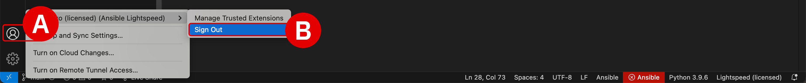

#


!!! quote ""
    Christopher Bienko *(Principal, IBM Global Sales Enablement)* demonstrates key elements and hands-on components of the `Generating Code` module. *[10 min]*

## **i. Generating Code with IBM watsonx Code Assistant for Red Hat Ansible Lightspeed**

An **Ansible Task** is a statement in Ansible's automation script (the YAML-based Playbooks you will be working with) that declares a single action to be executed. This might be installing a package, copying a file, or shutting down a service on a remote machine. Each *Task* represents an idempotent operation (an action that can be repeated multiple times and deliver the same result every time) that aligns the remote managed node to the specified state. Idempotent operations also ensure consistency across multiple executions, guaranteeing the same steps are taken on each execution of the task.

After you have learned the fundamentals of generating Ansible Task code blocks using *IBM watsonx Code Assistant for Red Hat Ansible Lightspeed* (**WCA**), you'll be ready to shape and tailor the AI-generated code recommendations using WCA's model tuning capabilities.

---


---

## **ii. Single task Ansible operations**

The process of creating AI-generated **code recommendations** is as simple as modifying the natural language (plain English) Task descriptions of an action that is to be executed, which always start with `- name:` and are followed by some description of the task to be performed. Ansible Tasks are often preceded with the prefix `#`, indicating developer comments or documentation. After the natural language description of the automation Task has been set by the user, WCA handles the rest.

WCA is also capable of generating multiple Ansible Tasks from more complex natural language descriptions— what is referred to as **multi-task** code generation —which you will experiment with later in this module. However, to get started, let's begin with the basics of generating code for **single task** use cases.

---

1. Begin by opening the `install_cockpit_single-task.yml` Playbook from the list of assets in the Explorer browser.

    - Click the **Explorer** tab from the left-hand interface^[A]^
    - Drill down into the `Install and configure Cockpit using Ansible` subdirectory^[B]^
    - Double-click the `install_cockpit_single-task.yml` Playbook
    - A replica of the Playbook code is also included below in the documentation

    <br/>
    !!! warning inline ""
        The red highlighting within the editor reminds users that the `tasks:` section contains no valid `-name:` task definitions. This is part of WCA's code validation process which runs automatically and alerts users to syntax errors in their code. You can safely ignore these warnings for now, as you will be un-commenting and generating valid `-name:` task definitions in the following steps.
    {: loading=lazy width="400"}

---

=== "~/Documents/ansible-wca-demo-kit/install and configure Cockpit using Ansible/install_cockpit_single-task.yml"

``` yaml linenums="1"
---
- name: Install and configure Cockpit
  hosts: rhel
  become: true

  # module_defaults:
  #   ansible.builtin.service:
  #     enabled: true
  #     state: started

  tasks:
        # TASK 1
        # # 1a. Uncomment task description below and generate a task suggestion.
        # #     Note - The suggestion included Ansible best practices by using Fully Qualified Collection name.
    # - name: Install cockpit package

        # TASK 2
        # # 2a. Uncomment task description below and generate a task suggestion.
        # #     Note - Ansible Lightspeed used "ansible.builtin.template" module based on the ".j2" file extension.
        # #     Note - The suggestion set the file permissions ("0644"), owner, and group based on Ansible best practices.
    # - name: Copy cockpit.conf.j2 to /etc/cockpit

        # TASK 3
        # # 3a. Uncomment task description below and generate a task suggestion.
        # #     Note - Ansible Lightspeed used the generic "Start and enable service" prompt
        # #            and full Playbook context to infer the recommendation should start the "cockpit" service.
        # # 3b. Uncomment the "module_defaults" section at the top of the Playbook.
        # # 3c. Clear current task suggestion and request updated suggestion.
        # #     Note - Ansible Lightspeed used the full Playbook context and evaluated the "module_defaults"
        # #            when generating a suggestion.
        # #            The updated suggestion no longer includes "enabled:" and "state:" arguments.
    # - name: Start and enable service

        # TASK 4
        # # 4a. Uncomment task description below and generate an Ansible Playbook task suggestion.
        # # 4b. Save the Playbook.
    # - name: Wait 15 seconds port 9090

```

---

The `install_cockpit_single-task.yml` Playbook code above warrants some explanation before we move on with making AI-generated modifications to it:

- **Line 2** essentially marks the beginning of the Playbook instructions, the purpose of which is to automate the process of installing and configuring **<a href="https://www.redhat.com/en/blog/automate-rhel-web-console-deployments-cockpit-and-certificate-rhel-system-roles" target="_blank">Cockpit</a>** for Red Hat Ansible.

- **Lines 3-4** define variables that will remain static throughout the remainder of the Playbook. These variables will be referenced by the AI-generated code suggestions at a later stage. This is a key capability of the offering and one which you will explore in much finer details later on in this module.

- **Lines 6-9** are variables which have been *commented out* and therefore are invisible to the execution of the Ansible script **and** not examined by WCA for context when generating code recommendations. You will experiment with how removing the `#` comment blocks impacts the recommendations of task block code. "Uncommenting" these lines of code will make them viable for execution and these lines will afterwards be considered as valid Playbook "context" for AI code generation.

---

2. Locate `TASK 1` on **Line 15** of the YAML file, which handles installation of <a href="https://www.redhat.com/en/blog/automate-rhel-web-console-deployments-cockpit-and-certificate-rhel-system-roles" target="_blank">**Cockpit**</a> for Ansible. Cockpit is an interactive server administration interface that provides a graphical overview of statistics and configurations for a system or systems within a network. 

    ``` yaml
        # - name: Install cockpit package
    ```

    Pay attention to the indentation and characters used on **Line 15**, which in sequence from left to right are as follows:

    - begins with ++tab++ (or ++space++ whitespaces) for indentation
    - a `#` character to "comment out" the line's contents
    - a whitespace ++space++ character
    - `- name: ` which signifies the start of a Task definition
    - and finally the natural language description of the Task

    !!! note "INDENTATION LEVELS AND WHITESPACE"

        Similar to Python, Ansible and YAML-based Playbooks are very sensitive to whitespacing and indentation. Indentations (such as the ++tab++ in this example) denote different hierarchies and code nesting levels within the YAML structure.
        
        You may use ++space++ instead of ++tab++ if you prefer, but be sure to **use indentations consistently**: choose to use either ++tab++ or ++space++ for indenting lines of code, and do not interchange between the two.

---

3. To generate code for `TASK 1`, first **uncomment** the line of code (remove the `#` character from the start of a line).
    - Highlight the line(s) of code you wish to uncomment and then press ++cmd+question++ for macOS or ++ctrl+question++ for Windows
    - You can repeat those keystrokes with the line(s) selected to toggle between commenting or uncommenting lines of code
    - *Tip:* commented out lines of code in VS Code will appear as green text

        <br/>
        
        Afterwards, **Line 15** should look like the following — beginning with a single ++tab++
    
    ``` yaml
        - name: Install cockpit package
    ```

---

4. Now you are ready to begin generating code. Place your cursor on **Line 15** and hit ++return++
    - Wait for WCA to engage and generate the suggested (in *grey, italicized text*) code block for executing the task
    - This temporary code suggestion is entirely generated by AI
    - As a user, you have the option to either:
        1. **Accept** the code recommendation as-given by pressing ++tab++
        2. **Modify** the recommended code by highlighting and replacing the italicized text

    ??? quote "FAILED TO CONNECT TO THE SERVER / `"YOU DON'T HAVE ACCESS TO IBM WATSONX..."`"
        This warning will occur when the Ansible plugin for VS Code needs to be re-authenticated with WCA. It can occur after an extended period of inactivity or a system restart. For example, if your lab environment is running inside a VM, pausing or restarting the VM may produce this error.

        To re-authenticate:

        - **Sign out** from the *VS Code* application by clicking the User icon^[A]^ in the bottom-left corner of the interface, hover over your username, and then click **Sign Out**^[B]^

        - **If you are running this environment inside a virtual machine (VM)**, closing and restarting the VM *will not* resolve the issue — you must sign out from the *VS Code* application, not the VM

        - Once logged out, follow from *Step 7* of the *Setup & Troubleshooting* to re-authenticate with WCA

        <br/>
        {: loading=lazy width="600"}


    ??? quote "CODE RECOMMENDATIONS ARE NOT GENERATING"
        Ansible Lightspeed and WCA will only generate code recommendations for *Ansible Playbooks* and *YAML* files. VS Code will typically auto-detect the programming language of the document you're working with, but on occassion you may need to manually specify the language. Even if working with a YAML file, you'll still need to specify the language mode as `Ansible` for the Lightspeed plugin to engage.

        To set the language mode correctly:

        - In the bottom-right corner of the VS Code interface, hover over the **Select Language Mode** toggle^[A]^

        - A console will appear at the top of VS Code with a drop-down list of options^[B]^

        - Click `Ansible` from the suggested languages, or enter the text yourself and hit ++return++

        - Confirm that the Select Language Mode toggle in the bottom-right corner displays `Ansible`

        <br/>
        {: loading=lazy width="600"}

        {: loading=lazy width="600"}


    ??? quote "`"ANSIBLE-LINT IS NOT AVAILABLE."`"
        `ansible-lint` checks Playbooks for practices and behavior that could potentially be improved and can fix some of the most common ones for you. It will constantly check your Ansible syntax as you type and provide recommendations for how to improve it.
        
        - You can safely **ignore** this error if it occurs during the lab exercises

        - If you wish to install `ansible-lint` on your local machine, execute the following instruction within a Terminal console:

            ``` shell
            python3 -m pip install --upgrade --user ansible-lint
            ```

            {: loading=lazy width="600"}

---

5. Hit ++tab++ to accept the suggested code and then compare with the `SOLUTION` tab below.

    === "TEMPLATE"

        ``` yaml
        # TASK 1
        - name: Install cockpit package
        ```

    === "SOLUTION"

        ``` yaml
        # TASK 1
        - name: Install cockpit package
        ansible.builtin.package:
            name: cockpit
            state: present
        ```

    As part of the plain-text description of the Task, WCA was asked to include the `cockpit` Role, part of the <a href="https://access.redhat.com/articles/3050101" target="_blank">Red Hat Enterprise Linux System Roles</a> Certified Content Collection. The AI-generated code suggestion invoked a <a href="https://docs.ansible.com/ansible/latest/collections_guide/collections_using_playbooks.html" target="_blank">Fully Qualified Collection Name</a> (**FQCN**) - `ansible.builtin.package`

    Making use of FQCNs where possible is a recommended best practice and is a prime example of the many ways in which the offering infuses post-processing capabilities within the AI-generated code produced by WCA. 

---

6. Additional examples of infusing best-practices into AI-generated code recommendations can be found in  `TASK 2` (**Line 21** of the unmodified template or **Line 25** after *Step 5*):

    - Uncomment `- name: Copy cockpit.conf.j2 to /etc/cockpit`
    - Hit ++return++ to generate the task code recommendation and accept the AI-suggested code (without modifications) by pressing ++tab++
    - Compare your results with the `SOLUTION` tab below

    === "TEMPLATE"

        ``` yaml
        # TASK 2
        - name: Copy cockpit.conf.j2 to /etc/cockpit
        ```

    === "SOLUTION"

        ``` yaml
        # TASK 2
        - name: Copy cockpit.conf.j2 to /etc/cockpit
        ansible.builtin.template:
            src: cockpit.conf.j2
            dest: /etc/cockpit/cockpit.conf
            owner: root
            group: root
            mode: '0644'
        ```

    The AI-generated code recommendation will copy <a href="https://github.com/craig-br/demos/blob/main/blogs/lightspeed_tech_preview_jun2023/files/cockpit.conf" target="_blank">`cockpit.conf`</a> to the target host.

    Take note of the fact that the recommendation included the `mode:` argument and set the Linux file permissions to `0644`, neither of which were things explicitly requested in the Task `-name` description, but are both additions which adhere to best practices around defining Ansible automaton tasks. Setting a file permission to `0644` specifies read and write permissions for User and Group levels within the Linux OS, and provides only read permissions to all others.

---

## **iii. Multi-task Ansible operations**

Up to this point, we've kept a narrow aperture on AI-generated recommendations for single tasks — examining and experimenting with generating Ansible code task by task, one at a time. However, a powerful WCA feature is the ability to combine multiple task descriptions into a single natural language prompt; in turn, WCA is able to parse that instruction, decompose the instruction into discrete Ansible Task parts, and return a complete code recommendation for achieving the author's intended goal.

Syntactically, multiple tasks are combined into a single natural language expression through the use of **ampersand** (`&`) characters. Simply write out all the automation task descriptions on a single line, separating each description with a `&` character. The line must also *begin* with a `#` character for reasons that will be explained shortly.

---

7. To illustrate, let's look at a multi-task Ansible Playbook: `install_cockpit_multi-task.yml`

    - The contents of this Playbook should look familiar to you already: it is essentially the same Playbook examined in *Steps 1-6* (`install_cockpit_single-task.yml`), re-written in an equivalent multi-task expression
    
    - Each of the Task descriptions from the previous Playbook have been consolidated into a single description on **Line 12**, separated by `&` characters

    === "~/Documents/ansible-wca-demo-kit/install and configure Cockpit using Ansible/install_cockpit_multi-task.yml"

    ``` yaml linenums="1"
    ---
    - name: Install and configure Cockpit
    hosts: rhel
    become: true

    module_defaults:
        ansible.builtin.service:
        enabled: true
        state: started

    tasks:
        # Install cockpit package & Copy cockpit.conf.j2 to /etc/cockpit & Start and enable service & Wait 15 seconds port 9090
    ```

---

8. There are two crucial distinctions between *single task* and *multi-task* code generation: formatting and execution.

    - *Formatting*: Notice that **Line 12** does not begin with ` -name:`, as was the case with single task descriptions
    - *Execution*: In order to generate AI code recommendations for multi-task descriptions, **Line 12** must *stay commented out* (the `#` *must remain* at the start of the line)

    <br/>

    What is the rationale behind this? When WCA's generative AI capabilities parse **Line 12**, its output will include multiple `  -name:` tasks, each containing potentially multiple lines of instructions, based on how many `&`-delineated task descriptions are included on the line.
    
    Therefore, the way in which the code generation step is executed on **Line 12** is a consequence of the formatting decision. Execution of a code generation step on a commented-out (`#`) line containing `&` delineators is recognized by WCA as a unique case that will be acted upon as a multi-task statement.

---

9. Place your cursor at the end of **Line 12**, and *without* removing the `#` character, press ++return++ to execute the code generation step. Be aware that generating code for multi-task descriptions will take longer compared to a single task.

    Compare the `MULTI-TASK` solution tab with the `SINGLE TASK` solution (copied over from *Step 6*). How did the multi-task code generation fare compared to the single task approach?

    === "MULTI-TASK"

        ``` yaml linenums="1"
        ---
        - name: Install and configure Cockpit
        hosts: rhel
        become: true

        module_defaults:
            ansible.builtin.service:
            enabled: true
            state: started

        tasks:
            - name: Install cockpit package
            ansible.builtin.package:
                name: cockpit
                state: present

            - name: Copy cockpit.conf.j2 to /etc/cockpit
            ansible.builtin.template:
                src: cockpit.conf.j2
                dest: /etc/cockpit/cockpit.conf
                owner: root
                group: root
                mode: '0644'

            - name: Start and enable service
            ansible.builtin.service:
                name: cockpit.socket

            - name: Wait 15 seconds port 9090
            ansible.builtin.wait_for:
                port: 9090
                delay: 15
        ```

    === "SINGLE TASK"

        ``` yaml linenums="1" hl_lines="27 28 29"
        ---
        - name: Install and configure Cockpit
        hosts: rhel
        become: true

        module_defaults:
            ansible.builtin.service:
            enabled: true
            state: started

        tasks:
            - name: Install cockpit package
            ansible.builtin.package:
                name: cockpit
                state: present

            - name: Copy cockpit.conf.j2 to /etc/cockpit
            ansible.builtin.template:
                src: cockpit.conf.j2
                dest: /etc/cockpit/cockpit.conf
                owner: root
                group: root
                mode: '0644'

            - name: Start and enable service
            ansible.builtin.service:
                name: cockpit
                state: started
                enabled: true

            - name: Wait 15 seconds port 9090
            ansible.builtin.wait_for:
                port: 9090
                delay: 15
        ```

---

10. Comparing the two results, the only notable difference between the two approaches are **Lines 27-29** from the `SINGLE TASK` generative AI approach.

    Both the `SINGLE TASK` and `MULTI-TASK` suggestions for that particular task *satisfy* the request made by the user. However, whether the single task or multi-task approach resulted in a better code suggestion is up to the judgement of the programmer. Nearly 90% of the remaining code was identical between the two approaches and was achieved in far fewer lines of code (and less typing) using the multi-task approach.

    !!! warning ""
        The variability of generative AI suggestions is a fascinating topic and one that we will dive more deeply into with the module ahead.

---

11. Before moving on to other product features, experiment by creating a new Ansible Playbook in your workspace using the code template below. Suggestions will be given on how to perform the same automation task using single and multi-task generation approaches.

    - **Save** the YAML file as `create_ec2_single_multi.yml` (if you forget to save the file, WCA will not generate recommendations)

    - Copy the following code block to your clipboard using the ++plus++ icon in the top-right corner of the panel and paste into the newly created YAML file

    ??? quote "HOW TO CREATE NEW `YAML` PLAYBOOKS"

        **Note:** You need to copy and paste the contents of the Playbook into a **New File...** within the *same* Lightspeed project directory that was used for the previous lab modules in order for the VS Code extension to engage.

        To create a new YAML Playbook within a VS Code environment:
        
        **a.** Copy the contents of the Playbook to clipboard using the button in the top-right corner of the lab guide code block.
        
        {: loading=lazy width="400"}

        **b.** Return to your VS Code environment. In the top-left corner of the interface, with your Ansible Lightspeed folder selected, click the **New File...** button.
        
        {: loading=lazy width="400"}

        **c.** Name the file to a description of your choosing, ending with `.yml` as the filetype. Set it to `CustomPlaybook.yml`, for example. Save it to one of the directories in the `ansible-wca-demo-kit` folder.

        **d.** Paste the clipboard contents into the YAML file and follow along with the suggestions below.

    ??? quote "COPY AND PASTE CODE WITHIN THE VM"

        Information "copied" to your local machine's clipboard cannot be "pasted" directly into the virtual machine (VM) environment or VS Code. If you wish to copy and paste instructions directly from the lab documentation, it is recommended that you open the GitHub instructions **inside** the VM's web browser (Firefox). This will allow you to copy instructions to the VM's clipboard and paste instructions inside the VS Code editor.

    ??? quote "ANSIBLE LIGHTSPEED IS MISSING OR CODE RECOMMENDATIONS ARE NOT GENERATING"
        Ansible Lightspeed and WCA will only generate code recommendations for *Ansible Playbooks* and *YAML* files. VS Code will typically auto-detect the programming language of the document you're working with, but on occassion you may need to manually specify the language. Even if working with a YAML file, you'll still need to specify the language mode as `Ansible` for the Lightspeed plugin to engage.

        To set the language mode correctly:

        - In the bottom-right corner of the VS Code interface, hover over the **Select Language Mode** toggle^[A]^

        - A console will appear at the top of VS Code with a drop-down list of options^[B]^

        - Click `Ansible` from the suggested languages, or enter the text yourself and hit ++return++

        - Confirm that the Select Language Mode toggle in the bottom-right corner displays `Ansible`

        <br/>
        {: loading=lazy width="600"}

        {: loading=lazy width="600"}

    === "~/Documents/ansible-wca-demo-kit/create_ec2_single_multi.yml"

    ``` yaml linenums="1"
    ---
    - name: Provision an EC2 instance
      hosts: all
      tasks:
    ```

---

12. First, configure the Playbook for single task generation by adding the following code snippet into **Line 5** (remembering to properly indent with ++tab++ or ++space++ characters):

    ``` yaml
          - name: create vpc named demo
    ```

---

13. Your workspace Playbook should look identical to the `TEMPLATE` tab below. Place your cursor at the end of the newly-created **Line 5** and hit ++return++ to execute single task code generation. Compare your results to the `SOLUTION` tab. Record your results to a notepad so that you can compare the results later.

    === "TEMPLATE"

        ``` yaml linenums="1"
        ---
        - name: Provision an EC2 instance
          hosts: all
          tasks:
                - name: create vpc named demo
        ```

    === "SOLUTION"

        ``` yaml linenums="1"
        ---
        - name: Provision an EC2 instance
          hosts: all
          tasks:
                - name: create vpc named demo
                    amazon.aws.ec2_vpc_net:
                    name: demo
                    cidr_block: 10.0.0.80/16
                    tags:
                      Name: demo
                    tenancy: default
                  register: vpc
        ```

---

14. Now it's time to re-write the Playbook for multi-task code generation. The beauty of natural language statements is that your approach can be as terse or verbose as you want. The more verbose and descriptive, the more *prescriptive* you can be in terms of influencing the AI-generated code recommendations from WCA.

    The topic of *"prompt tuning"* will be explored in much greater detail in the <a href="https://ibm.github.io/wca-generative-ai-training/customizing/" target="_blank">Task Description Tuning and Model Customization</a> module. But for now: 
    
    - **Replace** all of the code inside `create_ec2_single_multi.yml` with the `TEMPLATE` code block (below)
    
    - Place your cursor at the end of **Line 5** (remember not to remove the `#` character) and hit ++return++, then accept the recommendation with ++tab++
        
    - Compare your results to the `SOLUTION` tab and to the result from *Step 13*

    === "TEMPLATE"

        ``` yaml linenums="1"
        ---
        - name: Provision an EC2 instance
          hosts: all
          tasks:
                # create vpc named demo & create security group for demo vpc and allow ssh and http & create internet gateway named demogateway for demo vpc & create subnet named demosubnet in demo vpc & create route table for subnet demosubnet and gateway demogateway & create t2.small ec2 instance in subnet demosubnet
        ```

    === "SOLUTION"

        ``` yaml linenums="1"
        ---
        - name: Provision an EC2 instance
          hosts: all
          tasks:
                # create vpc named demo & create security group for demo vpc and allow ssh and http & create internet gateway named demogateway for demo vpc & create subnet named demosubnet in demo vpc & create route table for subnet demosubnet and gateway demogateway & create t2.small ec2 instance in subnet demosubnet
                - name: Create vpc named demo
                  amazon.aws.ec2_vpc_net:
                    name: demo
                    cidr_block: 10.0.0.80/16
                    tags:
                      Name: demo
                    tenancy: default
                  register: vpc

                - name: Create security group for demo vpc and allow ssh and http
                  amazon.aws.ec2_security_group:
                    name: demo
                    description: demo security group
                    vpc_id: "{ vpc.vpc.id }"
                    rules:
                      - proto: tcp
                        from_port: 22
                        to_port: 22
                        cidr_ip: 0.0.0.0/0
                      - proto: tcp
                        from_port: 80
                        to_port: 80
                        cidr_ip: 0.0.0.0/0
                  register: sg

                - name: Create internet gateway named demogateway for demo vpc
                  amazon.aws.ec2_vpc_igw:
                    vpc_id: "{ vpc.vpc.id }"
                    tags:
                      Name: demogateway
                  register: igw

                - name: Create subnet named demosubnet in demo vpc
                  amazon.aws.ec2_vpc_subnet:
                    cidr: 10.0.0.80/24
                    vpc_id: "{ vpc.vpc.id }"
                    tags:
                      Name: demosubnet
                  register: subnet

                - name: Create route table for subnet demosubnet and gateway demogateway
                  amazon.aws.ec2_vpc_route_table:
                    vpc_id: "{ vpc.vpc.id }"
                    tags:
                      Name: demosubnet
                    subnets:
                      - "{ subnet.subnet.id }"
                    routes:
                      - dest: 0.0.0.0/0
                        gateway_id: "{ igw.gateway_id }"
                  register: route_table

                - name: Create t2.small ec2 instance in subnet demosubnet
                  amazon.aws.ec2_instance:
                    key_name: "{ _key_name_ }"
                    instance_type: t2.small
                    image: "{ _image_ }"
                    wait: true
                    vpc_subnet_id: "{ subnet.subnet.id }"
                    security_group: demo
                  register: ec2

        ```

    !!! warning "`TIMEOUT` WARNING"
        It may take several moments for WCA to process and return code recommendations for a multi-task description as complex as this one. If you receive a time-out warning, try executing the code generation step by pressing ++enter++ a second time.

---

## **iv. Next steps**

In the next section, you will examine in detail WCA's post-processing and content source attribution capabilities.