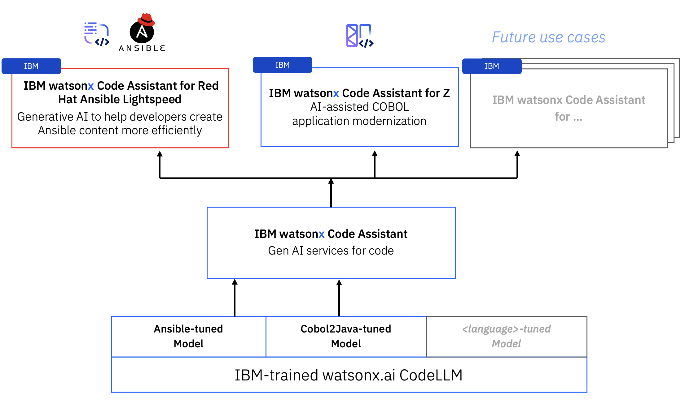
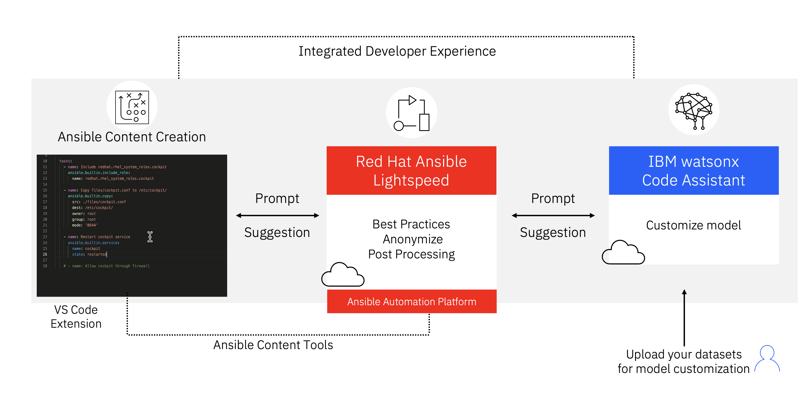

!!! quote ""
    **Christopher Bienko** (*IBM, Learning Content Development*) introduces IBM watsonx Code Assistant's generative AI capabilities and lays the groundwork for the hands-on training that will follow. *[6 min]*

 

# **80%** of the product development lifecycle will make use of generative AI-derived code by 2025 `—Gartner`

Take a moment to consider just how much code that 80% represents — and how quickly generative AI has moved to the forefront of nearly every industry.

What began to simmer in the early 2020s, as excitement within academic and technology communities around transformers, has today exploded into a firestorm of interest and investment across nearly every industry, institution, and government. For the first time at scale, everyday consumers have access to artificial intelligence (AI) on their phones and through their web browsers. Likewise, enterprise and business leaders no longer view AI as a topic of interest, but as a critical imperative to success in the future economy.

**Foundation models** — a term coined by Stanford University — are built using a specific kind of neural network architecture, called a *transformer*. The transformer architecture helps foundation models understand unlabeled data and turn an input into an output. The most consequential manifestation of this technology so far is what we know today as "*generative AI*."

So what is **generative AI**? The vast topic refers to a subset of AI techniques and methodologies that are designed to generate new content — in other words, AI applied towards the creation of novel content in the form of images, text, voice, and even programming code. This sharply differs from the goals of more "traditional" AI models of the past, which have primarily been focused on the analysis and classification (labeling) of information.

Historically, these early pioneering techniques of AI models have progressed from simple probabilistic models into increasingly sophisticated systems, building upon concepts like neural networks and deep learning techniques. Today, technologies like generative AI showcase not only the ability to perform analysis, but also tremendous capacity for creation. Even the creation of application code and automation tasks.

The advent of foundation models and generative AI, given their remarkable performance and extensibility to a wide range of tasks, has brought about an inflection point in AI. Recognizing the significance of the moment, IBM enterprise clients are actively evaluating and seeking to incorporate foundation models into critical business workflows and applications — anything and everything which involves generation, summarization, classification, and many other use cases.

---

!!! quote ""

    `Code Large Language Model` (LLM) is a generative AI foundation model for code generation that is based on the IBM Granite model, one of the many foundation models available to `IBM watsonx.ai` — and then further refined and calibrated for use with specific programming languages like COBOL, Ansible, and others. `IBM watsonx Code Assistant` is the flagship product for generative AI services, with a variety of options (`for Red Hat Ansible Lightspeed`, `for Z`) that are tailored to specific client use cases and business goals.

 

#
# **The notion of automating the generation of Ansible Playbook code with AI** stems from the challenges and bottlenecks often faced by developers tasked with traditional, manual creation of Playbooks

**IBM watsonx Code Assistant** (WCA) is powered by <a href="https://www.ibm.com/products/watsonx-ai/foundation-models" target="_blank">IBM Granite</a> foundation models, based on decoder-only transformer architecture. Granite language models are trained on trusted enterprise data spanning internet, academic, and code — especially open-source code repositories like GitHub and Ansible Galaxy.

IBM Granite is a 20-billion parameter model for code that was trained on 1.6 trillion code tokens. Within these models, IBM performs a comprehensive sweep to filter out sensitive, toxic, and copyright-protected code. Those models are then pre-trained on datasets for automation (Ansible content) and application modernization. The result are highly specialized models that can immediately go to work in service of IBM enterprise client's highest priority use cases.
 

!!! note "WHAT ARE PLAYBOOKS?"

    Ansible Playbooks instruct Ansible’s automation engine on how to execute tasks in a step-by-step manner. Playbooks defines roles, tasks, handlers, and other configurations; in turn, these attributes allow developers and users to codify complex orchestration scenarios. Conceptually, think of a Playbook as a recipe book for system administration: each recipe (or Playbook) spells out the steps required to achieve a particular system state or to complete a given operation.
    
    One of the standout features of Ansible Playbooks is that they are *idempotent*: executing Playbooks multiple times on the same system won't create additional "side effects" (unintended operations or creation of unwanted artifacts) after the first successful run. This ensures consistency and reliability across deployments of the Red Hat Ansible Automation Platform (**AAP**).

 

#
# **30% faster time to value** observed in IT automation by adopting IBM watsonx Code Assistant with Red Hat Ansible Lightspeed

Enterprise clients that are delivering an IT automation practice within their organization can be more efficient, can trust in the accuracy of AI-generated content, and can upskill their teams faster.

Regarding security— of upmost concern to enterprise organizations —the natural language prompts sent to WCA and the code recommendations returned by WCA are both encrypted (in-transit and at-rest.) The generative AI recommendations are also ephemeral: IBM does not store or retain prompts, recommendations, or code. The prompt is discarded as soon as a recommendation is ready to send back to a client; likewise, that recommendation is never retained by IBM.

When there is client data submitted by the user to WCA, such as when a client is looking to perform model customization based on their own datasets (something this training will explore in detail), that data is stored directly within a client-owned Cloud Object Storage instance. The data remains accessible only to the client — it is impervious to IBM, Red Hat, or any other user besides the client who owns it.

---

!!! quote ""

    There are three core components to the hands-on training environment:
        
    1. `Visual Studio Code` (VS Code) running on your local machine, connected via VS Code Extensions to...
        
    2. `Ansible Automation Platform` (AAP) running on the Red Hat cloud, licensed for use with Red Hat Ansible Lightspeed and integrated with...
        
    3. `IBM watsonx Code Assistant` (WCA) running on IBM Cloud, providing generative AI and model customization

 

Developers and programmers must craft precise, error-free Playbooks which are potentially automating jobs across vast collections of assets or hardware. One of the benefits of automation is being able to perform such tasks at-scale; conversely, this also poses one of the greatest risks of automation — that if things fail, they can fail rapidly and across vast swathes of IT estate. It should come as no surprise, then, that authoring Playbooks often demands technical expertise and a deep understanding of the targeted systems and services which Ansible is to automate.

Generative AI has recently demonstrated proficiency in creating syntactically correct and contextually relevant application code in a variety of programming languages. For example, if trained on a large dataset of Ansible Playbooks, generative AI models can be fine-tuned to understand the nuances of Playbook syntax and structure. An enterprise organization with dozens or hundreds of Playbooks within their IT estate today would have a rich corpus of training data on-hand that could be used to fine-tune AI models that are tailored to the automation needs and programming style or standards of that particular company. 

As you will see throughout the hands-on training material, generative AI models provide a natural language prompt to users which in turn is understood and translated by the AI models into the necessary Ansible Task code. For example, a user might describe a desired system state in plain language ("I want a Playbook to install and start the Apache web server") and the model will generate the appropriate Ansible Tasks for a Playbook.

All of this is achieved without physically writing code or requiring much programming expertise. Not only does this speed up the automation process by cutting the time needed to author Playbooks, but it also democratizes access to automation in general. Even those within a company with limited Ansible or programming expertise will be able to produce effective Playbooks. There are plenty of caveats of course, and thorough validation and testing of AI-generated code will be needed before being put into production. However, the productivity gains and broadening of skillsets within an organization can be tremendous. And as a whole, generative AI brings the original goals of Red Hat Ansible Automation Platform (the democratization of automation for everything) that much closer to a reality.

 

#
#**The material covered in this hands-on training** is intended to prepare IBM sellers and business partners with the skills necessary to create Ansible Playbook tasks using the generative AI capabilities of WCA

The curriculum will leverage WCA's generative AI code recommendations for automating cloud-based and infrastructure-based automation tasks. In-depth explanations accompanying Ansible Playbook templates will also explain:

- How WCA uses **natural language prompts**, as well as Ansible Playbook contents, to generate contextually-aware Task code recommendations

- **Post-processing** capabilities that refine the generative AI suggestions into syntactically correct code (adherent to best practices)

- How WCA provides **content source matching** attribution and "explainability" for all AI-generated content

- Leveraging WCA's **model tuning** capabilities to tailor content and code recommendations to an organization's standards, best practices, and programming styles

!!! quote "OPTIONAL CONTENT"

    To conclude the Level 3 Technical Sales education on WCA, you will be provided with a complete set of instructions for deploying a **LIVE** Amazon Web Services (AWS) environment with Ansible automation, consisting of a **<a href="https://wordpress.com" target="_blank">WordPress</a>** web application running atop an **<a href="https://aws.amazon.com/ec2/" target="_blank">Amazon EC2 VPC</a>**. This section is entirely **OPTIONAL** and not required for Level 3 credit; however, it is highly recommended by the authors that you attempt the section, given the tremendous demonstration value it provides for clients.

    - The generation of Ansible Tasks and code required to automate these deployments will be created using the generative AI capabilities of the WCA extension for VS Code.
    - The deployment of these environments will be conducted entirely using Red Hat Ansible automation, executed on your local machine, and deployed to AWS cloud.

---

#
# Next steps

The module ahead will outline the evaluation criteria for IBM sellers and business partners. Afterwards, you will setup your local environment with the necessary pre-requisites for getting started with the hands-on material.