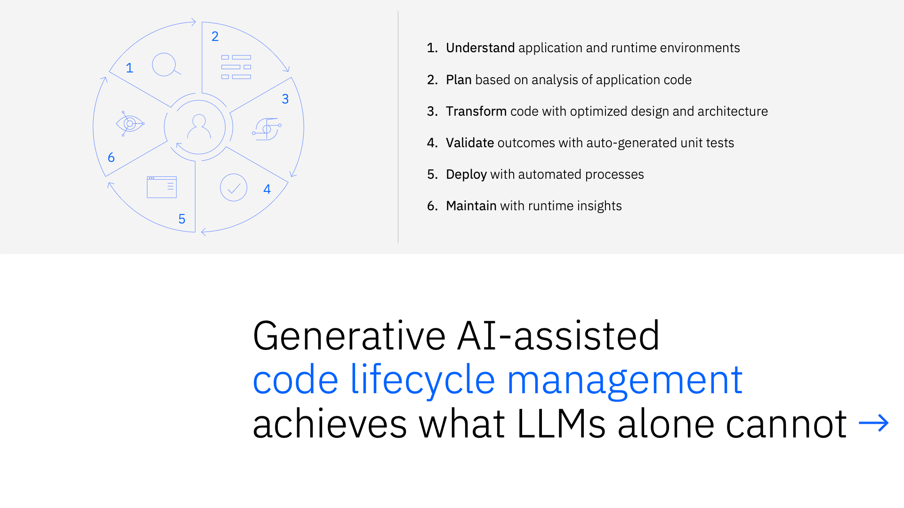
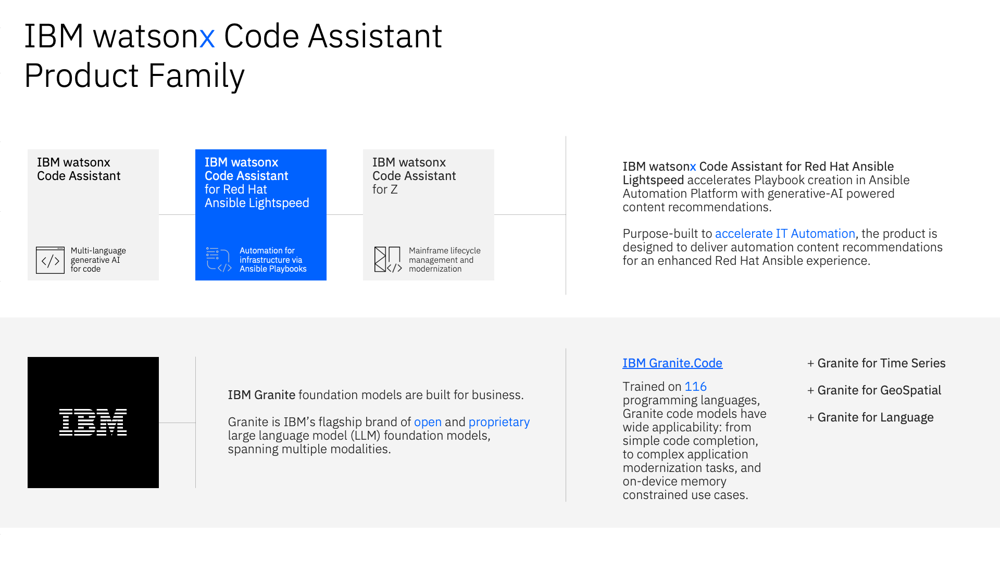
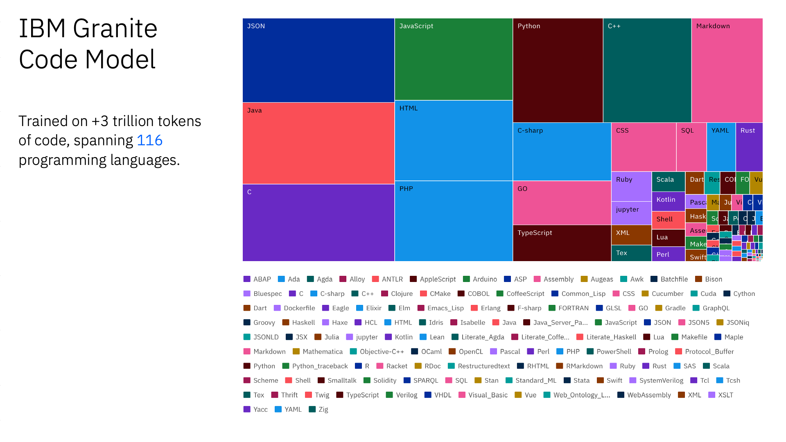
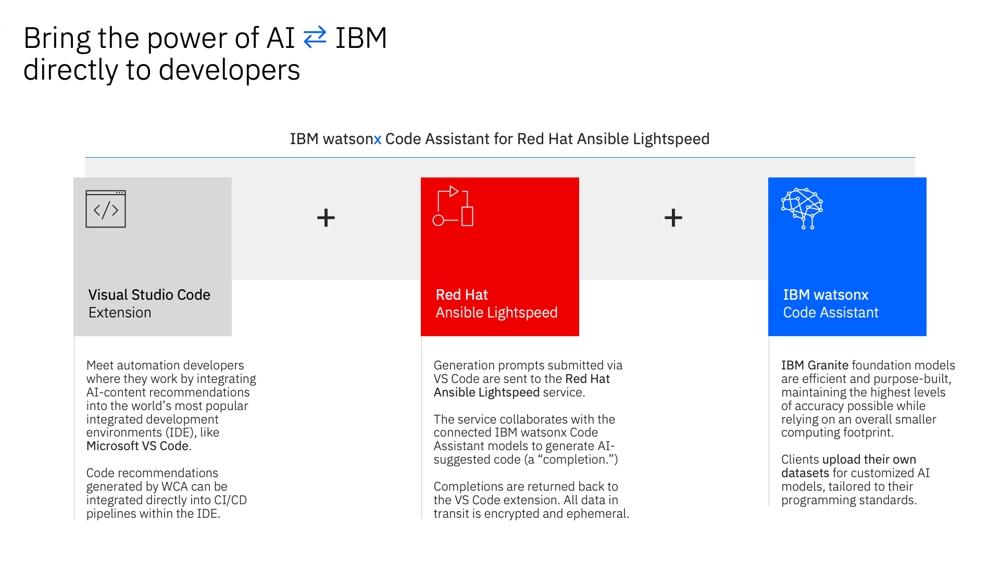

#

!!! quote ""
    Christopher Bienko *(Principal, IBM Global Sales Enablement)* introduces IBM watsonx Code Assistant's generative AI capabilities and lays the groundwork for the hands-on training that will follow. *[6 min]*

 

## **i. Automation is indispensable to modern IT strategy**

Despite the innovations and advancements made in the domain of automation, IBM sellers and partners know first-hand from discussions with clients that many businesses are still struggling to keep up with their IT operations.

The rapid pace of technological innovation— in particular, areas such as AI and machine learning —are obviously challenging for any organization to strategize and plan around. But smaller, more practical challenges also stand in the way of these businesses. The fact remains that IT operations, and wrangling those operations in an efficient and streamlined manner, remains a difficult problem to solve.

Three primary pain points that IBM consistently hears from the marketplace include: an ever-increasing skills gap in IT management; that Day 2 operations continue to be labor-intensive, mostly manual endeavors; and that the complexity of the systems needing to be managed are out-pacing many organization’s ability to adapt.

All of these pain points are potential automation challenges to be solved. Each of them impedes a company's ability to move quickly and adapt for the future. And as such, for many IBM clients, solving these automation challenges have become an indispensable element in their strategy to modernize IT.

!!! note "UNPRECEDENTED RATE OF **GENERATIVE AI** ADOPTION"
    Even though generative AI is relatively new, the widespread popularity of ChatGPT has created significant interest in the notion of large language models (LLMs) and foundation models (FMs) — and what they can do for business. It took quite some time for enterprises to start moving toward traditional AI.
    
    In contrast, generative AI has experienced massive early adoption: 80% of enterprises are already working with, or planning to leverage FMs, and plan to adopt generative AI in their use cases and workflow. Moreover, the following data points to an ever-growing adoption trend for generative AI:

    - `Scale Zeitgeist 2023 AI Readiness Report` notes that with the companies they reviewed, 21% have generative AI models in production; 29% are experimenting with generative AI and another 31% are planning to work with generative AI models; a total of 81% are either working with or planning to work with generative AI models 

    - `Goldman Sachs` has estimated that generative AI will have a very deep economic impact – raising global Gross Domestic Product (GDP) by 7% within 10 years, reflecting the technology’s huge potential.

    - `Boston Consulting Group (BCG)` noted that generative AI is expected to represent 30% of the overall market by 2025

 

## **ii. Generative AI-assisted code lifecycle management achieves what LLMs alone cannot**

Following the debut of OpenAI's ChatGPT, the marketplace has been awash with competing large language model (LLM) and generative AI-based assistants. It's one thing to train and deploy an LLM; it's another thing entirely to make it applicable and tangibly beneficial for business.

What separates IBM watsonx Code Assistant (WCA) offerings from competing vendors in the marketplace? The design and implementation of WCA is purposely built to assist, using generative AI, software and code lifecycle management.

In short, generative AI-assisted code lifecycle management helps to achieve what large language models cannot achieve on their own. It is what distinguished WCA from other code assistants in the marketplace today.

!!! quote ""
    1. Code lifecycle management begins with **understanding** client code, through training across a myriad of programming languages and specializations in paradigms such as Ansible Automation Platform, and applies that understanding across a client’s application and runtime environments.

    2. Users are able to **plan** next steps based on generative AI analysis of their existing application code.

    3. Operations teams can rapidly **transform** their codebases with optimized design and architecture that is recommended according to IBM Granite's best-practice models. 

    4. Administrators can **validate** the outcomes with automatically generated unit tests.

    5. Afterwards, they can **deploy** those services and applications using automated processes like Ansible's automation engine.

    6. Over the course of that application or code's lifecycle, generative AI can **maintain** healthy operations with runtime insights.

 

## **iii. Introducing the IBM watsonx Code Assistant product family**

IBM watsonx Code Assistant is the flagship offering in a suite of generative AI code assistant products, which also include offerings for Ansible Automation Platform (IBM watsonx Code Assistant for Red Hat Ansible Lightspeed) and IBM Systems modernization (IBM watsonx Code Assistant for Z).

These solutions accelerate software development tasks with AI-powered capabilities including context-aware code generation, explanation, documentation, translation, and unit test generation. It does so while maintaining the principles of trust, security, and compliance with regards to IBM client's data and intellectual property. Developers and IT Operators can utilize WCA to speed up application modernization efforts and generate Ansible-based automation jobs to rapidly scale out (or scale up) IT environments.

---

---

IBM watsonx Code Assistant products are powered by **IBM Granite** foundation models that include state-of-the-art large language models designed for code. For offerings such as WCA for Ansible Lightspeed and WCA for Z, bespoke code models— tailored to working with Ansible Automation Platform and COBOL-to-Z use cases, respectively —are invoked. Universally true for all of the watsonx Code Assistant offerings is that they are geared towards helping IT teams create high-quality code using AI-generated recommendations, based on natural language requests or existing source code. These AI models, and the recommendations they generate, are seamlessly integrated via extensions with the world's most popular developer integrated development environments (IDE), including Visual Studio Code and Eclipse.

Granite is IBM’s flagship brand of open and proprietary LLMs, spanning multiple modalities. Granite models exist for code, languages, time series, and GeoSpatial — with additional modalities expected in future. 

---

---

IBM Granite code models are a series of decoder-only models for code generative tasks, trained with code written in 116 different programming languages. The Granite code models family consists of models ranging in size from 3 to 34 billion parameters, in both a base model and instruction-following model variants. These models have a range of uses, from complex application modernization tasks to on-device memory-constrained use cases.

The larger the block size for a particular language on this chart, the larger percentage of training corpus data of that language was used to train the Granite code model. Languages and formats such as Java, C, JSON, JavaScript, HTML, and PHP are subjects in which the model “Majors” and excels. Other languages such as Ruby, SQL, and Swift could be considered “Minors” where the generalized code model can work with the language, but has less training data to base those recommendations on. These percentages and training data volumes will continue to evolve as the Granite code models mature.

!!! note "WATSONX CODE ASSISTANT vs. WCA FOR ANSIBLE LIGHTSPEED?"
    For those familiar with other IBM watsonx Code Assistant offerings— such as WCA for Red Hat Ansible Lightspeed and WCA for Z —the generalized code model approach, as seen here, differs from the specialized code model approach of those two aforementioned offerings.
    
    - The **WCA for Ansible Lightspeed** flavor of IBM Granite code models specializes (Majors) only in Ansible Playbooks and YAML
    
    - Similarly, the IBM Granite code model used by **WCA for Z** specializes in transforming COBOL mainframe code into modernized Java code
    
    Ansible Playbooks (YAML) and mainframe (COBOL) code are both supported (Minor) languages for the generalized IBM Granite code models— and therefore are supported by IBM watsonx Code Assistant —but if a client wishes to specialize in those particular languages and frameworks, they would be well advised to utilize the bespoke *WCA for Ansible Lightspeed* and *WCA for Z* offerings, respectively, to do so.

 

## **iv. Solution architecture of IBM watsonx Code Assistant for Red Hat Ansible Lightspeed**

**IBM watsonx Code Assistant for Red Hat Ansible Lightspeed** meets developers where they are: with a rich plugin via VS Code extensions, where developers input their prompts directly in the code editor. Prompts are sent to the Ansible Lightspeed service, and the service sends a suggestion back (a *completion*) that’s powered by IBM Granite LLMs for code. 

It is important to note that all data in transit is encrypted and ephemeral so users can be confident and have trust in the security of the service during this exchange. In terms of data security, client Ansible playbooks and customized models that they may potentially have are stored in client-owned Cloud Object Storage and are not shared with IBM, Red Hat, or any other clients.

!!! quote ""
    In order to utilize IBM watsonx Code Assistant for Red Hat Ansible Lightspeed, a client must have an existing license for Red Hat Ansible Automation Platform (the ”red tile” component in the center of the diagram), as well as a license for IBM watsonx Code Assistant for Red Hat Ansible Lightspeed (the “blue tile” on the right of the diagram).

 

Generative AI has recently demonstrated proficiency in creating syntactically correct and contextually relevant application code in a variety of programming languages. For example, if trained on a large dataset of Ansible Playbooks, generative AI models can be fine-tuned to understand the nuances of Playbook syntax and structure. An enterprise organization with dozens or hundreds of Playbooks within their IT estate today would have a rich corpus of training data on-hand that could be used to fine-tune AI models that are tailored to the automation needs and programming style or standards of that particular company. 

!!! note "WHAT ARE PLAYBOOKS?"

    Ansible Playbooks instruct Ansible’s automation engine on how to execute tasks in a step-by-step manner. Playbooks defines roles, tasks, handlers, and other configurations; in turn, these attributes allow developers and users to codify complex orchestration scenarios. Conceptually, think of a Playbook as a recipe book for system administration: each recipe (or Playbook) spells out the steps required to achieve a particular system state or to complete a given operation.
    
    One of the standout features of Ansible Playbooks is that they are *idempotent*: executing Playbooks multiple times on the same system won't create additional "side effects" (unintended operations or creation of unwanted artifacts) after the first successful run. This ensures consistency and reliability across deployments of the Red Hat Ansible Automation Platform (**AAP**).

As you will see throughout the hands-on training material, generative AI models provide a natural language prompt to users which in turn is understood and translated by the AI models into the necessary Ansible Task code. For example, a user might describe a desired system state in plain language (*"I want a Playbook to install and start an Apache web server"*) and the model will generate the appropriate Ansible Tasks for a Playbook.

All of this is achieved without physically writing code or requiring much programming expertise. Not only does this speed up the automation process by cutting the time needed to author Playbooks, but it also democratizes access to automation in general. Even those within a company with limited Ansible or programming expertise will be able to produce effective Playbooks. There are plenty of caveats of course, and thorough validation and testing of AI-generated code will be needed before being put into production. However, the productivity gains and broadening of skillsets within an organization can be tremendous. And as a whole, generative AI brings the original goals of Red Hat Ansible Automation Platform (the democratization of automation for everything) that much closer to a reality.

---

## **v. Lab objectives**

The material covered for this hands-on training is intended to prepare IBM sellers and business partners with the skills necessary to create Ansible automation tasks using the generative AI capabilities of WCA. The curriculum will leverage WCA's generative AI code recommendations for automating cloud-based and infrastructure-based automation tasks. In-depth explanations accompanying Ansible Playbook templates will also explain:

- How WCA uses **natural language prompts**, as well as Ansible Playbook contents, to generate contextually-aware Task code recommendations

- **Post-processing** capabilities that refine the generative AI suggestions into syntactically correct code (adherent to best practices)

- How WCA provides **content source matching** attribution and "explainability" for all AI-generated content

- Leveraging WCA's **model tuning** capabilities to tailor content and code recommendations to an organization's standards, best practices, and programming styles

---

## **vi. Next steps**

The module ahead will outline the evaluation criteria for IBM sellers and business partners. Afterwards, you will setup your local environment with the necessary pre-requisites for getting started with the hands-on material.