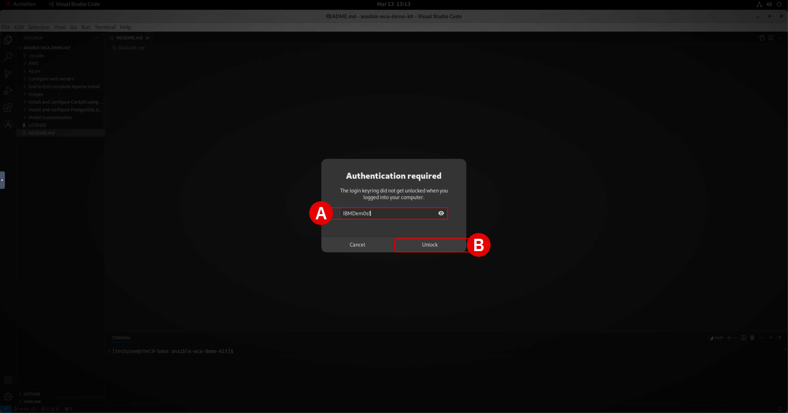
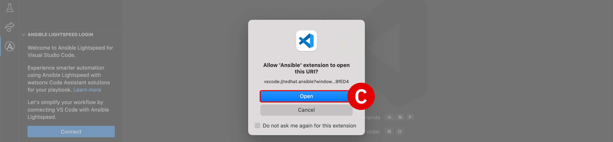
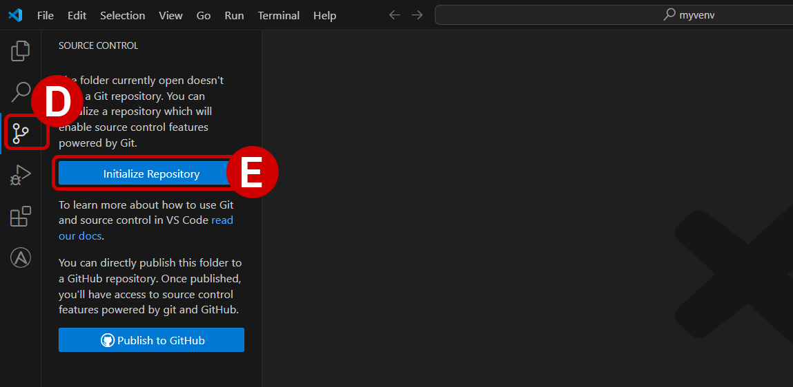

#

!!! note ""
    If you require assistance or run into issues with the hands-on lab, help is available.

    - **Environment issues:** The lab environment is managed by IBM Technology Zone. <a href="https://techzone.ibm.com/help" target="_blank">Opening a support case ticket</a> is recommended for issues related to the hands-on environment (provisioning, running, and so on.)

    - **Documentation issues:** If there is an error in the lab documentation, or if you require additional support in completing the material, open a thread on the <a href="https://ibm.enterprise.slack.com/archives/C063VF1G54J" target="_blank">#wca-ansible-techzone-support</a> Slack channel.

    - **Product questions:** For questions related to IBM watsonx Code Assistant capabilities, sales opportunities, roadmap, and other such matters, open a thread on the <a href="https://ibm.enterprise.slack.com/archives/C059NKPUCP9" target="_blank">#watsonx-code-assistant</a> Slack channel.

    Frequently asked questions and troubleshooting steps are <a href="https://ibm.github.io/WCA-AnsibleLightspeed-L3/setup/#troubleshooting-and-support" target="_blank">documented below</a>.

## **i. Reserving the lab environments**

Before getting started with *IBM watsonx Code Assistant for Red Hat Ansible Lightspeed* (**WCA**), an environment must be reserved and deployed via the *IBM Technology Zone* (**ITZ**).

You will require access to the ITZ in order to reserve your environment and complete the lab. If you do not yet have access or an account with the ITZ, <a href="https://techzone.ibm.com/" target="_blank">you will need to register for one</a>.

There are **TWO** environments that you must reserve from ITZ:

- `Request a Red Hat Account`: responsible for generating unique access credentials for *IBM watsonx Code Assistant* and *Red Hat Ansible Lightspeed* authorizations
            
- `WCA for Ansible Essentials Plan - Visual Studio Desktop 1.4`: virtualized machine prepared with Visual Studio Code and lab demonstration scripts pre-installed; you will authenticate within this environment using the Red Hat account requested from ITZ

Follow along with the instructions below to request and configure these environments.

---

1. Click the IBM Technology Zone link below and select **Request a Red Hat Account**^[A]^:

    !!! warning ""
        **URL:** <a href="https://techzone.ibm.com/collection/ibm-watson-x-code-assistant-for-ansible-lightspeed/environments" target="_blank">https://techzone.ibm.com/collection/ibm-watson-x-code-assistant-for-ansible-lightspeed/environments</a>

    <br/>

    !!! note inline end "FULLSCREEN IMAGES"

        Click on any of the screenshots within this documentation to enlarge the image.
    
    {: loading=lazy width="450"}

---

2. From the *Single environment reservation options*, select **Reserve now**^[A]^.

    <br/>
    {: loading=lazy width="600"}

---

3. Supply additional details about your ITZ reservation request:

    | Field                             | Value                                                                                                                                                                                                                           |
    | --------------------------------- | --------------------------------------------------------------------------------------------------------------------------------------------------------------------------------------------------------------------------------|
    | `Name`                            | ^[A]^ Give your reservation a unique name.                                                                                                                                                                                      |
    | `Purpose`                         | ^[B]^ If reserving for L3 training, select *Education*. If delivering a PoC, select *Pilot* and provide a Sales opportunity number.                                                                                             |
    | `Describe`                        | ^[C]^ If reserving for L3, enter *WCA for Ansible Lightspeed training*. If delivering a PoC, enter the PoC and client details.                                                                                                  |
    | `Preferred Geography`             | ^[D]^ Select the region and data center geographically closest to your location.                                                                                                                                                |
    | `End Date & Time`                 | ^[E]^ Select a time and date for when the reservation will expire. The recommended amount is 2 days, although it is possible to finish the hands-on demonstration within a few hours. Additional time extensions are available. |

    When satisfied, verify that you agree to the *Terms and Conditions* for the environment and finalize your reservation request by clicking **Submit**^[F]^.

    <br/>

    !!! note inline end "PROVISIONING TIMES"

        Red Hat account creation take approximately **5-10 minutes** to complete from the time that you click submit. If you navigate to the **<a href="https://techzone.ibm.com/my/reservations" target="_blank">My Reservations</a>** tab of the ITZ, you can monitor the progress of your reservation. Wait for the ITZ reservation to be marked as *"Ready"* before attempting to start the lab.

    {: loading=lazy width="400"}

---

4. When the Red Hat account request has been processed by IBM Technology Zone, you will receive a **pair** of emails: one from ITZ and a second from Red Hat.

    - `Reservation Ready on IBM Technology Zone` : You can ignore the contents of this email, as the relevant account and licensing information are contained in the Red Hat email. Confirm that the ITZ email states that **Status Update: Ready**^[A]^.

    - `Red Hat Login Email Verification` : This email, addressed from a `no-reply@redhat.com` account^[B]^, contains the resources necessary for accessing your uniquely-generated Red Hat credentials. The lab guide steps that follow will instruct you on how to set those up and how to use them for accessing your *IBM watsonx Code Assistant for Red Hat Ansible Lightspeed* entitlements inside VS Code.

    <br/>
    {: loading=lazy width="600"}

    {: loading=lazy width="600"}

---

5. With the `Red Hat Login Email Verification` email open, take note of two essential pieces of information:

    - Locate the **Account Information**^[A]^ details at the bottom of the email. `Your login:` is the unique Red Hat account assigned for you by ITZ. `Your email address:` will be the address associated with your ITZ account. **Record** both to a notepad for reference later.

    - Click the **URL**^[B]^ located within the body of the invitation email to finalize your account registration with Red Hat.

    <br/>
    {: loading=lazy width="600"}

---

6. An *Email Confirmation* page will load within your web browser.

    - Note that the value of `Red Hat login` is the same as the one recorded in *Step 5*

    - **Create** a new `Password`^[A]^ and record this to a notepad for reference later

    - When ready, click **Save**^[B]^ to finalize registration

    !!! note "REGISTRATION IS REQUIRED"
    
        - If you already have a personal account with Red Hat, **you must still register for a new account** using the invitation URL provided

        - **Do not** attempt to use a personal Red Hat account in the later steps of the *Setup & Troubleshooting* guide, as that account will not have access to the WCA services needed to perform the training

        - Red Hat accounts created for this training will be de-authorized and deleted by IBM Technology Zone after the reservation period has ended

    <br/>
    {: loading=lazy width="600"}

---

7. Now you must request your second ITZ environment, this time for the virtualized machine (VM) environment. Return to the IBM Technology Zone reservation link below and select **WCA for Ansible Essentials Plan: Visual Studio Desktop 1.4**^[A]^:

    !!! warning ""
        **URL:** <a href="https://techzone.ibm.com/collection/ibm-watson-x-code-assistant-for-ansible-lightspeed/environments" target="_blank">https://techzone.ibm.com/collection/ibm-watson-x-code-assistant-for-ansible-lightspeed/environments</a>

    <br/>
    {: loading=lazy width="450"}

---

8. From the *Single environment reservation options*, select **Reserve now**.

---

9. Supply additional details about your ITZ reservation request:

    | Field                             | Value                                                                                                                                                                                                                           |
    | --------------------------------- | --------------------------------------------------------------------------------------------------------------------------------------------------------------------------------------------------------------------------------|
    | `Name`                            | ^[A]^ Give your reservation a unique name.                                                                                                                                                                                      |
    | `Purpose`                         | ^[B]^ If reserving for L3 training, select *Education*. If delivering a PoC, select *Pilot* and provide a Sales opportunity number.                                                                                             |
    | `Describe`                        | ^[C]^ If reserving for L3, enter *WCA for Ansible Lightspeed training*. If delivering a PoC, enter the PoC and client details.                                                                                                  |
    | `Preferred Geography`             | ^[D]^ Select the region and data center geographically closest to your location.                                                                                                                                                |
    | `End Date & Time`                 | ^[E]^ Select a time and date for when the reservation will expire. The recommended amount is 2 days, although it is possible to finish the hands-on demonstration within a few hours. Additional time extensions are available. |
    | `VPN Access`                      | ^[F]^ Set to `Disabled`                                                                                                                                                                                                         |

    When satisfied, verify that you agree to the *Terms and Conditions* for the environment and finalize your reservation request by clicking **Submit**^[G]^.

    <br/>

    !!! note inline end "PROVISIONING TIMES"

        Red Hat account creation take approximately **15-30 minutes** to complete from the time that you click submit. If you navigate to the **<a href="https://techzone.ibm.com/my/reservations" target="_blank">My Reservations</a>** tab of the ITZ, you can monitor the progress of your reservation. Wait for the ITZ reservation to be marked as *"Ready"* before attempting to start the lab.

    {: loading=lazy width="400"}

---

## **ii. Accessing the VM**

10. Once the ITZ reservation has been marked as *"Ready"*, access connection details for the environment by either clicking the shortcut in the ITZ email or by drilling down into the **My Reservations** tab^[A]^ on the ITZ web portal.

    <br/>
    {: loading=lazy width="400"}

---

11. Scroll down to the bottom of the reservation page and click the blue **VM Remote Console** button^[A]^ to launch the VM interface.

    <br/>
    {: loading=lazy width="400"}

---

12. Select the `techzone`^[A]^ login when prompted.

    - Supply the following for the password:
    
        ```
        IBMDem0s!
        ```

    - Hit ++return++ to complete the VM login

    <br/>
    {: loading=lazy width="600"}

---

13. Once you have successfully authenticated, click the **Activities**^[A]^ button in the top-left corner of the interface to pull open the list of available applications from the bottom of the screen.

    - Click the **Visual Studio Code**^[B]^ application shortcut at the bottom of the desktop to start up the service.

    - If you wish to copy and paste instructions directly from the lab documentation into the virtual machine (VM), it is recommended that you open the GitHub instructions **inside** the VM's web browser (Firefox). This will allow you to copy instructions to the VM's clipboard and paste instructions inside the VS Code editor.

    - You may access the web browser at any time by clicking the **Activities**^[A]^ button and then launching **Firefox**^[C]^, as shown.

    <br/>

    {: loading=lazy width="600"}

---

14. VS Code will load and then present you with an *Authentication Required* splash screen.

    - Enter the same password^[A]^ used to log into the VM:

        ```
        IBMDem0s!
        ```

    - Click **Unlock**^[B]^

    {: loading=lazy width="600"}

---

## **iii. Authorizing VS Code with WCA**

Now you must authorize the VS Code environment for use with WCA, using the Red Hat account details that were generated for you in *Steps 5-6*.

15. Within your VS Code environment click the **Ansible** plugin^[A]^ (denoted by the `A` logo) on the left-hand side of the interface.

    - Two panels will open along the left side of the interface

    - Within the *Ansible Lightspeed Login* panel, click the blue **Connect** button^[B]^

    - `The extension Ansible wants to sign in using Ansible Lightspeed`: click **Allow**^[C]^

    - `Do you want Code to open the external website?`: click **Open**^[D]^

    <br/>
    {: loading=lazy width="600"}

    {: loading=lazy width="600"}

    {: loading=lazy width="600"}

---

16. A web browser will load with the header `Log in to Ansible Lightspeed with IBM watsonx Code Assistant` — this is where you will supply your registration details recorded in *Step 6* in order to authenticate the VS Code plugin with WCA.

    - Click the **Log in with Red Hat** button

    - Provide the `Username` and `Password` recorded in *Step 6* of this module

    - Click **Submit** to continue

    - When prompted for **We need a little more information**, set **Job Role** to `Student`

    - Click the **Submit** button to finalize your account activation

    !!! note "COPY AND PASTE INSTRUCTIONS INTO A VIRTUAL MACHINE"
        As you are running the lab environment inside a virtual machine (VM), it is not possible to "paste" lab instructions or information from your local machine's clipboard directly into the VM.

        If you wish to copy and paste instructions directly from the lab documentation, it is recommended that you open the GitHub instructions **inside** the VM's web browser (Firefox). This will allow you to copy instructions to the VM's clipboard and paste instructions inside the VS Code editor.

---

17. After logging in with Red Hat, the web browser will display the prompt to `Authorize Ansible Lightspeed for VS Code`.

    - Click **Authorize**^[A]^

    - `Allow this site to open the vscode link with Visual Studio Code - URL Handler?`: click **Open URL**

    <br/>
    {: loading=lazy width="600"}

    {: loading=lazy width="600"}

    {: loading=lazy width="600"}

---

18. At this stage, the Ansible extension for VS Code is now authenticated and connected to *IBM watsonx Code Assistant*.

    - Verify^[A]^ that the environment is logged in as your unique `Username` and that the `User Type: Licensed`

    - A notification pop-up will also appear in the bottom-right corner of the VS Code interface confirming the successful login

    <br/>
    {: loading=lazy width="600"}

    ??? warning "CLICK TO EXPAND — FAILURE TO LOGIN OR TIMED OUT"

        - If the authentication procedure in *Steps 15-17* takes too long, activation of the plugin will be "timed out" and the VS Code environment will display an error message^[B]^ in the bottom-right corner

        - Click the **Connect**^[C]^ button as shown and repeat *Steps 15-17* as before; the login process should run smoother (and faster) on the second attempt

            <br/>
            {: loading=lazy width="600"}

---

## **iv. [OPTIONAL] Download demo assets to local machine**

19. If you wish to complete the hands-on lab using a local installation of VS Code (instead of using the provided Virtual Machine), you may do so — but you'll need to clone (download) the accompanying demo assets first. To do so, first install the <a href="https://cli.github.com/" target="_blank">GitHub CLI</a> library.

    Execute the following command within a Terminal console to clone (via `git`) the supporting demo assets repository (`ansible-wca-demo-kit.git`) to your local machine:

    !!! warning ""
        ``` bash
        git clone https://github.com/chetan-hireholi/ansible-wca-demo-kit
        ```

    Open the local `ansible-wca-demo-kit` folder within VS Code to access the demo assets for the remaining sections of the lab.

---

## **v. Troubleshooting and support**

!!! note ""
    If you require assistance or run into issues with the hands-on lab, help is available.

    - **Environment issues:** The lab environment is managed by IBM Technology Zone. <a href="https://techzone.ibm.com/help" target="_blank">Opening a support case ticket</a> is recommended for issues related to the hands-on environment (provisioning, running, and so on.)

    - **Documentation issues:** If there is an error in the lab documentation, or if you require additional support in completing the material, open a thread on the <a href="https://ibm.enterprise.slack.com/archives/C063VF1G54J" target="_blank">#wca-ansible-techzone-support</a> Slack channel.

    - **Product questions:** For questions related to IBM watsonx Code Assistant capabilities, sales opportunities, roadmap, and other such matters, open a thread on the <a href="https://ibm.enterprise.slack.com/archives/C059NKPUCP9" target="_blank">#watsonx-code-assistant</a> Slack channel.

<br/>
As you settle in to the environment and begin your training, you may encounter unexpected warnings or errors. Many of these can be safely ignored or can be easily rectified. This section will serve as a running list of frequently asked questions and troubleshooting techniques. Click on any of the following topics for additional details.

---

??? quote "FAILED TO CONNECT TO THE SERVER / `"YOU DON'T HAVE ACCESS TO IBM WATSONX..."`"
    This warning will occur when the Ansible plugin for VS Code needs to be re-authenticated with WCA. It can occur after an extended period of inactivity or a system restart. For example, if your lab environment is running inside a VM, pausing or restarting the VM may produce this error.

    To re-authenticate:

    - **Sign out** from the *VS Code* application by clicking the User icon^[A]^ in the bottom-left corner of the interface, hover over your username, and then click **Sign Out**^[B]^

    - **If you are running this environment inside a virtual machine (VM)**, closing and restarting the VM *will not* resolve the issue — you must sign out from the *VS Code* application, not the VM

    - Once logged out, follow from *Step 7* of the *Setup & Troubleshooting* to re-authenticate with WCA

    <br/>
    {: loading=lazy width="600"}


??? quote "CODE RECOMMENDATIONS ARE NOT GENERATING"
    Ansible Lightspeed and WCA will only generate code recommendations for *Ansible Playbooks* and *YAML* files. VS Code will typically auto-detect the programming language of the document you're working with, but on occassion you may need to manually specify the language. Even if working with a YAML file, you'll still need to specify the language mode as `Ansible` for the Lightspeed plugin to engage.

    To set the language mode correctly:

    - In the bottom-right corner of the VS Code interface, hover over the **Select Language Mode** toggle^[A]^

    - A console will appear at the top of VS Code with a drop-down list of options^[B]^

    - Click `Ansible` from the suggested languages, or enter the text yourself and hit ++return++

    - Confirm that the Select Language Mode toggle in the bottom-right corner displays `Ansible`

    <br/>
    {: loading=lazy width="600"}

    {: loading=lazy width="600"}


??? quote "`"ANSIBLE-LINT IS NOT AVAILABLE."`"
    `ansible-lint` checks Playbooks for practices and behavior that could potentially be improved and can fix some of the most common ones for you. It will constantly check your Ansible syntax as you type and provide recommendations for how to improve it.
    
    - You can safely **ignore** this error if it occurs during the lab exercises

    - If you wish to install `ansible-lint` on your local machine, execute the following instruction within a Terminal console:

        ``` shell
        python3 -m pip install --upgrade --user ansible-lint
        ```

        {: loading=lazy width="600"}


??? quote "RED *ANSIBLE* ICON ALONG BOTTOM-RIGHT INTERFACE"
    The *Ansible* extension for VS Code will check your local machine to determine if Red Hat Ansible has been installed locally. If you have not set up Ansible (the standalone version) on your local machine previously, this tile will display as red.

    You can safely **ignore** this error if it occurs during the lab exercises.

    <br/>
    {: loading=lazy width="600"}


??? quote "CANNOT SET PROPERTIES OF UNDEFINED (SETTING 'currentModelValue')"
    Make sure that the **Model ID Override** field is set to `empty` in your Ansible for VS Code extension settings.
    
    To verify this:

    - Click the **Extensions** tab^[A]^ along the left-hand interface

    - Click the **Manage** icon^[B]^ on the right side of the *Ansible* extension tile, then drill down into **Extension Settings**^[C]^

    - Add the text `Model` to the search filter^[D]^ at the top of the Extension Settings panel

    - Clear the input field^[E]^ of any model IDs and leave it blank

    - Close the Extension Settings panel by clicking `X` and return to the Ansible Playbook

    <br/>
    {: loading=lazy width="600"}

    {: loading=lazy width="600"}

    {: loading=lazy width="600"}


??? quote "SPAWN C:\Windows\system32\cmd.exe ENOENT"
    This warning is not related to Ansible or WCA. You can safely **ignore** this error if it occurs during the lab exercises.

    <br/>
    {: loading=lazy width="600"}


??? quote "PYTHON DRIVERS ARE MISSING"
    The WCA extension for VS Code requires that Python drivers are included within the workspace. These are usually configured within VS Code by default, but can be easily set if necessary. Look for a ```Python``` tile adjacent to the ```Ansible``` tile along the bottom-right corner of the VS Code interface. If it is not set, **click** the tile and select the `Python 3.11.5 64-bit` drivers.

    - Click the gold-colored `Select python environment` button at the bottom-right of the interface

    - From the console at the top of the VS Code environment, select the recommended `Python 3.11.5 64-bit` option and hit ++return++ to confirm

        <br/>
        {: loading=lazy width="300"}
        
        {: loading=lazy width="300"}

??? quote "GIT NOT INSTALLED"
    If your machine has not used **<a href="https://git-scm.com" target="_blank">Git</a>** previously, you may be prompted by VS Code to install it before attempting a `clone` request. This is more commonplace on Windows operating systems, but some MacOS users may need to install Git as well. The following instructions will guide you through the process:

    - With the VS Code application open, click the **Source Control**^[A]^ tab from the left-hand interface and then click **Download Git**^[B]^.

    - A web browser will open to the <a href="https://git-scm.com" target="_blank">git-scm.com</a> Downloads page. 
    
        - **Download**^[C]^ the version recommended for your machine's particular operating system.
        
        - The recommended version will be displayed first at the top of the list. 
        
        - Execute the installer on your machine and follow along with the prompts to finish installing Git. Accept the license agreement and accept the default values on each page.
    
    - Return to VS Code and once again click the **Source Control**^[D]^ tab, then click the blue **Initialize Repository**^[E]^ button.

    - From the top of the **Source Control** tab, click the three dots `...`^[F]^ icon to expand a drop-down menu of options. Click on the **Clone**^[G]^ option.

    - Follow the instructions for the remainder of this section to clone the `ansible-wca-demo-kit` repository to your local machine^[H]^.

    <br/>
    {: loading=lazy width="500"}

    {: loading=lazy width="500"}

    {: loading=lazy width="500"}

    {: loading=lazy width="500"}

    {: loading=lazy width="500"}

??? quote "COPY AND PASTE INSTRUCTIONS INTO A VIRTUAL MACHINE"
    As you are running the lab environment inside a virtual machine (VM), it is not be possible to "paste" lab instructions from your local machine's clipboard directly into the VM.
    
    If you wish to copy and paste instructions directly from the lab documentation, it is recommended that you open the GitHub instructions **inside** the VM's web browser (Firefox). This will allow you to copy instructions to the VM's clipboard and paste instructions inside the VS Code editor.

---

## **vi. Next steps**

The following section will cover the fundamentals of AI-recommended code generation for Ansible Tasks.