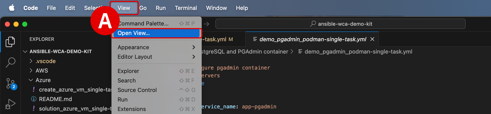
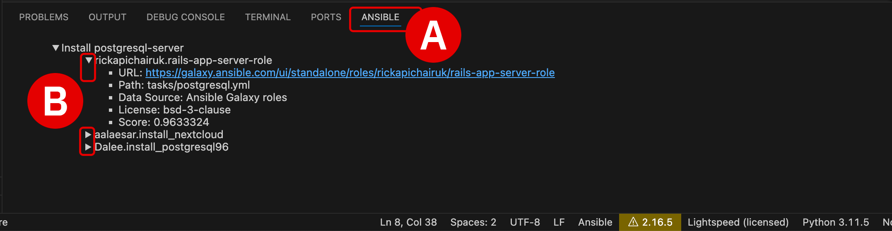

#


!!! quote ""
    Christopher Bienko *(Principal, IBM Global Sales Enablement)* demonstrates key elements of the `Content Source Matching and Post-Processing` module. *[10 min]*

## **i. Why code attribution and post-processing matters for generative AI**

At this point, you should now be well acquainted with *Ansible Tasks* and *Playbooks*. Ansible Playbooks are comprised of multiple Tasks — which you have been using *IBM watsonx Code Assistant for Red Hat Ansible Lightspeed's* (**WCA**) generative AI capabilities to define and expand upon.

If a Playbook contains multiple "tasks" that together achieve some singular goal or purpose, you might want to group these tasks into a single reusable unit. For example, a string of "tasks" might provision infrastructure for separate development, test, and production clusters from a major cloud vendor. Patterns for automating endpoints from these vendors can be codified into **Ansible Modules**, which are supported by Red Hat and the Ansible community writ large.

And finally, collections of Playbooks and Modules can be organized into "blueprints" for automation tasks that are frequently used together to achieve some goal; a goal which you might want to make repeatable or shareable with other teams within your business. These blueprints are referred to as **Ansible Roles**. They provide a structured way to organize tasks, templates, files, and variables, and are available to drop directly into Ansible Playbooks. Roles make it possible to easily manage and set up complex automation tasks, essentially providing a rubric to streamline automation projects.

!!! note ""
    Collectively, these Playbooks, Modules, and Roles form a **comprehensive ecosystem of business and community-driven support** for patterning automation to work with the broadest range of vendors, technologies, and clouds.

**<a href="https://galaxy.ansible.com" target="_blank">Ansible Galaxy</a>** is a Red Hat-curated, community-driven repository for *Ansible Roles*. Via communities such as Galaxy, thousands of Roles are available for Ansible users to leverage within their own Playbooks. Ansible Galaxy is also key to how generative AI code recommendations from WCA are attributed back to original content sources and authors.

---


---

## **ii. Content source matching**

A powerful capability within WCA is **Content Source Matching** (often referred to as "code explainability"), which attempts to match AI-generated code suggestions to the training data and sources that were utilized in generating the suggested Task code.

These code attribution suggestions are created using a **k-NN** (<a href="https://www.ibm.com/topics/knn#:~:text=Next%20steps-,K%2DNearest%20Neighbors%20Algorithm,of%20an%20individual%20data%20point." target="_blank">K-Nearest Neighbors</a>) algorithm that examines **Ansible Galaxy** and training data repositories in search of the nearest related content to the AI-generated code suggestions.

1. To enable **Content Source Matching** capabilities within WCA, navigate to the main menu bar for VS Code and drill down into **View** > **Open View...**^[A]^

    <br/>
    {: loading=lazy width="600"}

---

2. The console^[A]^ along the top of the VS Code interface is now activated and awaiting a prompt. Type `Lightspeed Training Matches` and hit ++return++ to confirm the selection.

    - After making this configuration change to VS Code, all requests for WCA to generate code recommendations will now open a panel at the bottom of the VS Code interface
    
    - It is under the `Ansible` tab that **content source matching** results will be displayed

    - Other tabs will also displayed for variety of options: `Problems`, `Output`, `Debug Console`, `Terminal`, and `Ports`

        <br/>
        {: loading=lazy width="600"}

---

3. Open the `install_pgsql-single-task.yml` Ansible Playbook, which is included within the `ansible-wca-demo-kit` directory. The full location of the Playbook, as well as the contents, are available in the code block below.

    === "~/Documents/ansible-wca-demo-kit/install and configure PostgreSQL and PGAdmin container/install_pgsql-single-task.yml"

    ``` yaml linenums="1"
    ---
    - name: Configure Database servers
    hosts: databases
    become: true

    tasks:
        # TASK 1
        # - name: Install postgresql-server

        # TASK 2
        # Ansible Lightspeed used an easy-to-understand natural language prompt and suggested the correct, more complex PostgreSQL CLI command to initiate the database.
        # Ansible Lightspeed used best practices and kept the task idempotent by including creates: /var/lib/pgsql/data/postgresql.conf in the suggestion.
        # - name: Run postgresql setup command

        # TASK 3
        # Ansible Lightspeed used natural language prompt and added state: started and enabled: true module arguments based on Start and enable... in the Ansible task description.
        # - name: Start and enable postgresql service
    ```

---

4. Generate a code recommendation for the task on **Line 8** by placing your cursor at the end of the line and hitting ++return++.

    - Pay attention to the code attribution details associated with this recommendation, which will be appearing under the `Ansible` tab at the bottom of the VS Code interface once the code recommendation is finalized.

    - You will need to **accept** the AI-generated code suggestions (using the ++tab++ key) *before* the `Ansible` content source matching tab will provide details about the code's origins.

    ``` yaml
    - name: Install postgresql-server
    ansible.builtin.package:
        name: postgresql-server
        state: present
    ```

---

5. The three most likely content sources used in training the WCA model— which produced the AI-generated code recommendations —are listed within the `Ansible` **tab**^[A]^. Recall from earlier that these code attribution suggestions are created using a **k-NN**  algorithm that searches **Ansible Galaxy** repositories for the nearest related content to the AI-generated code suggestions.

    Clicking the arrow icon to the left of each **attribution**^[B]^ will expand further details about the source. Information about the `URL`, `Path`, `Data Source`, `License`, `Ansible Type`, and `Score` are displayed (where available) under each listing. Red Hat-certified and maintained collections, as well as contributors to open source projects on Ansible Galaxy, are the primary sources for Ansible Lightspeed model training and are the content sources you are most likely to see matched to AI-generated code recommendations.

    <br/>
    {: loading=lazy width="600"}

---

6. Drilling down into the `URL` field will redirect your web browser back to the precise collections and sources on **Ansible Galaxy** from which the code recommendations were derived. Here you can learn much richer details about the status of the project, any associated open source repositories involved (such as GitHub), contributions and activities ongoing with the code base, the author(s) involved, and many more intricacies.

---
    


---

## **iii. Post-processing capabilities**

Another element of code generation that WCA excels at is understanding **context** within the Playbook it is executing against. If a variable or attribute is defined earlier within that Playbook, it will be recalled and referenced— where it makes sense to do so —in the generation of subsequent lines of code. You may have already noticed these **post-processing capabilities** in your experimentations with WCA-generated code suggestions. Post-processing of Task descriptions and YAML file contents helps generate contextually aware, accurate Ansible content suggestions.

However, one way to make this feature quite obvious is to take a previously-generated block of Ansible Task code, update the value assigned to a named variable *earlier* in the Playbook, and then regenerate the Task code block. In theory, the newly-generated Task block will use the updated variable name (and differ from how the code block was originally generated).

---

7. Create a **New File...** YAML Playbook named `demo_provision_ec2_instance.yml` anywhere within the `/ansible-wca-demo-kit/` directory.

    - You may save the Playbook in the root of the folder or any of the subdirectories
    
    - Be sure to reference the expandable tooltips below for instructions on how to perform these operations and how to configure the Playbook language for use with WCA

    - **Copy and paste** the following code block into the `demo_provision_ec2_instance.yml` Playbook and then save the file

    ??? quote "HOW TO CREATE NEW `YAML` PLAYBOOKS"

        **Note:** You need to copy and paste the contents of the Playbook into a **New File...** within the *same* Lightspeed project directory that was used for the previous lab modules in order for the VS Code extension to engage.

        To create a new YAML Playbook within a VS Code environment:
        
        **a.** Copy the contents of the Playbook to clipboard using the button in the top-right corner of the lab guide code block.
        
        {: loading=lazy width="400"}

        **b.** Return to your VS Code environment. In the top-left corner of the interface, with your Ansible Lightspeed folder selected, click the **New File...** button.
        
        {: loading=lazy width="400"}

        **c.** Name the file to a description of your choosing, ending with `.yml` as the filetype. Set it to `CustomPlaybook.yml`, for example. Save it to one of the directories in the `ansible-wca-demo-kit` folder.

        **d.** Paste the clipboard contents into the YAML file and follow along with the suggestions below.

    ??? quote "COPY AND PASTE CODE WITHIN THE VM"

        Information "copied" to your local machine's clipboard cannot be "pasted" directly into the virtual machine (VM) environment or VS Code. If you wish to copy and paste instructions directly from the lab documentation, it is recommended that you open the GitHub instructions **inside** the VM's web browser (Firefox). This will allow you to copy instructions to the VM's clipboard and paste instructions inside the VS Code editor.

    ??? quote "ANSIBLE LIGHTSPEED IS MISSING OR CODE RECOMMENDATIONS ARE NOT GENERATING"
        Ansible Lightspeed and WCA will only generate code recommendations for *Ansible Playbooks* and *YAML* files. VS Code will typically auto-detect the programming language of the document you're working with, but on occassion you may need to manually specify the language. Even if working with a YAML file, you'll still need to specify the language mode as `Ansible` for the Lightspeed plugin to engage.

        To set the language mode correctly:

        - In the bottom-right corner of the VS Code interface, hover over the **Select Language Mode** toggle^[A]^

        - A console will appear at the top of VS Code with a drop-down list of options^[B]^

        - Click `Ansible` from the suggested languages, or enter the text yourself and hit ++return++

        - Confirm that the Select Language Mode toggle in the bottom-right corner displays `Ansible`

        <br/>
        {: loading=lazy width="600"}

        {: loading=lazy width="600"}

    === "demo_provision_ec2_instance.yml"

    ``` yaml linenums="1"
    ---
    - name: EC2 Cloud Operations
    hosts: localhost
    connection: local
    gather_facts: false

    module_defaults:
        group/aws:
        region: us-east-1

    # vars:
    #   ec2_instance:
    #     name: lightspeed-instance-01
    #     key_name: lightspeed-keypair
    #     image_id: ami-016eb5d644c333ccb # RHEL 9 us-east-1
    #     tags:
    #       function: lightspeed-demo
    #     security_group: secgroup-lightspeed

    tasks:
            # TASK 1
            # # 1a. Uncomment task description below and generate a task suggestion.
            # #     Note - Best practices: The suggestion used the Fully Qualified Collection name.
            # #     Note - Context: Ansible Lightspeed used the Playbook name "EC2 Cloud Operations" to use the correct "amazon.aws.ec2_vpc_subnet_info" module.

        - name: Gather subnet info tag:Name subnet-lightspeed

            # TASK 2
            # # 2a. Uncomment task description below and generate a task suggestion.
            # #     Note - Context: The suggestion included the previous task's registered variable in the suggestion.
            # #     Note - Accuracy: The suggestion provides the correct key value from the previously task's registered variable.

        - name: Create vpc_subnet_id var

            # TASK 3
            # # 3a. Uncomment task description "Provision t3.micro instance" below and generate a task suggestion.
            # #     Note - Efficiency: The suggestion provides practical variable examples to improve efficiency.

        - name: Provision t3.micro instance

            # # 3b. Remove the above task and suggestion.
            # #     Uncomment 2nd task description "Provision t3.micro instance using ec2_instance var".
            # #     Generate an updated suggestion.
            # #     Note - Context: The updated suggestion includes the "ec2_instance variable fields in the suggestion"

        - name: Provision t3.micro instance using ec2_instance var

    ```

---

8. `TASK 1` (**Line 26**) and `TASK 2` (**Line 33**) are responsible for gathering information about a network subnet that is to be provisioned and then creating a virtual private cloud (VPC) definition based on those details.

---

9. Generate suggested code for `TASK 1` (**Line 26**) by placing the cursor at the end of the line, hitting ++return++, and then confirming with ++tab++. Afterwards, perform the same steps to generate code for `TASK 2` as well.

    - The first round of WCA-generated code produces a code block^[A]^ with a `register: subnet_info` (**Line 30**), the result of which is to assign this VPC definition to a variable `subnet_info`. Nothing terribly complicated or surprising about that.

    - The WCA-generated code that follows for the task on **Line 38** (previously *Line 33* in the raw template) recommends a code block^[B]^ with `vpc_subnet_id: "{ { subnet_info.subnets[0].subnet_id } }"` as the value associated with the VPC's subnet ID. Critically, the variable `subnet_info` that was generated in the previous Task^[A]^ is also referenced in the second Task. This demonstrates the contextual awareness of WCA in action.

        <br/>
        {: loading=lazy width="600"}

        {: loading=lazy width="600"}

---

10. Change the name of variable `subnet_info` to `subnet_name` on **Line 30**. Then delete the code block recommendations under **Line 38** and regenerate the task.

    - Notice that the new block^[A]^ of `TASK 2` now references the variable `subnet_name` that was modified just a moment ago in `TASK 1`
    
    - WCA has generated code for `TASK 2` that takes into account the **modified context and variables** from `TASK 1` of the Playbook

        <br/>
        {: loading=lazy width="600"}

        <br/>

        Continue experimenting with WCA's contextual awareness and post-processing capabilities. Try adjusting other variables within the Playbook and study how these modifications impact the generation of later blocks of Task code within the Playbook. 

---

## **iv. Next steps**

In the next section, you will begin experimenting with customized Ansible Playbooks and testing how changes to Ansible Task natural language descriptions impacts the recommended code produced by WCA.